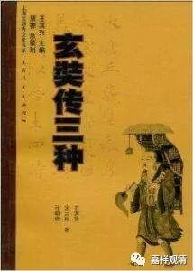
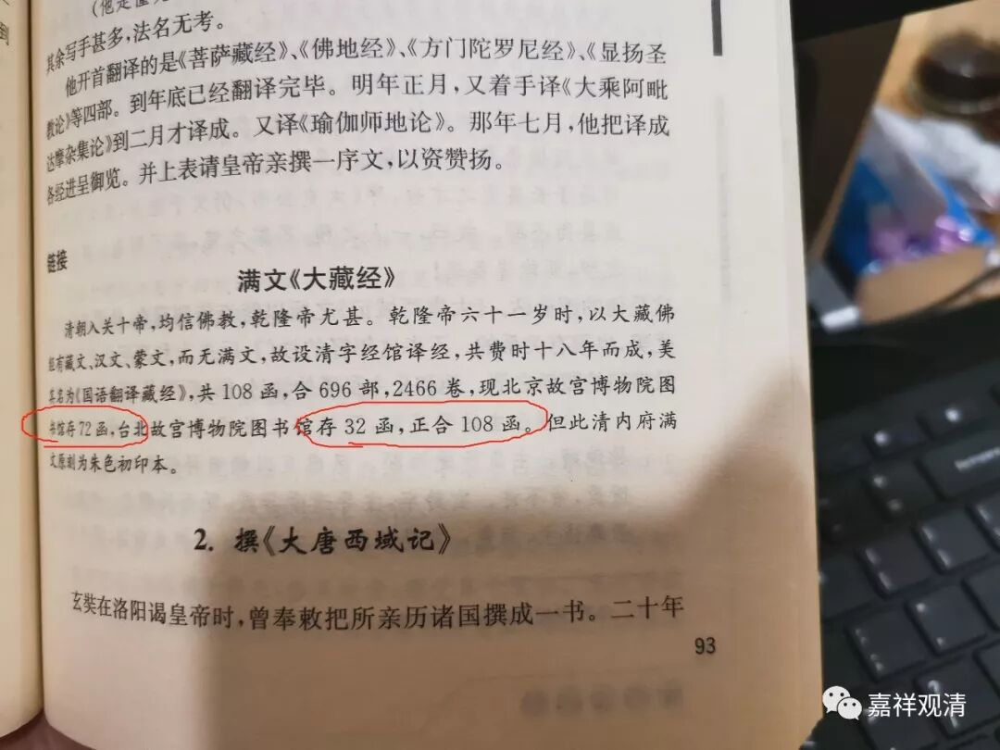
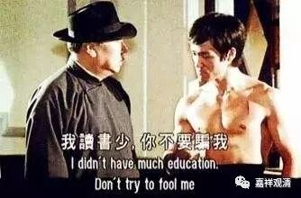
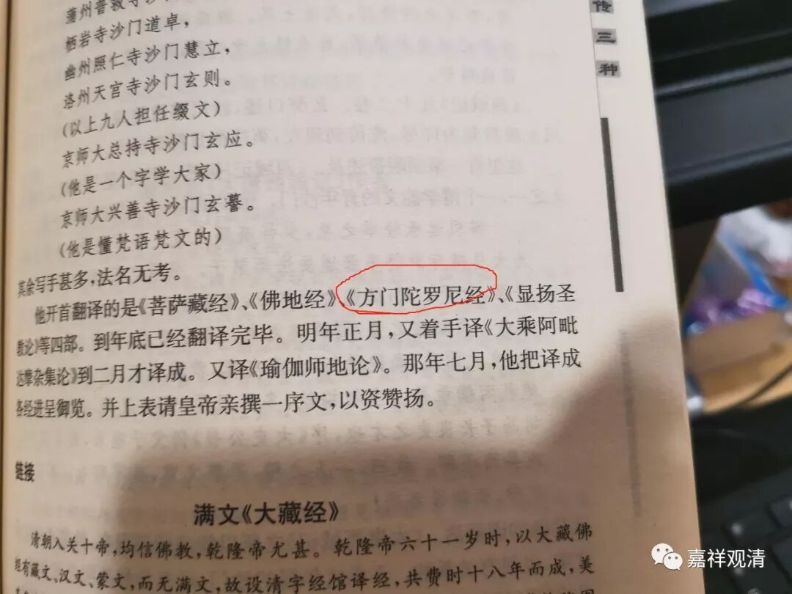
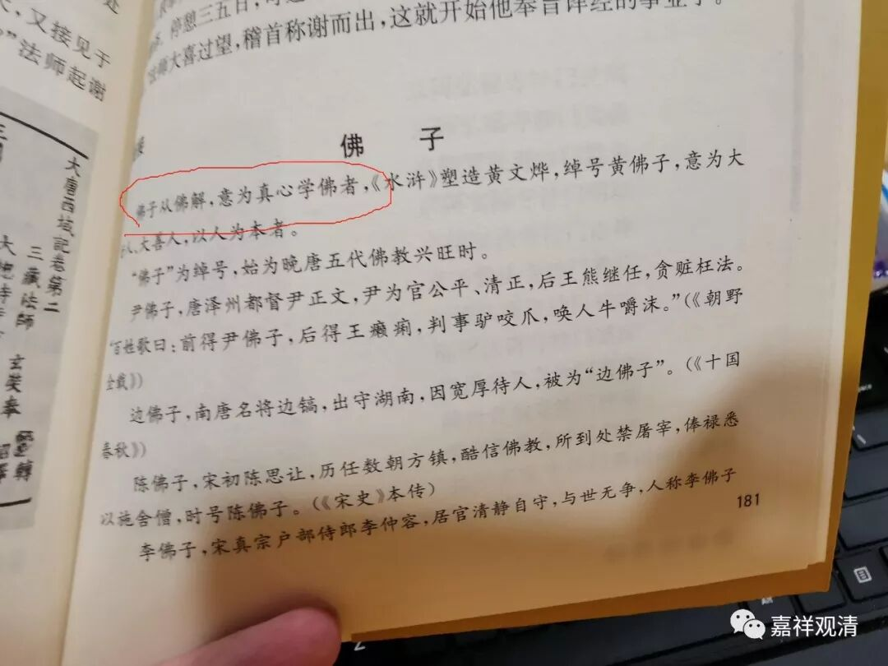
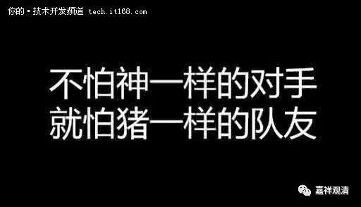

**“队友”编新版毁经典**

要查玄奘年谱，记得有几个有名的版本（记得有刘汝霖先生的），但都在图书馆，身边没有。今天发现我这里有一本《玄奘传三种》，翻出来看看。

三种《玄奘传》都是用的都是解放前的作品，作者分别是孙毓修、宋云彬、苏渊雷三位先生，也都是牛人了，分别是1911年商务印书馆版、1933年开明书店版和1944年重庆胜利出版社版。

三本原作自然都是经典，但莫名其妙地，在新版的书里面加进了很多“狗屎”，“狗屎们”丢都在一个新潮的词下面，这个神经一样不知道在什么节奏下回出现的词叫“链接”，“链接们”散在全书各处，直接把“三种”经典整成了垃圾！

随便举几则：

这段“满文大藏经”被塞在这里，完全不知道是出于什么“思路”。而且，这里有谁数学不好吗？我都看傻了，“北京故宫博物院图书馆存72函，台北故宫博物院图书馆存32函，正合108函”——72+32=108？

我读书比较少，但是，72+32不是等于104吗？

随便打开网络资料，

“……** 故宫博物院收藏76函（夹），台北故宫博物院收藏32函（夹），两地所藏为一部完整的满文大藏经……**”

原来是76+32=108呢！（我都不想说这“链接”里面另两个明显的因为资料阅读理解出现的错误了。）

同一页里面

《方门陀罗尼经》？《方广陀罗尼经》吧？！（难道是扫描识读后直接印刷的？）

再看这段：

“佛子”是“菩萨”的另一种说法，这段“链接”想要告诉我的是什么鬼？

好好的三本经典愣是被塞满了垃圾，我都懒得骂人了。

这本新版书最后倒是出现了一个亮点——“定价15元”

