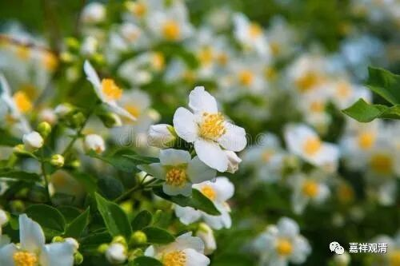
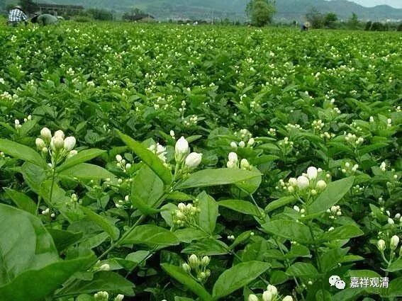
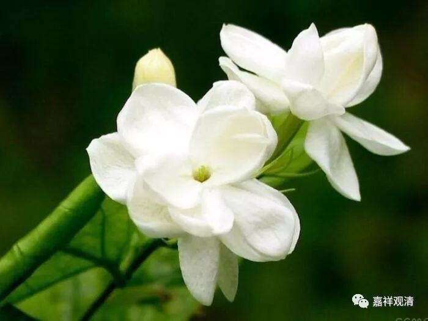
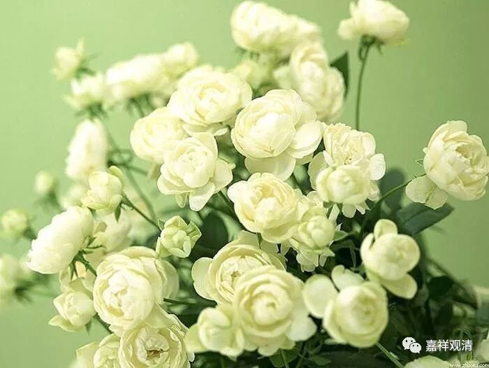

**外来的“末利”，新造的“茉莉”**

以前我们聊过好几个外来的“传统”（饺子、馄饨、烧麦……）和基于梵语新造的汉字（“爹”）了，今天我们聊聊“茉莉花”吧。

其实，“茉莉”联用或者“茉”、“莉”分开用，早先都不见于中国的各类“字典”（连《故训汇纂》都没收录），他其实是一个标准的外来词，即梵文mallikā，早年音译译为“末利”——完全是一个外来的单词。

《杂阿含经》卷三十八：

** “多迦罗，栴檀，优鉢罗、末利。**

** 如是比诸香，戒香最为上。”**

这里，多迦罗taggara，栴檀candana，优鉢罗utpāla、末利mallikā，都是梵文的音译。末利，就是后来的“茉莉”。

** 

《妙法莲华经》卷六：

** “……以是清淨鼻根，聞於三千大千世界上下內外種種諸香——須曼那華香、闍提華香、末利華香、瞻蔔華香、波羅羅華香……”**

这里的須曼那華sumanas、闍提華jātika.、末利華mallikā、瞻蔔華campaka、波羅羅華pāṭala也都是音译。

《一切经音义》卷二十一：

** “末利者，花名也。其花黄金色，然非末利之言即翻为黄也。”**

《翻译名义集》卷七：

** “末利：此翻黄色花。花如黄金色。”**

由于是音译，所以在很长时间里并没有一定规范，“抹莉”、“没利”、“末丽”都用过（为什么没有“美丽”？）。后来有人发明了新写法——加上了“艹”字头，成为了新的形声字“茉莉”，被大家接受并沿用至今。

有说“茉莉”的用法最早见于李时珍《本草纲目》（《佛教汉语研究》P287），但《汉语大词典》说更早宋·李格非的《洛阳名园记•李氏仁丰园》就有了这两个新字：“远方奇卉如紫兰、茉莉、琼花、山茶之俦。”

今天，这一远方奇卉“末利”已经随着《好一朵美丽的茉莉花》成为中国符号——这又是一个文化交流的典型案例了。

