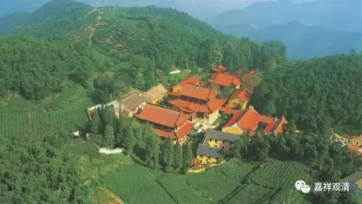
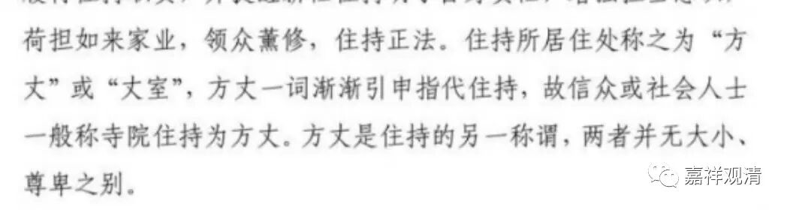
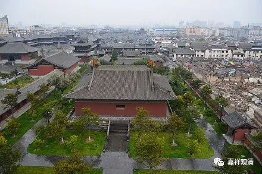
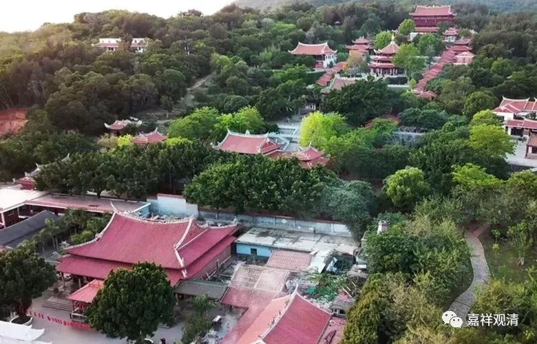
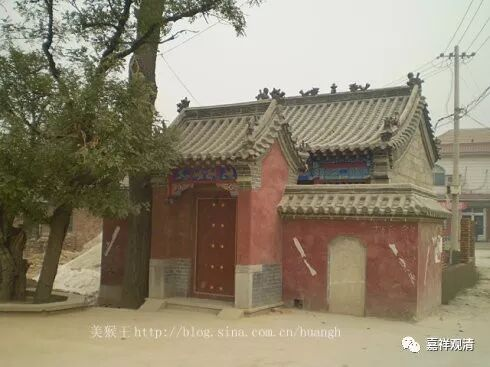
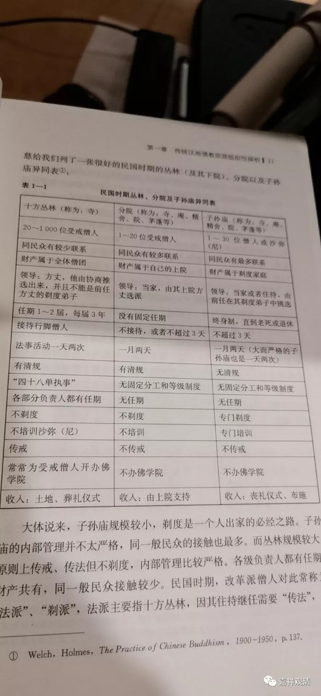

**以前的“方丈”和“住持”

看到近日有一篇文字，是这么说的——

其实这个说法，算是比较有新意的“统一口径”。早先，“方丈”和“住持”还真不是一个概念。远的暂不追究，民国时期，有比较成型的约定俗成的模式里，方丈和住持就不是一回事。

“方丈”，是大丛林（这样的“十方丛林”，少至数十人，上可至千余人）的“第一人”、领导，有一定的任期，一般不终身制，前后任“方丈”在原则上（早期必须）应没有师徒关系（后期在实践上至少不以师徒关系作为传承“方丈”职位的必要条件）。“方丈”一下，一般另有“当家”之职务人选（当家，也称“住持”，但丛林寺院多称“当家”）。“当家”不是“方丈”，是“高管”之一。

其下有“小庙”——1、“丛林的‘下院’”和2、“子孙庙”，他们的组织形式不同于“大庙”（十方丛林）。小庙（丛林的下院，和，子孙庙）的第一人一般就称“当家”或“住持”（都可以）。丛林下院的住持由丛林方丈任命、选派、没有固定的任期，接受丛林的领导。子孙庙的住持则一般都奉行终身制（直至老死或自主退任），前后任住持以师承（师徒、剃度）关系递相授受。这两类寺院的“住持”（或“当家”）都不能称“方丈”，至少传统上（教内外都）不称“方丈”。

丛林的“方丈”，更早则相近于是宗教性的职务；当家，则接近于管理性的职务，二者也是有区别的。

《佛教法源宗族研究》P11

当然，有为法是无常的，职务名称的演变在历史上就不是什么新鲜事，所以，今天的“方丈”和“住持”……我们慢慢适应新的用法就是了。

