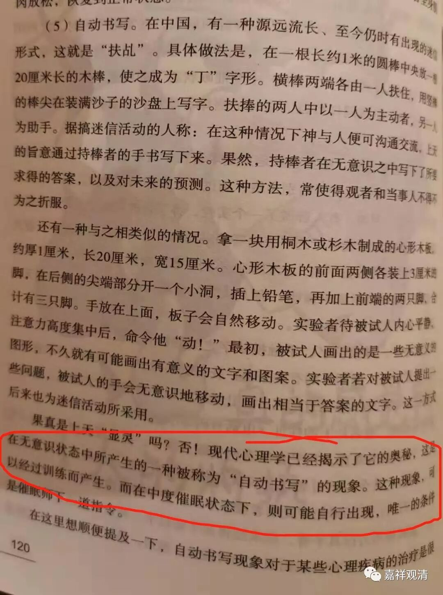

**催眠大师**

最近继续学习心理学。

这次有一门新课——《催眠术》。

其实我在高中就看过几本关于催眠术的书了，大学里面基本上把学校图书馆的阿德勒、荣格都看完了，还修了两门心理学的课程……有个精神病院的老师还专门给我们表演了催眠术——他把某师大学生会副主席（女生）催眠后锁定全身关节，变成了一块木板，然后把她头脚架在两张桌子边缘，对我们说“你们班谁最胖？出来，站上去”。后来我们班G胖站出来还是把老师吓到了（应该是胖的程度超出了老师的想象，哈哈哈哈……），最后只让他用尽全力双手压“那块木板”。“学生会木板”非常坚硬，腰完全没有塌下去的意思……

课上还有两个例子让我记忆很深。，其中一个是他的亲身经历。离现在二十多年前了，美国一位顶尖的催眠大师来做讲座，他去翻译的，然后大牛在礼堂讲台上说“我给你催眠吧”。老师说：“你在我身上不可能催眠成功！”大牛不信，结果真的大牛极罕见地失败了，我们老师没有被催眠成功！老师给我们“揭秘”说：他忘了，** 英语不是我的母语**！

后来我在讲《集论》的时候曾经给在场的两位法师试着用催眠的语言催眠“五遍行”和“五别境”——我放慢语速，用赵忠祥版的声音、音调柔和地念了两遍，然后说了两遍“你们都记住了、忘不了了”……第二天来上课，在没有复习的情况下，她们都背出来了。

昨天看到教科书《催眠术》里对“扶乩”的一段解释。

说起来，我并不完全按否认某些“扶乩”的事例可以用“催眠理论”解释，但我不认为全部扶乩可以被“催眠”解释，至少不能完美解释。我认为：1、比如说书写出被试者“未知的过去”的扶乩案例，这暂时无法完美解释；2、“催眠”本身也来源于欧洲民间宗教，“扶乩”之用“催眠”来解释，不过是从大仙换成洋巫师而已，背后的原理仍旧是未知。

其实，对一些“未知”，我们不妨心态开放一些，承认“未知”好了。（当然，另说回来，催眠大师必须对自己的能力和理论有极其强大的自信，这能增加他的催眠成功率。）

PS：等老衲学完催眠术，有谁愿意报名做实验者的吗？我们先催眠一本《百法》如何？之后我们还能试试能不能催眠出禅定……

说不定将来会有一个“大乘催眠学派”哦（哈哈哈哈）

