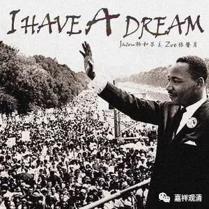

**《善说精髓》053（下）**

** “（癸二）异熟用：**

** 寿积善形众归仰，”**

** **

这些异熟果——这八个异熟功德有什么用呢？

如果你是正统信佛的，那么你活得长一点，你做好事就可以多一点。如果你不信佛，那还是短寿一点比较好，坏事可以少做一点。** “寿积善”**，寿量的好处是什么呢？就是积累这些善根。

** “形众归仰”**，长得比较好看一点呢，大家就比较愿意去听他的话。如果眼睛长得像黄豆一样，小得一点点，脸就像斜鞋棒子一样，像赵本山那样的话，大众不太容易生起归仰心，出去都不好意思跟人说。如果师父长得好一点，和师父的合影照可以随便发。师父长得难看一点，不发了，发了太丢人。人家会问这是谁的师父，不好意思说啊。

** “族贵遵教自在摄，”**

** **

** “族贵”**是什么呢？如果他的身份比较高贵的话，他说的话大家相对来说就会容易听一点。

** “遵教”**，大家会遵从他的教导，相当于他的身份在给他备书了，这个肯定是有道理的。

** “自在摄”**，事情比较容易，各种** “自在”**，容易摄受大众。

** “言肃四摄因势大，”**

** **

** “言肃”**，语言威肃是“布施、爱语、利行、同事”这“** 四摄**”的“** 因**”。

（我做过一个梦I have had a dream，梦里听到谁谁讲经，内容基本都忘了，只记得说到四摄，说：“四摄法就是谈恋爱的过程……”，觉得非常有道理，醒了也没忘……）

** **

** “势大”**，势力大的好处是——

** “为报恩故受劝教，”**

** **

也是大家听他的话的意思吗？这个势力大，可能是他经常替人出头做好事吧？做了很多的慈善，大家也比较容易听他的话。

** “男根智广无嫌碍，”**

** **

呵呵，男人的智慧比较广大。** “无嫌碍”**，他的界限、障碍就比较小。确实，我们从总的方面来说——不是全部，是从总的方面来说，气量小的人还是有点偏狭，有些事情就想不到、做不到。

** “具力勇健速发通，”**

** **

** “具力”**，比较勇悍、精进。** “速发通”**的意思就是，比较习惯精进于禅定，不停止修行，很容易生起禅定、引发神通。

** “（癸三）异熟因：”**

** **

异熟的因，这是指这些殊胜的异熟功德，它们的因是什么。

