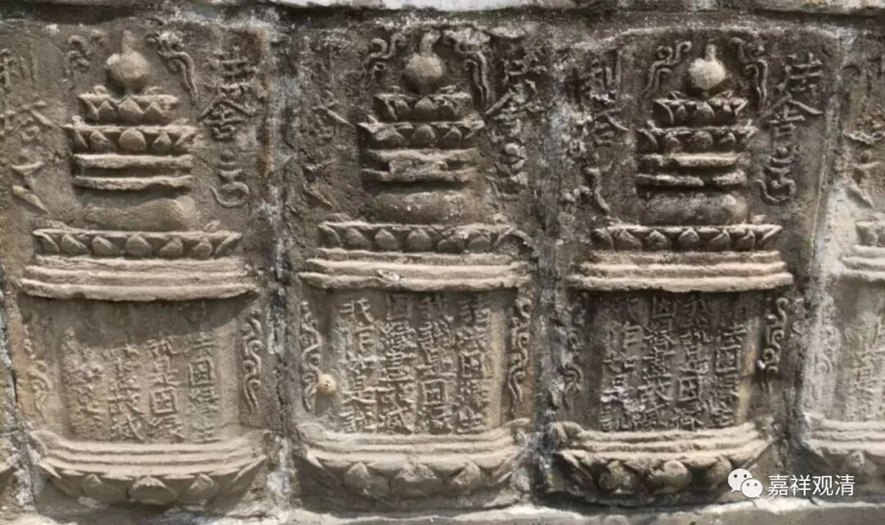
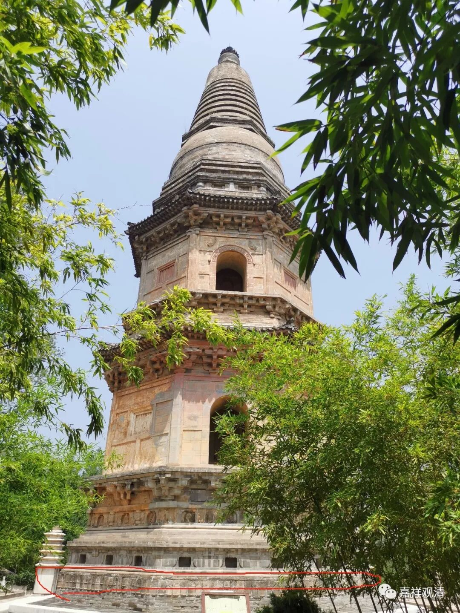

**《缘起赞》005**

龙树菩萨讲的缘起是最大的一个“缘起”的概念。以前的缘起的概念，就象《稻杆经》，里面的缘起就有两个，有“内缘起”和“外缘起”，“内缘起”就是十二缘起，有情世间的缘起（特别是胎生的人的缘起），就声闻乘的缘起来说，讲这些就够了，它只是针对个人的修行，对外界不去过多的考虑。在大乘还要讲，有了内缘起，还有外缘起，就是器世间的缘起，认为世间的所有法也都是有因有果，是依赖缘起建立的，

这个在早期并没有过多的发挥，但这个意思是完全成立的，必须是如此。在内缘起，声闻乘的教言主要讲杂染品的缘起，苦谛和集谛，至于清净品的缘起，声闻道当中基本上不怎么讲，比如说菩萨的十地，比如说阿罗汉的心境（“言语道断，心行处灭”就是《经集》里给的回答了）。

我们讲的法舍利《缘起偈》——“诸法因缘生，如来说是因；法灭亦如是， 是大沙门说。”声闻乘还是把它解释为杂染品的缘起。

（北京房山云居寺塔基的法舍利“缘起颂”：“诸法因缘生，我说是因缘；因缘尽故灭，我作如是说。”这里用“我说”，是如来自说的版本了。最早出现的、流行的是马胜比丘的复述版——“如来说”。常见的梵藏汉文本也是“如来说”。）

我们今天理解的缘起，还是龙树菩萨的缘起。但是在今天南传当中，“诸法因缘生”的这个诸法的法，指的是苦谛。“如来说是因”，“是”指这个，如来说它的因，烦恼和业，是集谛。“法灭亦如是”，法灭（杂染法的灭）也是这样的，这是灭谛；“是大沙门说”，这是道谛。

在南传的解释系统里，“诸法因缘生”，这个是苦谛，这个“诸法”是要灭掉的，是杂染品的缘起。龙树菩萨以后，把这个“缘起”的内容，扩展了，他同样说“诸法因缘生”，却指向了一切诸法、一切事物。应该说声闻的经典包含了这个意思，但声闻的经典并没有在这方面更多地进行展开。

