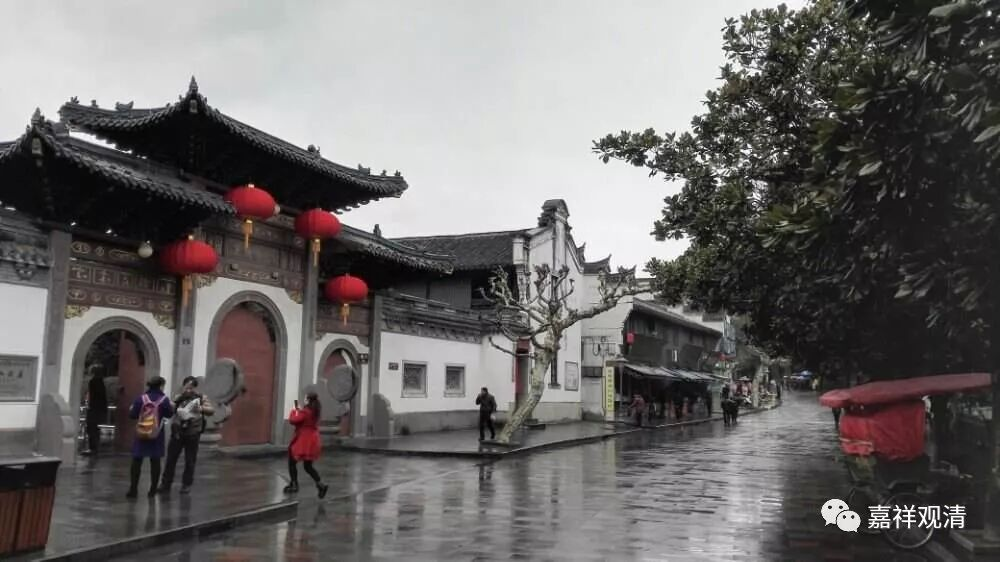
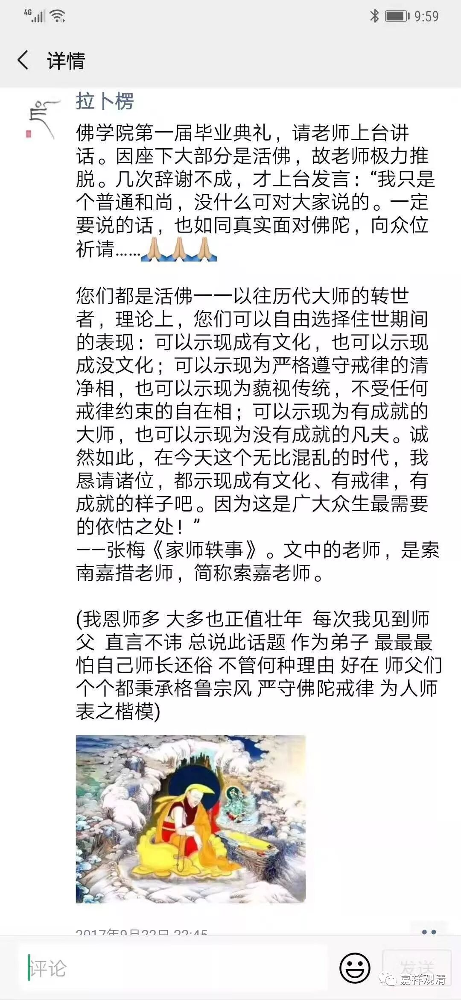

**《善说精髓》054（下）**

** “思已进止之理**

** **

** （壬三）思已进止之理。”**

** **

就是观察这些善恶的因果以后，知道哪些该做，哪些不该做。** “进”**就是应该做，** “止”**就是不该做——江波的文字也不错哦。有些地方也有用“进退”的。

** “分二：（癸一）总示；（癸二）特以四力净治之理。**

** （癸一）总示：**

** 黑白业果应知修，”**

** **

黑白业果，应该知道的和应该修习的。

** “于此未得真定解，修空性时舍业果，任修不得佛喜见。”**

** **

如果对黑白业果没有获得定解的话，那就是走错路了。很多人就会说修空性时因果不重要，或者说最后是没有因果的——这就完全南辕北辙了。

中国汉传的禅宗当中不是有一个公案吗？因为回答错了一个问题，五百生堕野狐身，我们称为“野狐禅”。问题就是：“大修行人不落因果也无？”大修行人到底落不落因果呢？结果那个和尚回答错了，他说是不落因果，然后就五百世堕野狐身。

大修行人不是不落因果，正确的答案应该是“不昧因果”。“昧”就是不清楚的意思，“不昧”就是清清楚楚。因果是明明白白、清清楚楚的。善因——乐果，恶因——苦果，这是明明白白的。所以对空性越是了解，在因果方面就越是会注意。

如果一个人说自己有很大的功德，又是什么活佛，又是什么再来人等等，最后又没有特殊的示现，就像前两天在美国被人扇耳光的那种“活佛”，我觉得多半是有问题的。我是不能接受这类活佛的，实在是不能接受，一点都不能接受。有些人还很喜欢看他们的书，因为这些人的书好像写得还挺好的，但是嘴上一套做的又是另一套，惊世骇俗地“不惊人死不休”。那个某某仁波切，私生活非常非常“奔放”的那个，书还写得挺多，大家都很喜欢。但是通过他自己的传记来看，如果没有特殊原因的话，我觉得我不会接受。

我好像发过两次了，这是一个真实的事情（见张梅《家师轶事》），是发生在中国佛学院的故事。现在的中国佛学院专门有一个藏传佛教的班，学院里有一位老师是噶举派的，他的水平很好，但为人很低调，他本身不是活佛。有一届毕业的时候，就请这位老师来说两句，一开始他还不肯说，后来非要让他说，他就答应了。我听了他说的，非常感动，而且有点觉得自己心里也是这样想的，但他比我们说的好多了。

他说：“本来我是不想来讲话的，是大家一定要拉我上来讲。你们在座的各位都是活佛，都是再来人，都是佛菩萨的化身，那么，对你们来说，你们完全可以表现为学识渊博、智慧精深，也可以表现出各种方便行。你们可以表现为戒行清净，也可以故意表现一些很特殊的形象，还可以表现为在山林里面修行，或者好好地在寺院里面带徒弟，还可以表现为在城市里面乱窜。就你们来说，这些都是各种不同的化现。但是，就目前这个社会的所化机而言，就这些众生的背景而言，我还是更希望你们戒行谨严，还是更希望你们以更好更正面的形象示现，这个才是我们这个时代需要的。”

反过来看，他可能真实的意思就是想说：“你们不要表现为只知道在大城市里面乱晃，只知道把戒律扔在一边，经书等等也不学习，最后还跑到居士的床上去了——这些最好都不要在我们面前示现。”

但是，现在这些情况好像是越来越多了，难道是我们的根器越来越好了吗？还是这些所谓的“转世”根本就找错人了呢？这个是很麻烦的一件事情哦。所以有些事情讲起来，说实话挺没信心的。这个没信心的意思就是，我对这些人没信心。我认为这些人能够做出这些事情来，恐怕是不信佛的吧？恐怕是不信黑白业果的吧？

有些比较八卦的人就知道我在说什么，有些新人可能不知道我在说什么，但是大致也应该知道吧，因为现在负面的新闻太多了。多到什么程度呢？就是如果你看到这些所谓的“高僧大德”所做的事情呢，你会觉得现在是末法时代了。如果你看到密法这样流行呢，你会觉得大家都快成佛了。

这个为什么会有这样相背离的这种行为呢？很奇怪啊！其实道次第学得越多，或者是佛法学得越多，对因果应该是越相信，是越有把握的，对黑白业的取舍也应该更好。我们需要深信因果的榜样，不需要倒行逆施的榜样！

