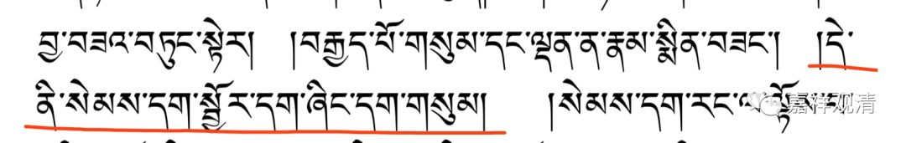
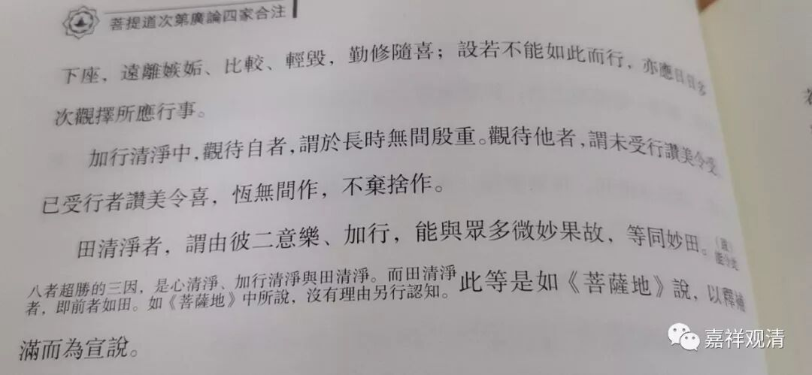

**《善说精髓》054（中）补**

** “八具三缘异熟妙：”**

** **

这“** 八**”异熟各当“** 具**”备“** 三**”个“** 缘**”，能获得殊“** 妙**”的“** 异熟**”果。

哪三个缘呢？前面说“增上缘”等，不是这样的，这里可能漏译了一句（也可能是版本的问题）。“** 此谓心、行、田清净”**，要加上这句。三个缘，就是：1、心清净；2、加行清净；以及3、田清净。

** “心清净中待自二，”**

** **

** “心清净中”**又分两方面，1、** “待自”**有** “二”；**2、待他有二

** **

** “修因众善回无上，”**

待自二中，第一，我们“** 修**”这些异熟果的“** 因**”位“** 众善**”时，不要只是单纯地为了那些异熟果而修集其因，而应该最终“** 回**”向“** 无上**”正等正觉。

** **

** “至心殷重办诸因，”**

** **

待自二中，第二，这个八异熟果是八类异熟身具备的殊胜的果，我们为了要获得这八异熟果呢，就要“** 至心**”努力很“** 殷重”**地去成“** 办”**这些“** 因”**。

** “随喜同法离竞争，不逮、日观所应行，此是待他之两种；”**

** “待他之两种”，**为：1、** “随喜同法”**者，** “远离竞争”、**嫉妒、比较、轻慢、毁谤；2、若于此而“** 不逮”，**那么应该日** “日”**多次“** 观”**择** “所应行”**事——如果做不到，就要经常想想自己该干什么。

** “加行待自待他二：”**

** **

** “加行”**清净中也分** “二”**：1、** “待自”**；2、** “待他”。**

** **

** “前久猛利无间断；”**

** **

1、待自，即自己长** “久”、“猛利”、“无间断”**、殷重地修行；

** **

** “后未受行赞令受，已受赞美令欢喜，**

** 令无间作不弃舍；”**

** **

2、待他，即，“** 未受行赞令受”**，他人没有受持、奉行的，通过赞美而令对方受持正法；“** 已受赞美令欢喜**”，对于已经受持的人，则通过赞美令他更加欢喜，这样能“** 令”**他** “无间”**断地** “作”**持而** “不弃舍**”。

** **

** “田清净由心行二，予众果故等妙田。”**

** **

第三、“** 田清净**”。有“** 二**”，意乐“** 心**”和加“** 行**”。

前面说具备“三缘”能生“妙异熟”，三缘就是1、心清净；2、加行清净；3、田清净。这里说到“田清净”时，其内容就是前二者——“心清净”和“加行清净”，因为他们能“** 予众果故”，“等”**同于能生妙果的殊胜** “妙田**”，所以叫“田清净”。

这一段异熟果的三缘部分，可以参考嘉祥版《广论四家合注》P201-202。

