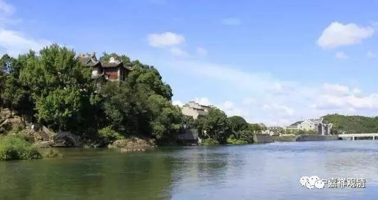
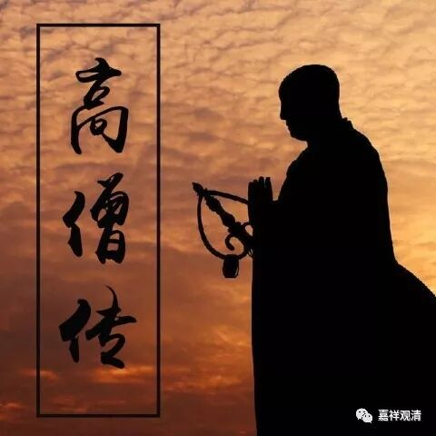

**《善说精髓》讲记055（上）**

对于我们今天来说，还有一个很麻烦的事情就是：假如你之前选择师父的时候没选择好，师父出现这种问题的话，你就根本不觉得这个方面有问题，你自己也会这么做的——非常麻烦！

还有一个问题，是我一直在想的，也是我一直没想明白的，甚至前两天我也讲过的：“我们到底应该走精英路线呢，还是应该走大众路线呢？我们到底应该是像顺子那样唱大家都唱不出来的歌呢，还是应该唱那种“左三圈，右三圈”的歌曲呢？现在整体的情况是非常糟糕的，恐怕我们还是应该先把一些精英层面恢复起来，再看看能够对周围影响多少。

我现在也可以装“老人”了，是吧？到西藏也去过很多次了，但是，可以说越来越有点心寒啊。早期还好一点，那批现在八九十岁、七八十岁的老先生们大量都还健在的时候，很多事情还压得住。现在呢，这个时代过去了，老先生们越来越少，那些老师父们都不在了，基本上下面的人都已经压不住了。同时，外面的诱惑又太多。现在的寺院，包括藏地的寺院都是这样，和尚越来越少。然后为了让和尚多一点呢，就开始良莠不分地全都收进来再说。收进来之后呢，又不敢管教，情况就越来越糟糕！有个别地方，已经非常非常地糟糕。

太虚大师的《整理僧伽制度论》当中曾经提到过和尚数量的问题，当时应该也有几十万和尚吧，至少三五十万是没问题的。而现在中国大概有十几万和尚，真的假的加起来，三十万应该是有的。太虚大师就说，我们中国有一万个好和尚就足够了，一个省市不需要那么多寺院，有一两个大寺院就够了。如果是真正在那里好好学习的，不需要那么多。我们就算中国有四十个省好了，如果总共一万个和尚的话，一个省多少和尚？才两百多个？哈哈，那太少了……

我们如果从精英的角度来看，数量肯定没有到一万，现在出家人精英的数量肯定没达到一万。一千呢？恐怕也没到。五百？那要看下面的人有没有成长。我觉得今天能够在中国佛教界称得上精英的，应该是两百以内。说实话，两百以内这个数字还属于比较乐观的。会不会五十以内呢？这也太少了！还是两百以内吧。有机会被《和谐高僧传》初选的应该不会超过这个数字，而且最近那些老先生们都纷纷过世以后，下面就有点压不住了。师父还是要凶一点的，是吧？唉，我们这个时代……

