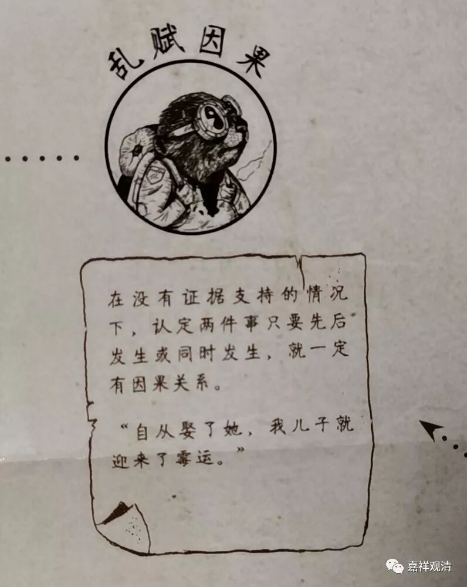

**《善说精髓》056（中）**

** “又如《谛者品》中云﹕”**

** **

这个** “《谛者品》”**是《大宝积经》当中的，《大宝积经•迦叶品》。

** “大王汝莫为杀生，”**

** **

国王啊，你不要去杀生。

** “一切众生极爱命，”**

** **

众生都是爱命的，都不想死，是吧？

** “由是欲护长寿命，意中永莫思杀生。”**

** **

如果你自己想长寿的话，那你不要去杀生。

** “如是十不善业等，起心动念亦应遮。”**

** **

十不善业方面，最好连想都别想。

这个** “遮”**是什么意思呢？你要是连起心动念都没有，那太难了。如果能够做到这样，很随喜。有一种说法就是起心动念以后马上就把它克制住；或者是根本不起心动念——这个很难做到。一般来说，有恶的或者不好的心念起来以后，你不要再追着它去走，不要反复跟着那个念头想下去，把这个事情再去放大。这样的话我们还是可以做得到的。再不行呢，就每天下午忏悔忏悔，或者每天晚上临睡之前忏悔忏悔。那么，最好就是起心动念都能够遮除，或者呢，在它生起来以后不要追，至少不要追得太远。

** “极不现事甚微细，”**

** **

什么因会得到什么果之类的** “极不现事”甚微细，**以我们的智慧呢，实际上是没办法真正知道的，至少以目前的情况来说是没有办法知道的。你要有神通的话——有其他能力也可以，大概基于我们所不知道的神通的特殊的原理可以知道一些特殊的因果。但是以我们现在的这个能力，大概是不知道的。有些情况在我们看来觉得是因果关系，实际上只是条件之一，可能都不见得是主要条件。

所以我们经常犯“归因错误”，逻辑里面叫“乱赋因果”，就是在没有确定证据支持的情况下，认定先后发生的两件事有因果关系，比如：“自从我买了这个房子，家里就开始走霉运。”“我一穿这件衣服，就能拿冠军！”事实上，大部分流传于佛教徒圈子里的所谓“因因果果”，全都是这类心血来潮式的“乱赋因果！”

