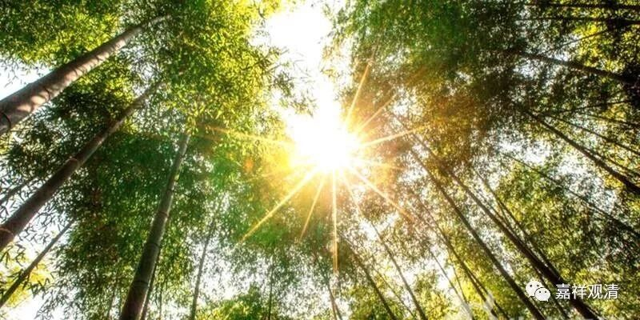

**《善说精髓》057（二）

**
**

** “复堕恶趣际恶故，”**

** **

如果你自己的心没控制好，在人天当中又去做坏事了，然后又堕恶趣了。所以单纯的人天安乐不能保信。

有的地方说五乘佛法，有“人天乘”，其实这不是一个具格的概念。“乘”是车乘，有运载的目的地，但单纯“人天”显然还不具备车乘（去彼岸）的能力——他还没有和解脱相应！

** “应修共中之意乐。”**

** **

所以我们应该这样想：“怎么能够保证以后一直不堕恶趣呢？这个（在轮回中上上下下反反复复）实在是太麻烦了。”但是从整体来说，轮回本身就是这样的，数数上下，有这样的过患，所以我们要厌离轮回。所以呢，应该继续，发起解脱的意乐。

** “脱轮回缚名解脱，”**

** **

要对整个的生死、整个的轮回、整个的三界，都有这样的厌离心，要** “解脱”**。很多人听不懂** “解脱”**是什么意思。** “解”**就是解开，** “脱”**就是脱离。就好比待会儿某师去把绳子一解，然后小狗多杰就解脱了，就是free——自由了，是吧？现在有把英文翻译成free的，有些人一看free就明白了，但是看** “解脱”**两个字却不懂——那是汉文太差的缘故。

** “求解脱心求获此。”**

** **

我们要求解脱的心，就要获得这个中士道次第的修心。

** “思苦谛轮回过患**

** （庚二）发此心之方便。”**

** **

那应该怎么做呢？要继续思维，继续修行。发求解脱心的“套路”是什么呢？

** “分二：（辛一）思苦谛轮回过患；（辛二）思集轮回流转次第。**

** （辛一）思苦谛轮回过患。**

** 分二：（壬一）显示四谛先说苦谛之意趣；（壬二）正修苦。”**

** **

下士道是修归依、修业果，中士道是修四谛，其实就是修佛陀主要讲的解脱法——在《阿含经》当中叫生天法（人天善法、增上生），之后就叫解脱法（出离法），是吧？解脱法就是四谛啊、十二缘起啊等等。这些都是相关联的，就放在这里一起学习。如果讲得少的地方就讲四谛，如果要多讲一点的话，就把十二缘起一起讲。

