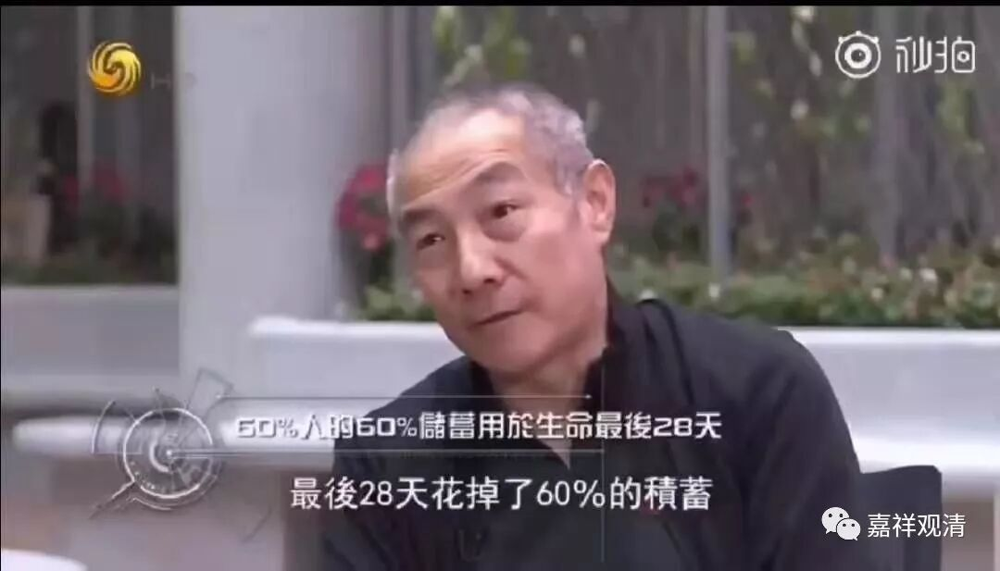

**《善说精髓》060（三）**

第三，病苦。病苦我们都经历过，一辈子不生病的人实在太少了，我都不敢说有部生病的人。连马云这些人都要生病，头发都快剃光了。

** “(丑三)：**

** 如是思惟五病苦：”**

** **

病苦也是五个。

** “身变心忧苦增长，”**

** **

** 一、“身变”**，身体也不灵活了，甚至被绑着；体质越来越差、皮肤越来越差、肌肉、骨骼、消化、吸收，无一不在衰减。

** 二、“心忧苦增长”**，因为身体的变化，，心里也产生痛苦、忧恼。比如心里担忧：“自己会不会死？他们还会不会理我？”甚至有些疾病还不那么雅兴——身上跳蚤多：“他们最近不理我了，是不是因为我身上跳蚤多啊？”

今天身心医学说，心理不健康也是病，并且这样的比例还很高，但社会和人群还没完全接受心理病是和身体疾病一样的常见。就身体的疾病而言，心理的疾病、亚健康还远远没被大家适当的关注……但是它存在。

** “不能受用悦意境，”**

** **

三、“** 不能受用悦意境**”，就比如说刚才所讲的，你以前喜欢的，在你生病的时候都不能吃了，是吧？湿气太重，明明喜欢吃芒果的也不能吃。医生经常说：糖尿病要忌口、痛风要忌口、肾病要忌口……等等等等，乃至过敏要忌口——这些需要忌口的怎么喜欢吃的啊！？唉，可怜！

** “强受非爱”**

四、** “强受非爱”——**和上面相反，现在是必须“受用非悦意境”。不喜欢的呢，非要你吃，非要你受。比如说打针，谁都不喜欢。“我不喜欢打针的啊！不要找我啊！”** “强受非爱”**，你不喜欢打针，却还要被打。连成龙都怕打针……苦的药，必须吃。乃至明知有很大副作用的药，也硬着头皮得用下去……乃至开刀、截肢……

所以病人和家属看到医生是又爱又恨，爱的是他可以解决你的病，恨的是几乎没有舒服的事情。其实病还不是自找的，又不是医生打断你的腿，是你自己摔的。有些人找不到因，腿接不上，把医生打了——颠倒！** “强受非爱”**是病苦必然带来的。

** “将离命。”**

** **

** 五、“将离命”**，病重了以后，命不久长。最新统计，60%的人60%的积蓄用于最后28天。什么意思？就是花了大把的钱（好不容易存下来的）治病，但终究难逃无常。

这就是病苦。

