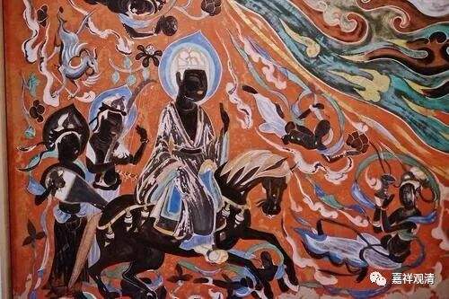
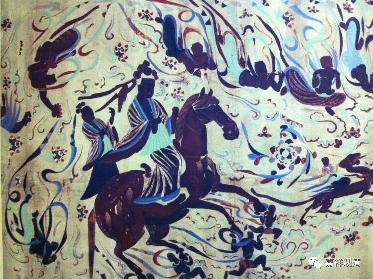

**《善说精髓》060（四）**

第四，死苦。

** “（丑四）：**

** 死苦亦有五种相：”**

** **

本来单纯的死，就一刹那，这个“死苦”是指死的过程。

** “舍离身财与亲朋，”**

** **

一、舍离圆满可爱身体；

二、舍离圆满可爱财位；

三、舍离圆满可爱亲戚；

四、舍离圆满可爱朋友；

你的身体、长时间所蓄积的财物，全都不想舍也得舍。** “与亲朋”**，亲朋好友也要舍去的。你花了一辈子的时间，好不容易交了这些朋友，只需要一刹那就没了，跟你没关系了。

我们多想想，就会发现，我们一辈子努力辛辛苦苦去换来的，不过是这些财物、身体、友伴、亲朋，多少善善恶恶无不因此，但是无常到来，一个也带不走……

** “领受猛利忧苦理，”**

** **

五、死时因为要和这些可爱之物分离，心中不免** “领受猛利忧苦”。**

** **

你跟你自己喜爱的东西分离的时候，自己各种痛苦啊！** “猛利”**的** “忧苦”**。

** “当善思惟令意厌。”**

** **

应该思惟这个死苦，知道令心眼里这个苦海。你看佛陀，那个时候之所以有佛教，就是他最初思惟死苦嘛。看一看周围：有老病死苦，每个人都要死。怎么办呢？这个事情能不能解决呢？然后就出离了，出家了。

佛陀那个时候很厉害啊！已经二十九岁了，还有这么强的叛逆精神。一般都是十五六岁离家出走的，他二十九岁才离家出走。（“无乃太晚乎？”）看来不是任性、怄气！嗯，好像我也差不多是这个年龄离家出走——29岁出家。不过他结过婚，我没结过婚。（说不定他就是觉得：“啊？又给我生了一个儿子，累不累啊？”他有几个儿子，压力太大了。中年危机……哈哈哈哈）

哲学也好，宗教也好，很多地方都是一样的，首先要考虑死的问题。怎么考虑死的问题呢？道教他考虑的是：能不能长生不老？而佛教则考虑：既然死的原因是有生，那能不能不生……这两个思路真的是完全不一样啊。

 