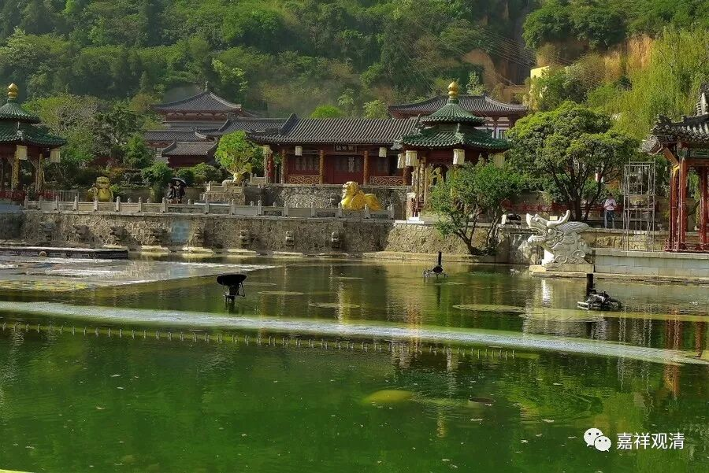

**《缘起赞》018**

** 引至无性门，  缘起为无上，**

** 若即于此名，  执为自性有，**

** 则导此众生，  至圣众正路，**

** 及佛所喜道，  有何妙方便？**

** **

把一切众生“引至”诸法“无自性”的“门”口的最好的方法是通过“缘起”来了解。

如果对缘起反而执为自性有，那你要把众生引导到解脱之路上，你还有什么方法呢？

只有证悟（通达、认知）中观应成派所讲的空性，才能证圣果。离开这个办法是没有办法证圣果的。证圣果的方法也只有通达自性空。通达自性空也只有通过缘起的方法来解决。现在你只承认“缘起”却不承认自性空，那现在我来问你，怎么怎么把众生带到解脱的路上去呢?佛所喜道，指最终的涅槃，大乘的解脱。

对于佛教的其余宗派而言，缘起是承认的，但，承认“缘起”的力度和中观应成不同，所以，实际在中观应成师的眼里看来，其余宗派所许的“缘起”仅仅是粗分的缘起，乃至大乘中观自续派所许的“缘起”，都要在世俗上成立一个“自性有”的“缘起”，这在应成看来，都是没有究竟通达“缘起”——不论是“独立实有”、“依他起性、圆成实性实有”、“世俗自性有”，都离“唯名言有”有一定的距离。从这个角度来说，其余宗派最终不能通达无自性，也是因为他们没有最终通达“缘起义”！当然，少分的缘起义、或者说粗分的缘起义他们也是了解的。

所以，有人认为自己承认了“事物依缘而起”，“事物都依靠条件而建立”，以为这就是通达了“缘起”，实际这只是“缘起义”的入门罢了（同样的，认可了“无常”和“通达空”之间，还有很长的路要走）……

