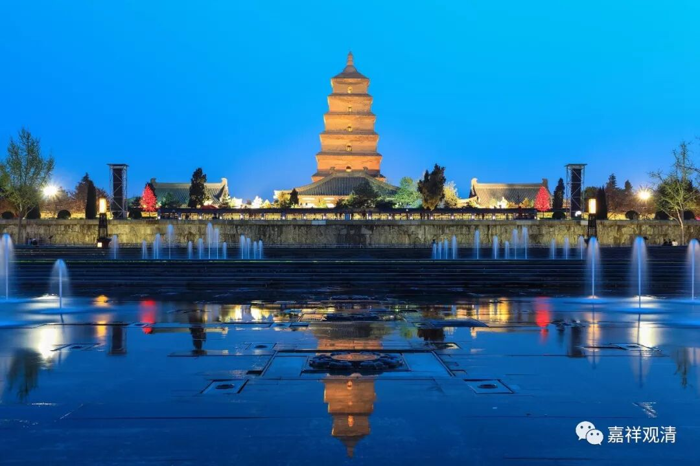

**《善说精髓》065（中）**

** “容有转改有二说。”**

** “容有转改”，**中有可能有转变、改变** ——“有二说”，**有些地方说可以转，有些地方说不能转。

这句话是什么意思呢？中有的时间长度，（有说）最多不是有49天嘛？在这49天当中，比如本来是要去地狱道的，能不能改去天道呢？** “容有转改”**，就是有可能可以改，有一定的比例可以转、改。但也有说不能改的，也有说能改的，所以说“** 有二说**”。但是一般说能改的是《集论》《杂集论》的说法，接受度要超过说不能改的。（不能改的话，超度业务就不能开展了嘛。哈哈哈哈……这是开玩笑哦，大家千万不要当真了。）

但是大乘是说有** “转改”**的可能，所以这个时候（去世四十九天以内），有认识活佛、认识大德的、和那个清净僧团比较熟络的，赶快请他们超度，一定要请他超度，是可以改的。

那么，这里还有一个说法：在中阴（中有）的这段时间里，每七天还有一次“重生”的机会。七天、七天会变一下，如果生缘还没到的话。

** “同类中有净天眼，”**

** **

“** 同类中有**”间是可以看到的，老实说这个“** 同类**”我也没有完全搞清楚，什么叫“同类”？是畜生道都能互相看得见呢，还是大象互相都能看得见呢？这就是泛泛的一说。到底哪种算“** 同类**”？是哺乳动物互相都能看得见还是其他什么？就是泛泛的“** 同类**”的中有互相可以看得见。

还有一种就是** “净天眼”**看得见，简单来说就是，有神通的、清净的天眼能够看见。

** “能见中有见生处。”**

** **

** “能**”够看** “见中有”**，能够“** 见生处**”看见他投生的道。

** “作善造罪二中有，分別如光黑暗夜。”**

** **

做善比较多的众生，他的中有是光明的。做恶比较多的众生，中有是比较黑暗的。（为什么呢？我不知道。标准答案可能是“法尔如是”——就这样的！）

** “如同焦杌烟水金，地狱旁生鬼欲天，”**

** **

这个很奇怪哦，居然光会跟我们世间上的等级有关，就像炭、像烟、像水、像金一样，分别对应什么呢？地狱、旁生、鬼、欲界天。我们人呢？人没有？

** “色界色白《入胎》说。”**

** **

这个《入胎经》不知道是从哪部经中来的。

** “生无色界无中有。”**

** **

无色界没有色，中有要是有色的话，无色界就没有中有。也有说地狱没有中有，但是正常的经典当中没有这种说法。去地狱的话，地狱是在欲界的，它有色，有物质，会有下一世的本有的形状，那么应该是有中有的。只是他的速度比较坏，因为做的坏事太多，死了就直接投到地狱去了，并不是说地狱没有中有。（我们平时听到的很多理论实际上根本和佛教无关，不知道那些糊涂虫用什么脑子想出来的，按照某某法师的说法，他们都是从屁股里想出来的，都不看书嘛！今天还看到一个法师说“畜生只有无记业”，呵呵，让我们惊讶于他的“无知地大胆”！）

L-O-O-K！

