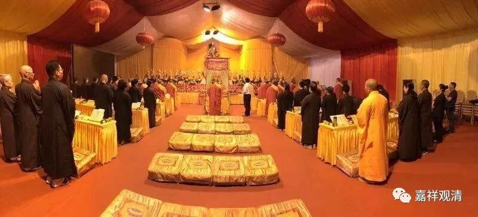
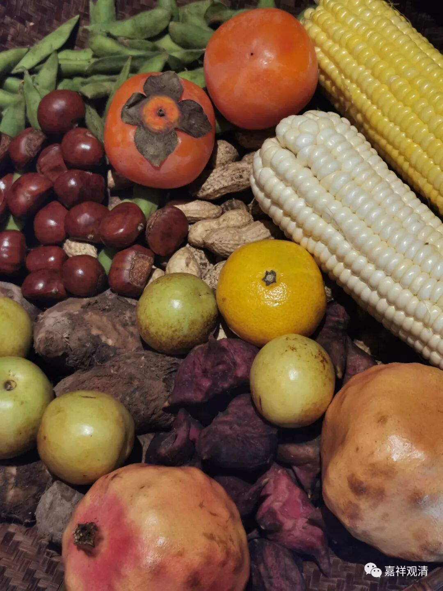
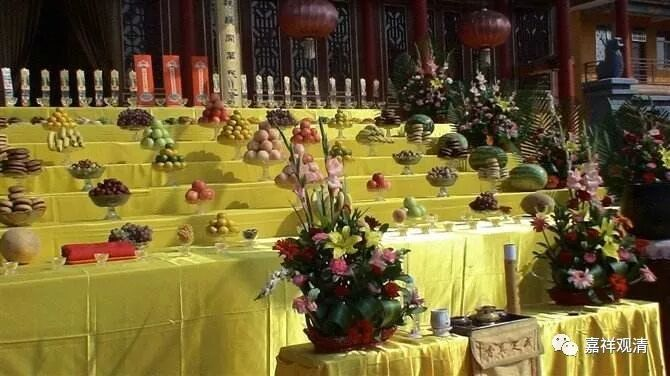
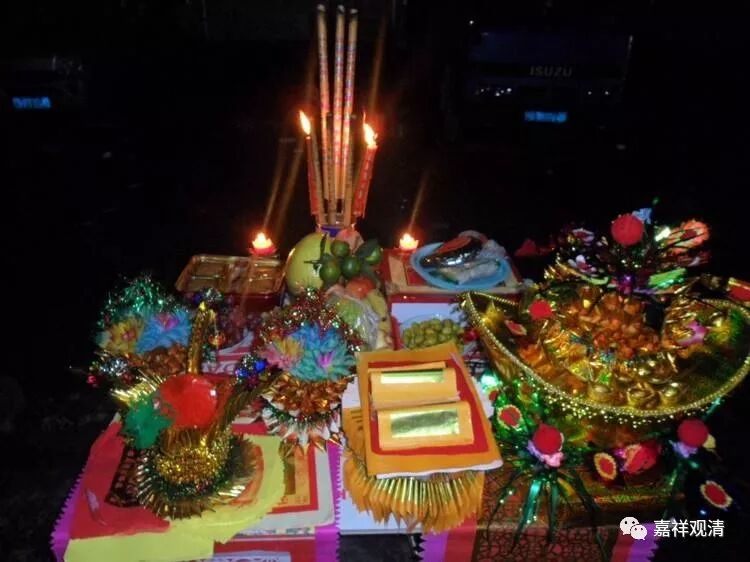
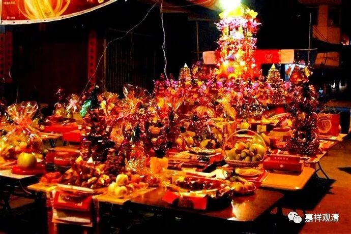
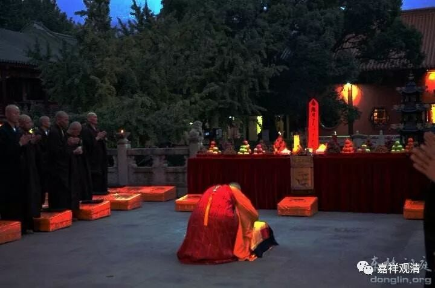

**中秋节，谈谈民俗和佛教拜月的“传统”**

八月十五中秋节，汉地很多寺院会在这天晚上拜月斋天，赶上这个日子，不妨借这个地方聊聊佛教走向大众的“传统”。

说起来，中秋节，本来并非佛教自身的节日，但八月十五却和佛教有很深的关联性。若正依五月十五安居，则八月十五正当安居最末，正是佛教的除夕——解夏之日。即使按汉地后来四月十五安居，那么五月十五算后安居，后安居解夏也是八月十五。所以本来这一天在佛家也是可以隆重的。

中秋节本身是标准的中国传统节日，佛教走入大众，统合了这一民俗，而有了今天的斋天拜月，仔细观察的话可以发现，寺院斋天拜月的内容里面，大量地保留了中国本地民俗的内容。比如供果，江浙一带常见的供果是：石榴、红枣、花生、菱角、芋艿、毛豆、玉米、柿子、板栗、月饼……这些一方面是时令果蔬，一方面也有一些民俗象征意义：多子多福、长寿健康、事事如意。所以这些果蔬的选择还是有一定的选择的，比如你基本看不到供上土豆、红薯、油菜这些，因为这些不具备象征意义。

民间的信仰层面，自下而上，不很精确的层级划分大约是这样的：民俗——民间信仰——民间宗教——民间化的正统宗教——宗教（这里主要指佛、道教，其他宗教的中国化还没有完成。若再细分，站在民间传统的角度，大家看佛教要略胜道教）。在这个角度看，中秋斋天拜月，是佛教直接和民俗结合的产物，拜月，应该还不算“民间信仰”或者“民间宗教”。

民俗的中秋节，主要有团圆的意思，还结合了嫦娥奔月的传说，而嫦娥是偷吃了长生不老的仙药的。把民俗和佛教结合，佛教派出的是哪一位呢？药师佛！因为：1、他暗含长寿的意思是和中秋的纪念意义合拍的。2、好巧不巧，药师佛身边有个月光菩萨，正点了“月亮”的题。中秋节“月光遍照”，而玄奘法师正翻译为“月光遍照”菩萨，这简直是送上门的点题啊！（此“月光遍照”和中秋的月光遍照真的有关吗？大家认为有关就行！）到了明清之际，可以明确找到文献记载的是在清初，丛林里还编出了相应的仪轨，丰富了很多内容（包括曲调），有很多是佛教（内容）、非佛教的（南曲的调），还出现了并没在经论被提及、却被大家熟悉的“香云盖菩萨”——明清之际的基层“佛教”还编出了很多这样的“菩萨”。

派出了药师佛和月光遍照菩萨，整合中秋的民俗，给予组织化和仪式化，就形成了今天流传下来的佛教中秋斋天拜月传统。民间喜其仪式感的增强，佛教得益在走向大众……

这是说的佛教和民俗的结合，下次我们还可以聊聊佛教和官方信仰的融合。官方推动的信仰，比如——张巡、南霁云……

中秋的话题，应个景而说几句。至于佛教和民间信仰、民间宗教、民俗、官方信仰的融合，有空的时候我们可以找点现实的例子，给大家掰扯掰扯。

