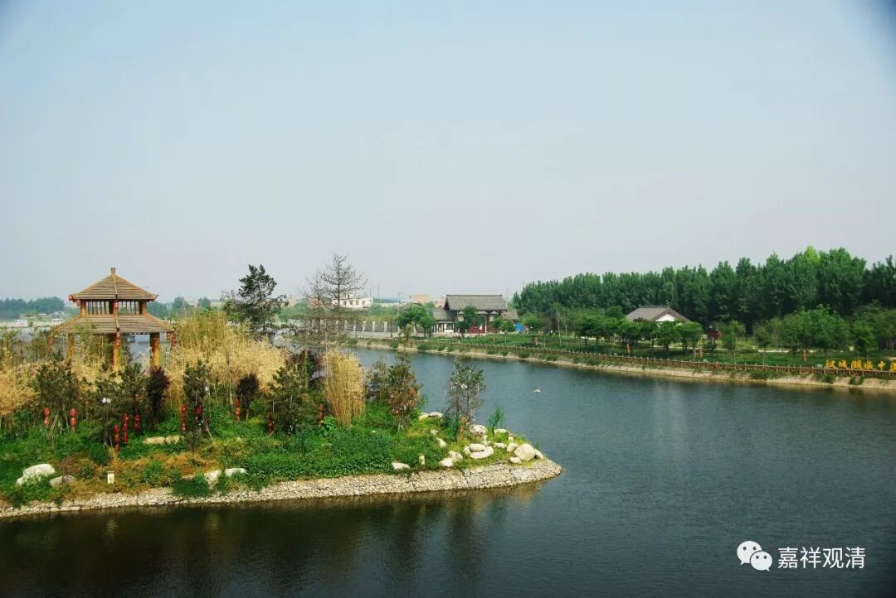

**《善说精髓》066（下）**

** “此时入识有二说，”**

** **

现在讲这个** “入识”**有两种说法，承认八识的就说是阿赖耶识，不承认八识的就说是意识。

** “有许彼为阿赖耶，有不许为阿赖耶，则许结生乃意识。”**

** **

就是这两种说法。

** “若于生处不欲往，定不于彼受生故，”**

** **

简单来说就是：如果你跟他们（父母）没有缘的话，你肯定不会去投生的。就是必须有缘才会去的。

前几年不是有外国人跟父母打官司吗？“我根本没想来，是你们把我拉过来的，你们要赔我。”按照佛教的原理来讲，父母应该回：“如果你不想来，你是不会来的。你还耽误了我们俩的快乐生活呢，应该你赔我们才是！”

所以呢，肯定是你喜欢去的，这里面有相应的结生的因缘。

** “感生地狱屠夫等，见所杀习乐趣彼，”**

** **

三恶道没人想去（特殊情况除外，前面谈到过了），但你怎么会去的呢？比如说，这辈子是屠夫，下辈子感生地狱的，就类似于他在死的当中有一些幻觉，感觉又是他很习惯的那种环境，他还想杀，然后就投生到地狱里面去了，相应的环境就出现了。** “乐趣”**的这个** “趣”**就是趋向的意思，不是高兴的意思，就是乐于趋向于那个地方。

** “次由恚彼生处色，”**

** **

这个** “恚”**，说起来是忿恨（我觉得还是兴奋的意思吧），对那个地方就比较有想法。这里的“** 生处色**”，就是那个投生的地方的周围环境。“** 恚彼生处色”，**看到那个地方不爽（兴奋？）。

** “中有遂灭生有起。”**

** **

这个时候** “中有”**就结束了，** “生有起”**，比如地狱等等的** “生有”**就** “起”**来了。

** “旁生饿鬼人欲天，及色界天于生处，见己同类欣往趣，”**

** **

其他的这些，在中阴当中可以见到自己同类的，看到相应的地方就喜欢去。

** “次嗔生处等如前。”**

** **

对于** “生处”**也产生了兴奋的心。这里面都是讲** “嗔”**，人天也不爽吗？还是用兴奋这个词比较好一点。

** “化生求宅湿生香，”**

** **

** “化生”**的原因说是喜欢到那里住着，那今天的宅男、宅女是不是都是化生啊？** “湿生香”**，** “湿生”**是求那个香。这个大家再自己看看哦，愿不愿意接受这种说法。

** “热狱求暖寒希凉，”**

** **

热地狱呢，就是你在死的时候，或者是在中有的时候，会觉得周围很凉，然后热一点也好，暖一点也好，就去了热地狱。如果寒地狱呢，也是你喜欢的，为什么呢？将投生到寒地狱的话，你就会觉得周围很热，你就想“能不能凉一点”，你有一个欲求的心，就趋向于那个地方了，就有生起的因缘。

** “卵同胎生《俱舍》说。”**

** **

卵生和胎生一样，这个是《俱舍》的说法。

这些都是套路，基本上各个地方讲的都是一样的。有时候有不一样的讲法呢，那肯定要么是非常大的大德，要么就是胡说八道。好像我们今天胡说八道的比较多。

