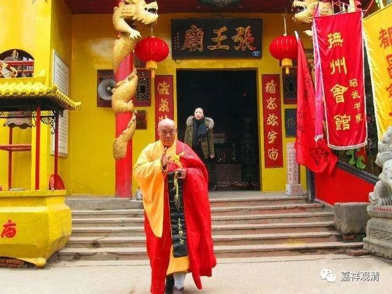

**张王庙与信仰活化石**

再聊聊鄱阳的张王庙

张王庙诸种种，算民俗，也有民间信仰、民间宗教和官方祭祀的成分在里面，又最终加入了佛教的形式……

首先，“张王”是谁呢？张巡！

熟悉历史的人会知道，安史之乱中，雎阳围城大战，张巡、许远、南霁云、雷万春等死守，城破尽亡。

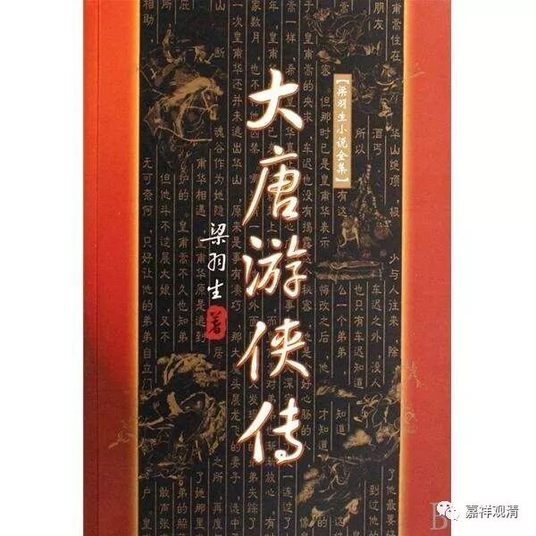

记得梁羽生有一部武侠小说，可能是《大唐游侠传》，就是以这个为背景展开的，当时在图书馆里读的那可是血脉喷张啊！

“精忠弥宇宙”

安史之乱后，唐肃宗追赠张巡为扬州大都督，配享春秋二祭。于是大江南北多建祠以祀之，今天各地还都有张王庙的地名或祠堂，很多都是那时候延续下来的。这里，祭祀张巡是皇家官方推动的忠孝表彰类的“信仰”。

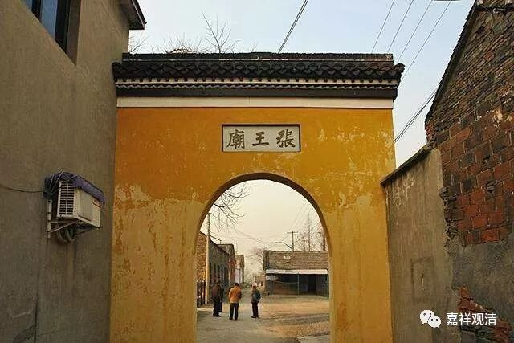

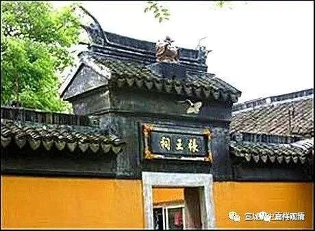

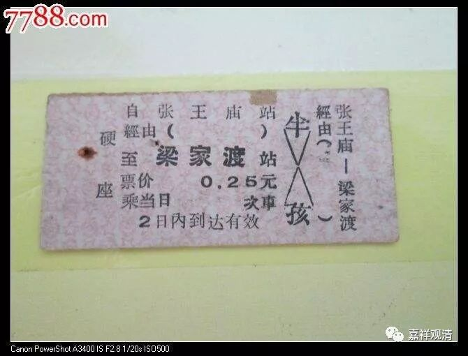

各地张王庙

安史之乱后，颜真卿出为饶州刺史，便在鄱阳祭祀张巡，估计最初应该仅是祠堂性质的。而鄱阳之侧便是鄱阳湖，于是，慢慢“扬州大都督”张巡变成了民间的“安澜王”“张王”，升格成类似鄱阳湖神性质，这是与民间信仰相结合了，又有了民间祭祀的合理性。

乃至当地某柳氏少女身故，死前说张王来娶……好事者便又为张巡娶了一房本地妻子，也安奉于祠堂之内。张王成了鄱阳的女婿！

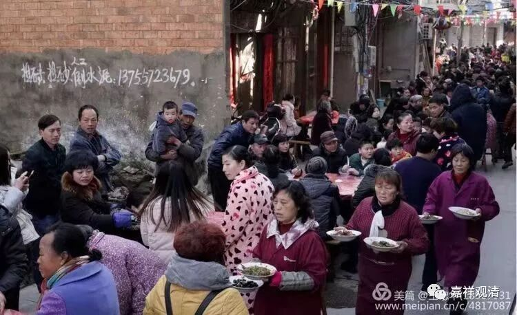

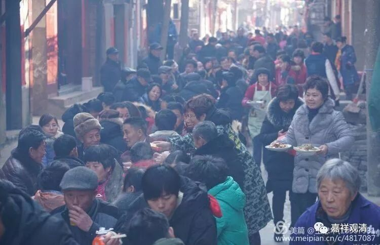

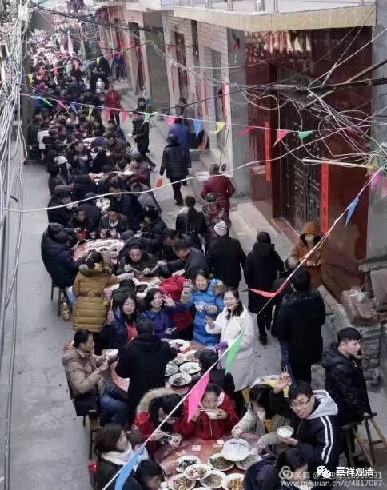

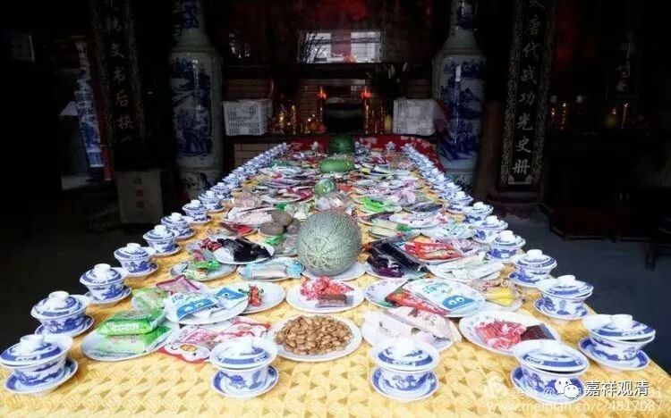

张王拜会丈母娘，宴开数里

时日渐久，终于来了和尚，塑了如来佛祖、菩萨金身，扩建房舍……张王庙又加入了佛教信仰，岁时“祭祀”不绝，每天香火不断……终于形成了今天的“非物质文化遗产”——包含了民俗、国家祭祀、名人效应、民间信仰、民间宗教、正统宗教在内的一个大的“嵌合体”，也确实当得起“活化石”一词了。

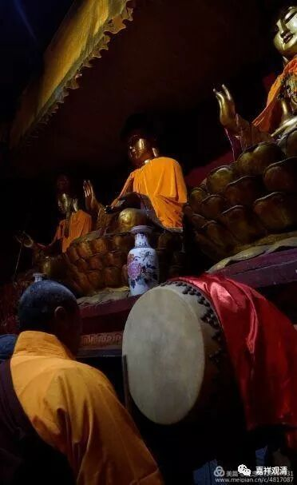

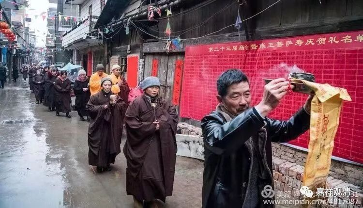

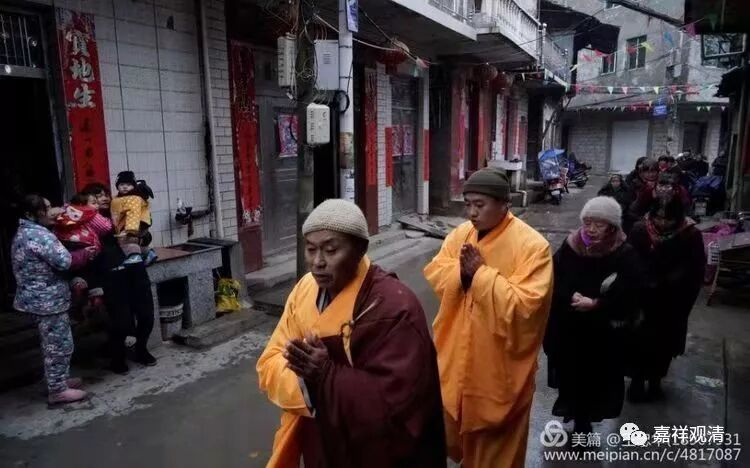

这就是活在民间的佛教。

（本文大量图片由鄱阳文史馆王忠华先生提供，谨表感谢！）