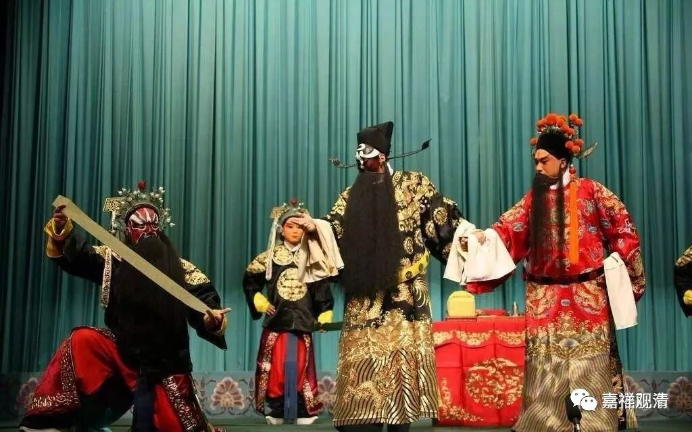

**戏曲承载的民俗、信仰**

流行在民间的信仰层面的，有时候，一个具体的“传统”很难明确给一个词，它有时候既非民俗，也还谈不上是民间信仰，到现在我还找不到一个很合适的词来表述它，也许用“类信仰的民间传统”或者“民间传统类信仰”？

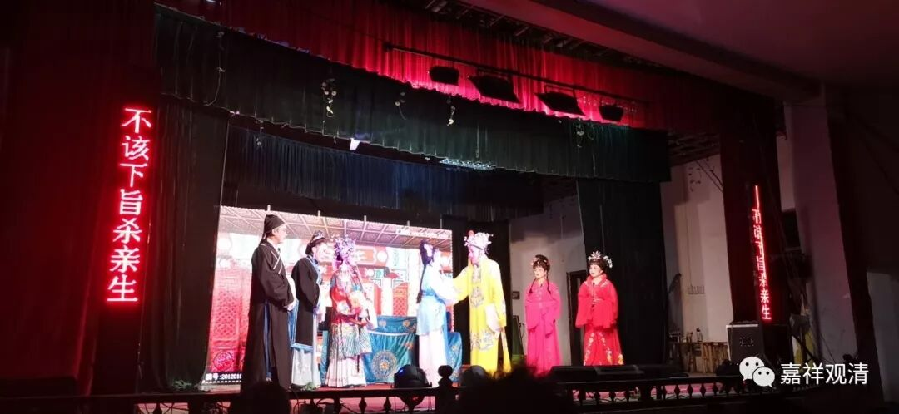

上次请了一个黄梅戏小戏班在村里演了一场《观音出世》，和团长、演员聊了几天，就听到很多“江湖趣事”……

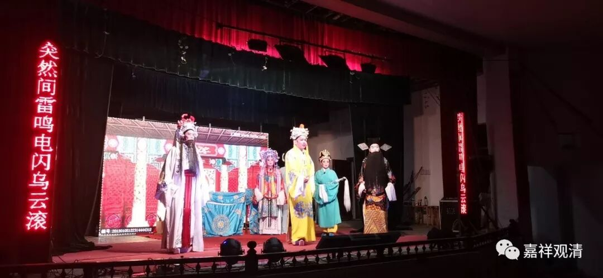

黄梅戏发源于湖北黄梅，成长于安徽，原先叫黄梅调，后来发展为中国的一个大的地方剧种（我跟他们聊起赣剧和婺剧，他们表示那是很小的地方剧种），这些黄梅戏的底层演员就曾游走于湖北、安徽、江苏、浙江、湖南、江西、福建、广东诸省，有一位到过北京（演戏）。（上海进不去，河南则经济不够发达、没市场。）在四处游走的过程中，就见到有些民间信仰层面的“风俗”，比如……

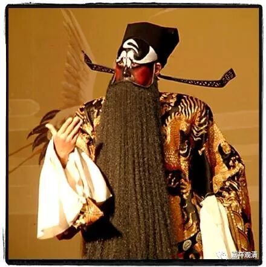

在安徽和湖北一带，有请戏班扮包公驱邪的做法。白天（晚上要演戏）请演员扮上包公，最低限度甚至只要花上个花脸（这个不可少），带上二到四个戏团里的人跟着，算是张龙、赵虎、王朝、马汉（或者只有张龙、赵虎），到村里各家堂屋坐一坐，各家都会准备供果摆在堂屋正中的桌子上。演员在家里走一走，就算“包公”来走过了，演员走的时候，供果全部带走，也许还有个红包（一般金额不大），而并不在家里唱念，一般也不说话……

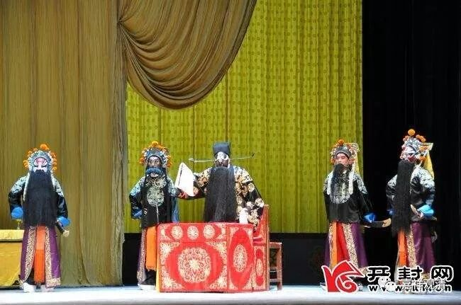

村里各家走完之后，有个“节目”是不能少的：得带着张赵王马，回到戏台之上，这时候要摆个姿势念一句：“斩！”侍卫们做势“开铡问斩！”——这就算是斩了妖、除了魔了。村民们高高兴兴散去，算是村里“不干净”的东西被除掉，今年可以无惧妖孽、放心生活了……

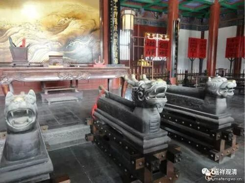

有些地方那个家里“家里不太平”的，还会专门提个要求：主人会拿来一张宣纸（反正不能太不讲究的纸），请“包公”蒙在脸上，印一个脸谱下来，以后供在家里辟邪（所以我在其他地方听说这时候包公的脸谱是反着画月亮的，我想，这是保证印下来的脸谱是正的吧）。

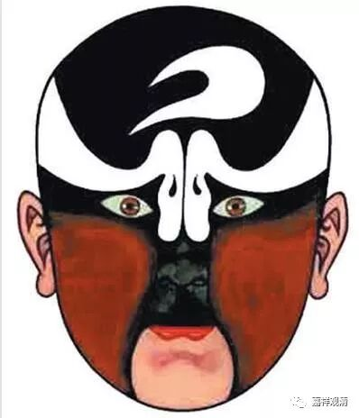

我“挖坑”问团长：“这有用吗？”团长很官方地回我：“这我们也不好说，反正也有用也有没用，也许巧合……反正当地就这么传下来。”他就给我讲了一个他们前几年的事情……

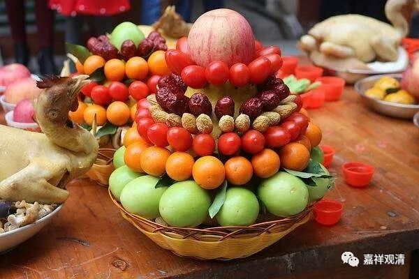

有个村子请戏团去唱戏，第二天请“包公驱邪”，村里面有一户人家死活不让“包公进门”，（好象是新信了基督的，）最后全村就他一家没去……第二年这村里又请戏班子演戏，那户人家还专门请“包公”去“坐坐”——原来那一年，村里就她们家种种不顺，其他人都好好的。从此，这个村子每年必“唱戏”，每回必请包公全村人家走一走

团长说：“我也不知道这是灵还是巧合……”

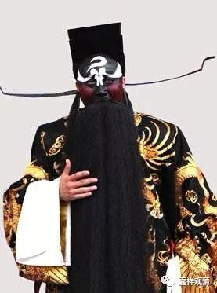

除了包公驱邪，类似的还有两位也有这个功能、套路：钟馗、关公。

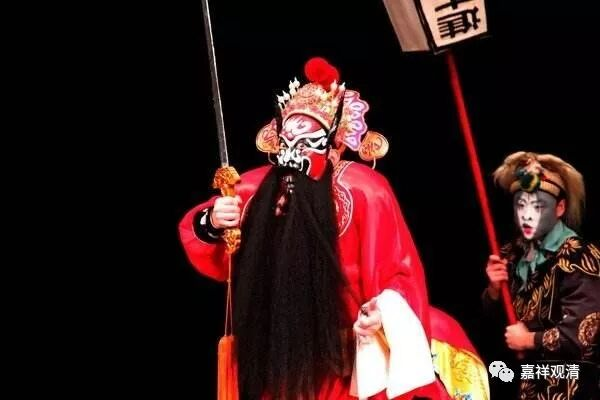

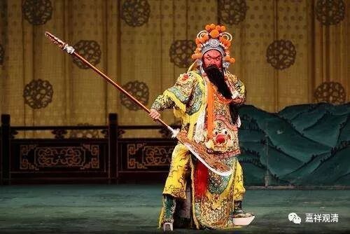

明天接着聊小戏班子的避讳与辟邪。

