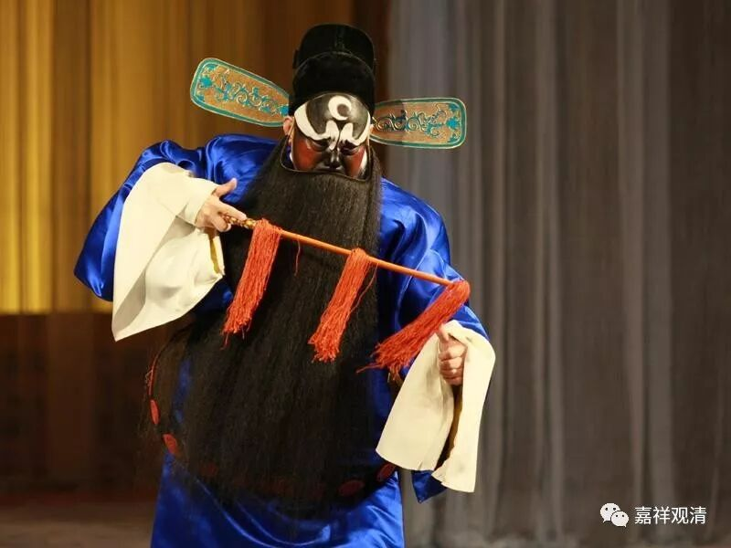
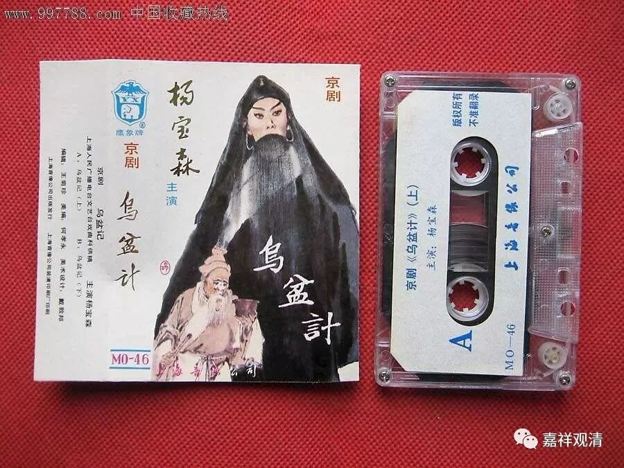
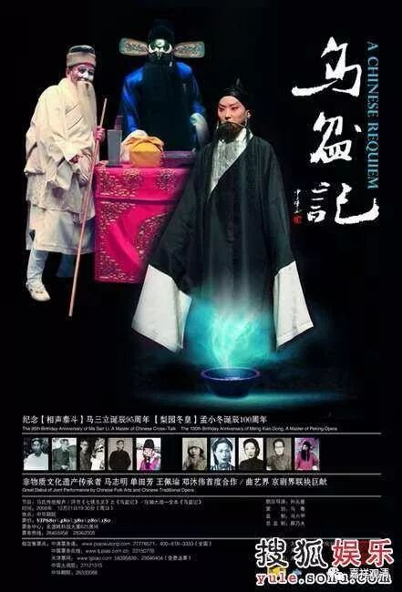
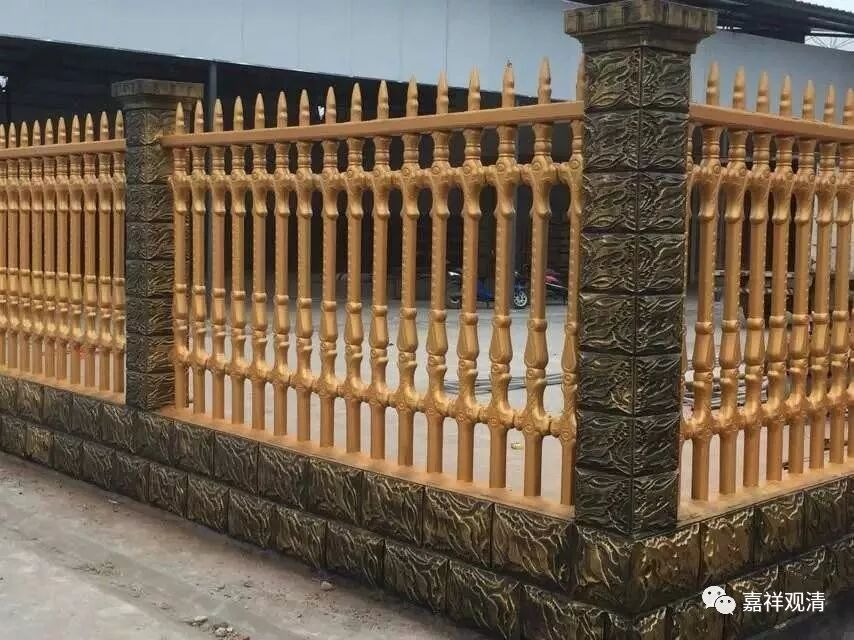
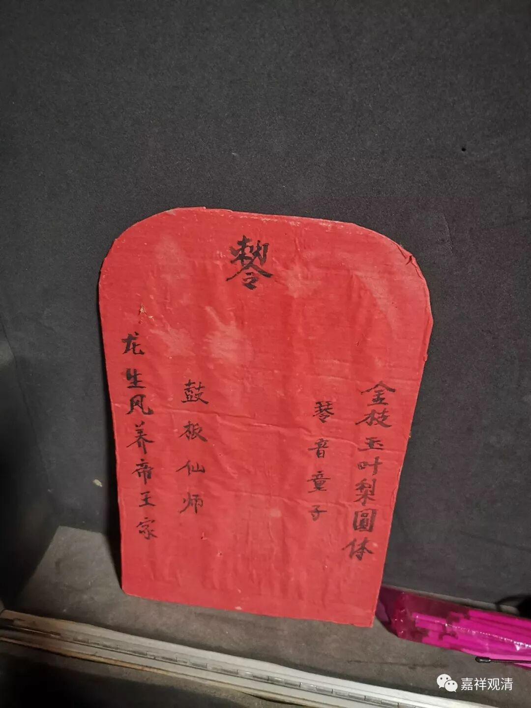
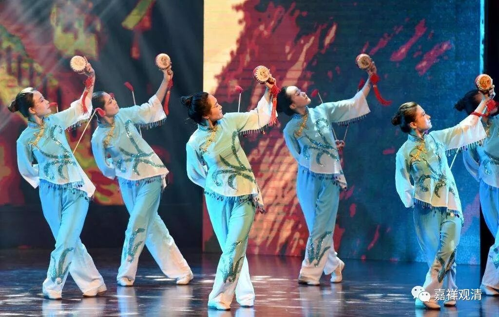

**小戏班的小忌讳与小迷信**

跟小戏班子团长聊天，他说，最邪的是演《乌盆纪》，那几乎一定会出事，整个气氛都不对，所以一定老早就会在戏台上悬一口宝剑辟邪。

我问“挂哪儿？左边右边？上场口下场口？”说随便挂哪儿，但必须挂上。我问《乌盆纪》是包公戏吗？说不是。后来我一查，油，这戏还真是个恐怖片呢！（但也是包公戏。不知道团长为什么说不是。）没想到中国早就有“恐怖片”这个形式了。

我问：“这宝剑有什么特别讲究不？比如要不要开光，或者要不要在祖师面前供着啥的？”说不需要特别加工，啥宝剑都行，一般就是他们唱戏的道具，挂那儿就行。还有人专门要他们宝剑回去辟邪的，一般会给个红包，或者再拿一柄宝剑来换。（好像他们并不借这个机会发财。）

呃，这家的辟邪功夫真是做足了！

常年走在民间，会遇到“有些地方不干净”（他们用这个词），一般没什么的话呢，就一天，当天演完戏就太平了，我想这大概是不干净的东西也爱看戏吧。再不行就演包公戏，包公戏都能辟邪。也有可能是有“祖师爷”镇着呢！

他们在后台都供一个“敕令”的牌子

戏班子的祖师叫“老郎师”或者“老郎神”，我问团长是不是唐明皇，他没接茬。下来我一查，还就是唐明皇。后来和几个演员聊，他们都说就是唐明皇。因为唐明皇演丑角，所以戏班子里开脸化妆必须从丑角开始，好像还得虚拟几笔，据说就是空写“敕令”两个字。

团长跟我说画个符，画出来我对照看起来，就是“敕令”两个字。这个小戏团普遍文化不高，都是初中以下文化水平，他们告诉我：穷人才唱戏呢。大概意思是，安徽很多地方穷，要饭的多，唱戏的多。我说是噢，凤阳花鼓……

