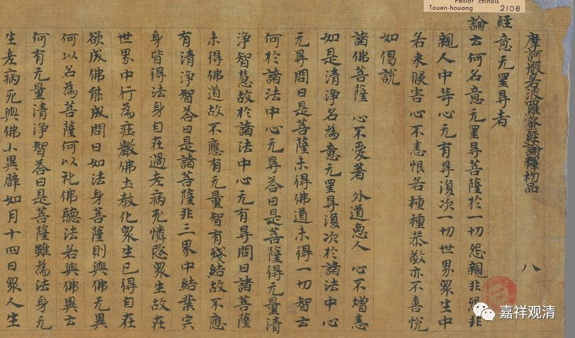
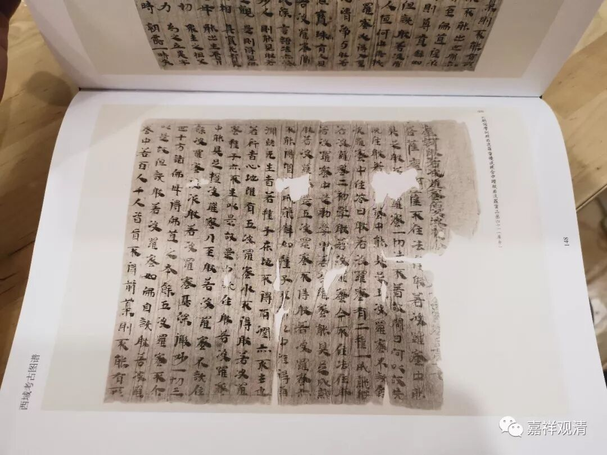
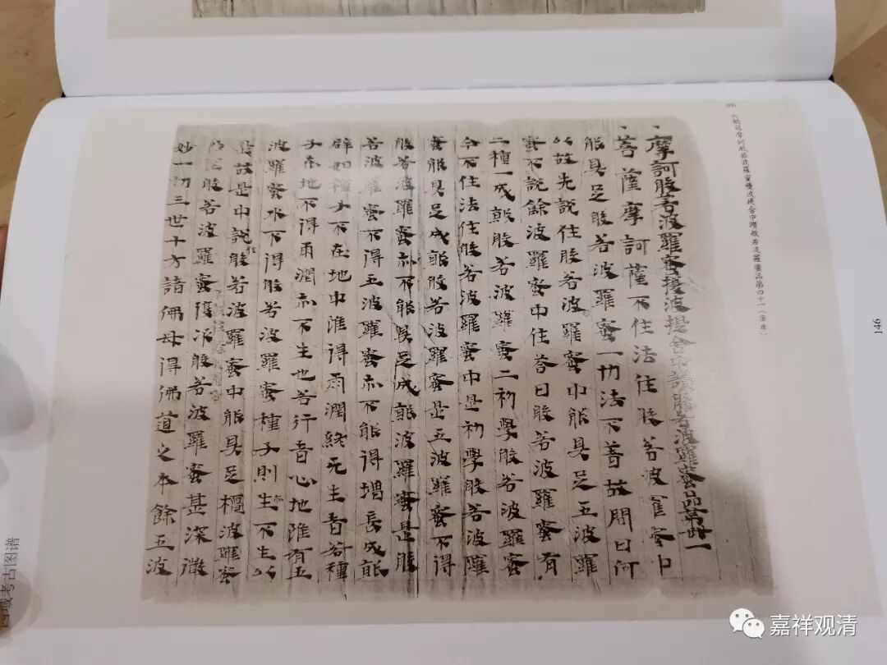
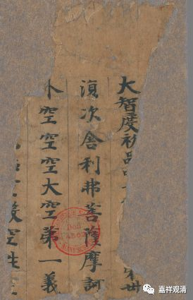
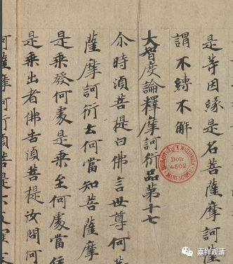
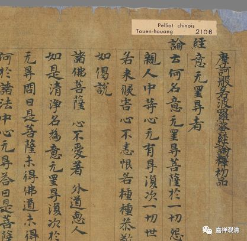

**《大智度论》的名字**

《大智度论》的名字，《二十二种大藏经通检》单收了“大智度论”条目，回译为“Mahāprajñāpāramitā-sūtra-śastra”，意为“摩诃般若波罗蜜经论”。

今天略略翻检，发现此“论”名称颇不统一。

1、最早僧睿有《摩诃般若波罗蜜经释序》，房山石经本《大智度论》也作《摩诃般若波罗蜜经释》，则此论当作《<** 摩诃般若波罗蜜经>释**》;

2、《大正藏》二十五册P57脚注十：“首題前行宋、元、宮、聖、石五本俱有“摩訶般若波羅蜜經釋論”十字……”，则当作《** 摩訶般若波羅蜜經釋論**》；

3、《西域考古图谱》库车本《大智度论》名为“** 摩诃般若波罗蜜优波提舍**”，若依此，当回译为Mahāprajñāpāramitā-upadeśa：

4、法国国家图书馆藏《大智度论写本》Pelliot Chinois 6017做“** 大智度初品……第卅”，**法国国家图书馆藏《大智度论》写本Pelliot Chinois 2082则直接作** “《大智度论》**”；

5、法国国家图书馆藏《大智度论》写本Pelliot Chinois 2106作《** 摩訶般若波羅蜜經論釋**》

6、《大正藏》地二十五册目录云：“又** 名《大智度经》、《大智度经论》、《摩诃衍经》、《摩訶般若波羅蜜經》、《摩訶般若波羅蜜多經》**”……

看样子可以继续搜寻一下《大智度论》的各种名字哦

