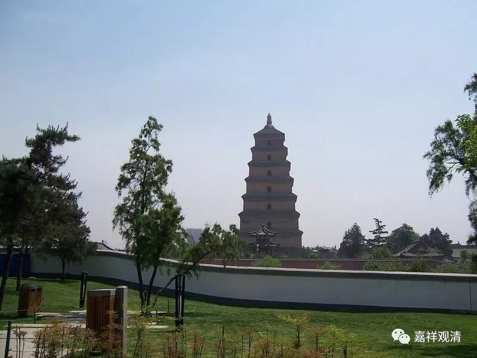

**《善说精髓》068（四）**

** “决定共中士道修持之门说讫。”**

** **

** **

好，我们继续。

中士道部分到这里结束了。现在我们来到了上士道，这个就有点像旅游，对伐？李敖讲的“卧游”，是吧？宅男就是这样的：我不要出去旅游，我只要在家里搜集一些资料，就等于旅游了。宅女也表示深感心有戚戚焉。

应该说，中士道还有大量的内容没讲，就是关于定学和慧学的部分。但“道次第”后面专门会谈奢摩他和毗婆舍那，那里面包含了定学和慧学，所以先讲到这里暂告一段落。

** “于上士道次第修心**

** **

** （戊三）于上士道次第修心。”**

** **

下士道呢，是恶趣的苦要脱离；中士道呢，是轮回的苦要脱离；上士道，则是要圆满一切应该圆满的功德。

** “分三：（己一）显示入大乘门唯是发心；”**

** **

有大乘** “发心”**就是** “大乘”**，没有** “发心”**就不是** “大乘”**。这个抉择很简单。这是从人上来分的，从补特迦罗上来分的，有了大乘的发心，你就是大乘的人（补特迦罗），不论神通解脱。

宗义书里面还会谈到“说宗义者”，或者会谈到从教法的角度来分。从教法的角度，宗义书里面抉择说，佛教内部，承认法无我的是大乘的教法，不承认法无我的是声闻教法。不过说起来，这个应该只算宗义类教科书的答案，难说是事实的答案了，现实当中，“法无我的抉择”未必是大小乘教法的分水岭。

就人和法合说，那就有四种了（我们文字模糊一点）：一、小乘人+小乘法；二、小乘人+大乘法；三、大乘人+小乘法；四、大乘人+大乘法。宗义书里面说的是“说宗义者”。

** “（己二）如何发生此心之理；**

** **

怎么发心？在正式发起菩提心以前，什么样的因缘具足了才能生起菩提心。

** **

** （己三）既发心已学行之理。”**

** **

发起大乘菩提心以后应该继续做些什么？

