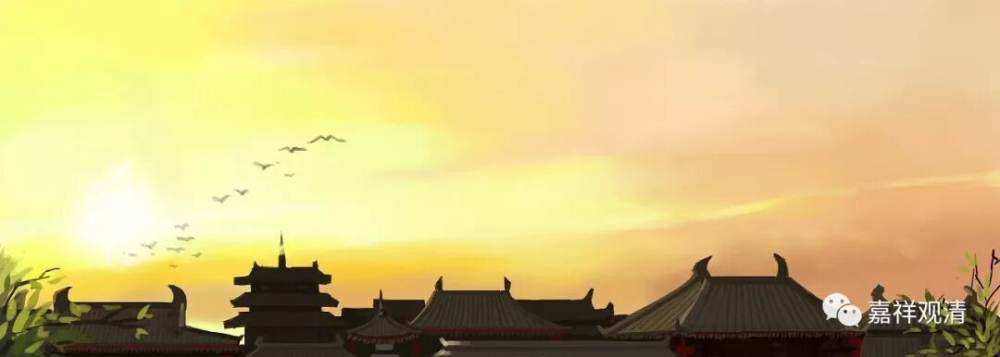

**《十二门论》初颂与《入大乘论》**

《十二门论·观因缘品第一》的第一颂：

** “眾緣所生法，**

** 是即無自性；**

** 若無自性者，**

** 云何有是法？”**

此颂在《入大乘论》（北凉道泰译，题坚意菩萨造，坚意，或即安慧）和《弥勒菩萨所问经论》（菩提流支译，未署名作者）都被引用到了：

《十二门论》

《入大乘论》

《弥勒菩萨所问经论》

观因缘品第一

眾緣所生法，

是即無自性；

若無自性者，

云何有是法？

卷上

因緣所生法，

是即無自性；

若無自性者，

云何有體相。

卷一

因緣和合生，

彼法無實體，

若無實體者，

云何名有法？

《入大乘论》云：

** 是故因緣假他而成，無有自體。如尊者龍樹所說偈：**

** “因緣所生法，是即無自性；**

**　若無自性者，云何有體相？！”**

明说是龙树所作。或以为此颂颇类《中论》之三是偈：

** “因缘所生法，我说即是无；**

** 亦唯是假名，亦是中道义。”**

但《入大乘论》另外引了《中论》此颂，云：

** 因緣假起，無有自體。如尊者龍樹所說偈：**

** “十二因緣空，我今欲解說，**

**　假名因緣法，此即是中道。”**

可见《十二门论》初颂与《中论》“三是偈”并不是同一颂，但安慧认为作者都属龙树无疑。

