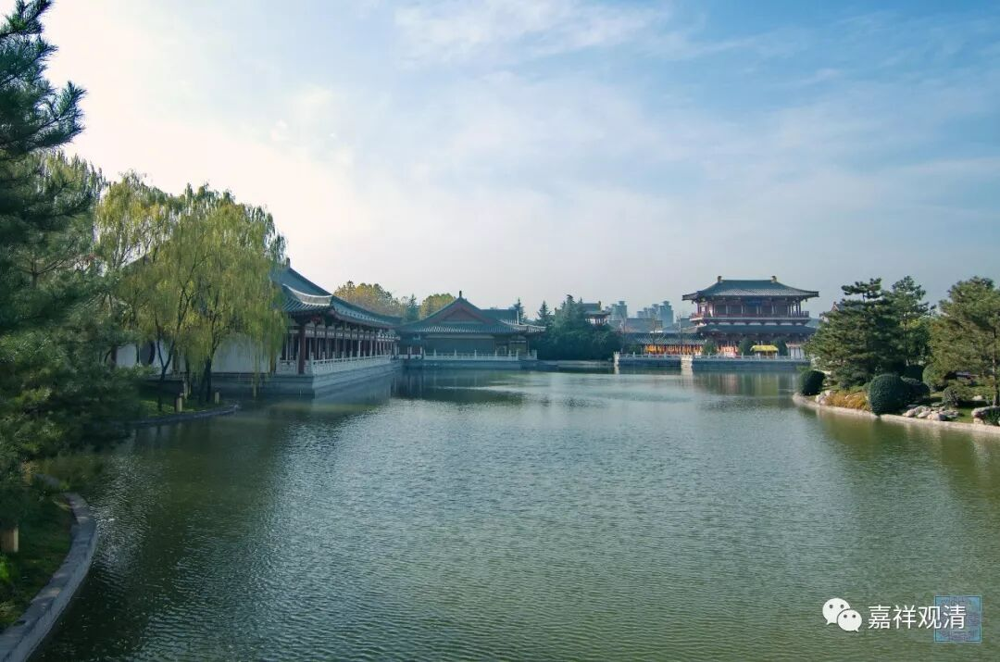

**《善说精髓》069（中）**

** “大乘入门菩提心，有此无他亦大乘，”**

** **

** “大乘”**道的及格线就是** “菩提心”**，有了** “菩提心”**，哪怕其他什么都没有也可以入** “大乘”**。如果没有** “菩提心”**呢，即使你其他的全部都具备，也不算** “大乘”**。

** “离此即退大乘道。”**

** **

反过来说，一旦** “离”**开了这个菩提心，** “大乘道”**也就丢失了。

** “发生此心之理**

** （己二）如何发生此心之理。**

** 分二：（庚一）修菩提心次第；（庚二）以仪轨受持法。**

** （庚一）修菩提心次第。**

** 分二：（辛一）修七种因果教授；（辛二）依寂天菩萨论中所出而修。”**

** **

那么** “修菩提心”**呢，现在有两种教授：一个是** “七种因果教授”**，一个是** “寂天菩萨”**所传的自他相换的教授。有些地方说三种，就是再加上上面两种合修的算一种。

** “（辛一）修七种因果教授。”**

** **

菩提心的七支因果教授是什么呢？知母、念恩、报恩、慈心、悲心、增上心、菩提心，前面再加一个平等心（平等心也算的话就要算八个了。），这是“七因果教授”。

** “分二：（壬一）于其次第令发定解；”**

** **

只有按照这样前后的次序，对这个次序要记牢。

** “（壬二）依次正修。”**

** **

然后按照正确的修行方式，按照次序来修行。

** “（壬一）于其次第令发定解。**

** 分二：（癸一）开示大悲即大乘道根本；（癸二）诸余因果是此因果之理。”**

** **

那么，这个七因果当中的核心是什么呢？核心是** “大悲”**心，这个是关要，是** “大乘道根本”**，也是通前铺后的。

** “（癸一）开示大悲即大乘道根本：**

** **

** 佛菩提心增上心，悲慈报念恩知母，”**

** **

这个是倒过来的次序。成** “佛”**是由** “菩提心”**而来的，** “菩提心”**由** “增上心”**而来的，** “增上心”**由** “悲”**心而来的，** “悲”**心由** “慈”**心而来，** “慈”**心由** “报”**恩而来，** “报”**恩由** “念恩”**而来，** “念恩”**由** “知母”**而来。所以就是倒过来的七因果，从果到因。

** “诸心决定七因果。”**

** **

所以这些** “心决定”**是** “七”**重的** “因果”**。

** “悲者望佛之稼禾，”**

** **

悲心，对于佛果来说就是因，佛可以称为是果，如果把佛比喻为“稼禾”，那悲心就是种子。

** “如种水肥并果熟。”**

** **

那么悲心在最初呢，就像在《入中论》里面讲的——“初犹种子长如水”。悲心在最初就是菩提心的种子，叫“初犹种子”。“长如水”呢，就是在菩提心成长的时候，悲心就像** “水”**一样能够滋润这个菩提心。“长时受用”，就像这里的** “肥”**，菩提心增长的时候呢，它又像肥料一样。“若成熟”，一直到成佛以后，度众生的心仍旧是依这个悲心而引发的，叫“悲不入涅槃”。

所以这个悲心呢，从前到后都是跟菩提心相关的。“悲性于佛广大果，初犹种子长如水，常时受用若成熟”，这样从未成熟一直到成熟的整个阶段中，都一直陪伴在修行人身边的，就是这个悲心。

