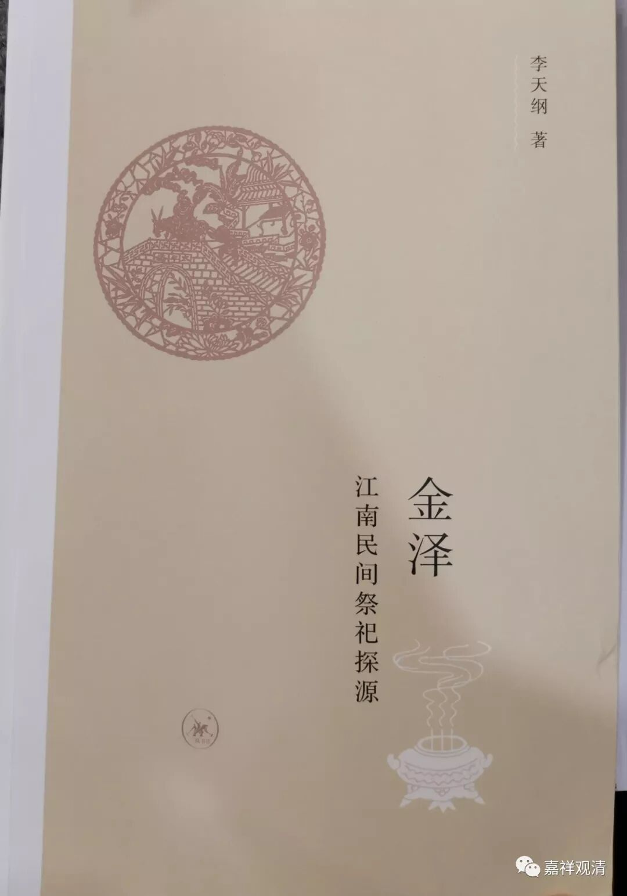
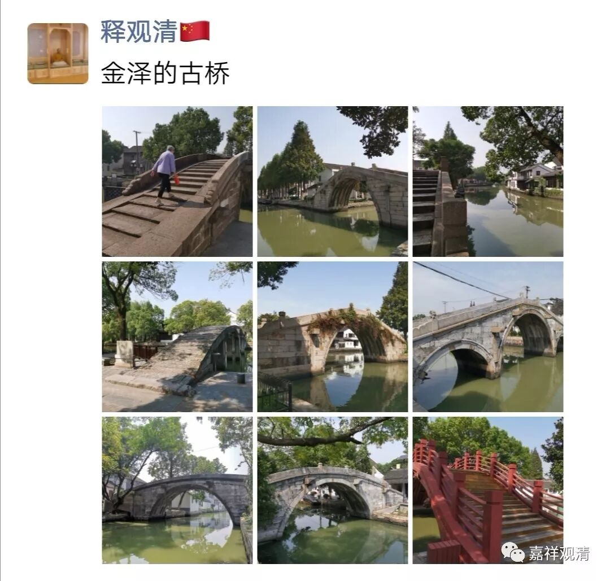
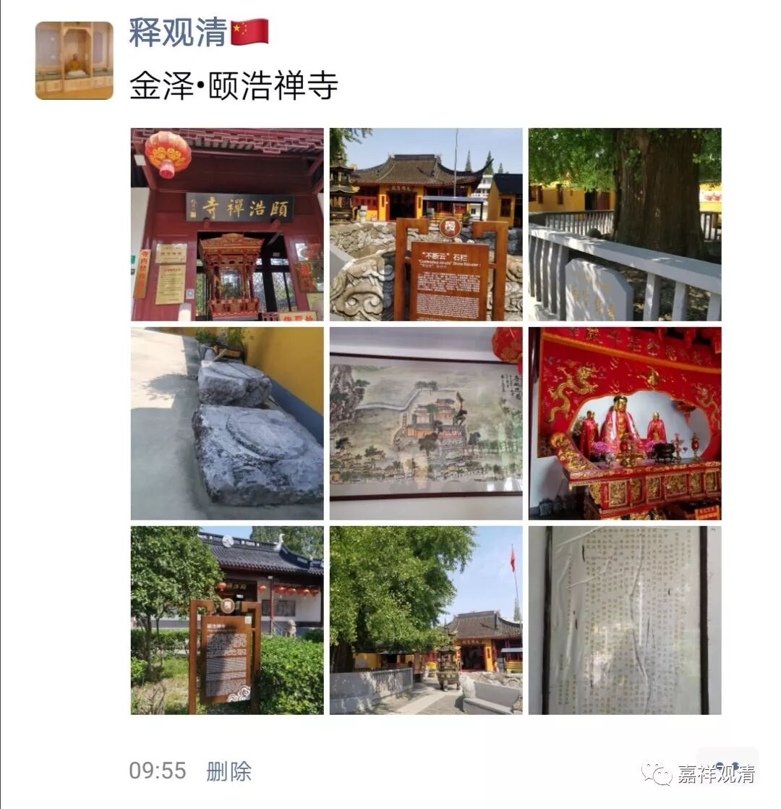
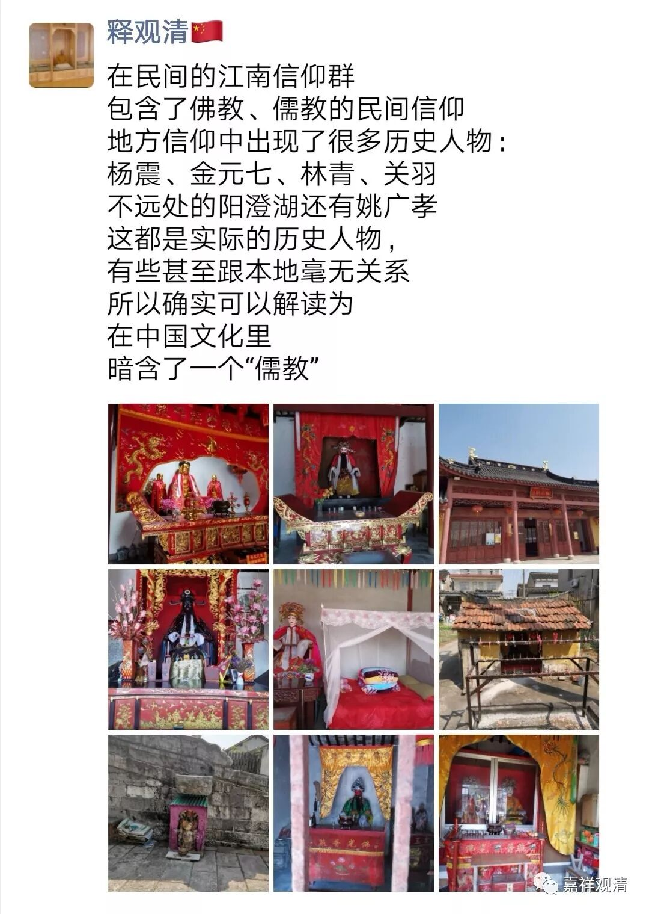

**“金泽”之悟**

《金泽》是一本书，金泽也是一个地名，今属上海市青浦县，上海建市前，金泽属苏州府昆山县管辖。复旦大学李天纲教授研究这里的民教信仰，写了一本《金泽》。

本来这几天应该在云南“采风”白族民间巫蛊现状的，不巧前几天生病没去成，结果在上海倒是有了时间下去“晃晃”。

金泽村核心区域不大，是难得的上海地区还没有开发地古村镇，地紧接江浙。今天探探路，直观的学到了很多东西。

先说一个改变我观念的例子。

站在佛教的立场上，“民间”供奉的各路“老爷”、“太太”都算是“事鬼”，以死人作为“崇拜”对象在正统佛教里应该是难以想象的，顶多因为民间惧其作祟而“谄事”而已，而“民间”处处“事鬼”又确实令我们觉得很奇怪，为什么中国人这么看重“鬼”而“事鬼”如此殷勤呢？！

今天在金泽走了一圈，回来的时候我突然“悟”了！是我预设的“佛教的立场”错了，实际上，所谓的“民间事鬼”，现在既不能说是“民间”，也不是“事鬼”，而是暗藏的“儒教”的“神”——生而正直，死而为神！正直而阳刚，死后是被“神格”化的，也就是说，“儒教”的“有情世间”是由三个层面组成的：神《====人====》鬼，核心是人，死而为鬼神。

佛教进入中国文化大家庭以后，儒家传统受到佛教影响而加入了畜生，但中国的畜生却似乎还有另一个独立的生死系统：畜生===》仙儿，乃至和人也有各种“交流”——这有些是受佛教影响，有些恐怕是受地方巫术的影响。

乡绅系统带领大家拜的不是“鬼”而是“神”，这是“儒教”的“天道”之一部分。若拿来和道教做对比，在道教系统里就是鬼、仙了。道教的仙（五种：鬼仙、人仙、地仙、天仙、大罗金仙，乃至给罗汉流了“大罗金仙”的位置）是要借“修真”得来的，而“儒教”的“修身”，是“为国为民”，生而正直，死后，或由朝廷（如各地的“张巡庙”、“关公庙”）、或由士绅公推（如金泽的杨震庙、林青庙、金元七总管庙、浦东的欧阳修庙）而封神。可见，道教和佛教以外，中国的传统当中“儒教”实际一直是一条暗含着的“教”（虽然他的教、道、果非常模糊，可是，“中国人”的“中国佛教”不也一样的模糊混乱吗？），而且他也自觉地当作“教化”、“教育”在用——比如常说“神道设教”，从这个角度来说，“儒教”的“教”和佛教的“教”字的含义相通着。

这是接着白天的朋友圈说的，懒了，不再重复朋友圈的东西了，直接截图过来吧……

