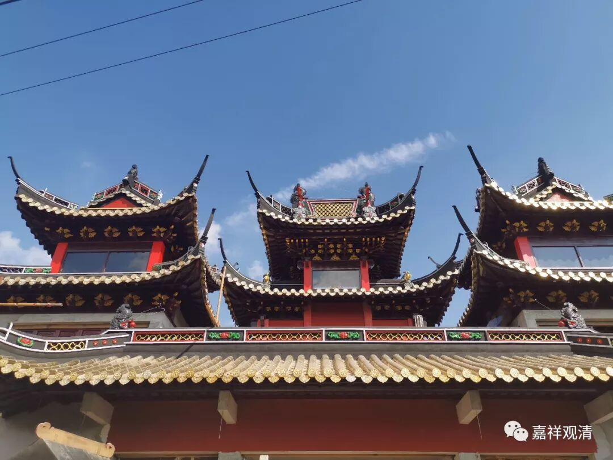

**龙王庙的正主儿**

今天去了浦东龙王庙，应该说，19年的今天和14年发表的论文已经有了一段“距离”，龙王庙正在扩建中，而且，此地的几个道观庙堂相隔较远，没能一口气走下来——毕竟我们是借助公交的“徒步走访”。

先聊一个自己的发挥吧，从“寺观庙堂”谈起（记住，是发挥）。

“寺、观、庙、堂”四个字，大致可以对应几大传统（宗教）信仰在汉地的基础：1、寺，可以代表佛教；2、观：可以代表道教；3、庙：可以大致代表“儒教”信仰，比如之前提到过的张王庙、杨震庙；4、堂：“堂”代表什么呢？我觉得最适合的就是民间信仰的“堂口”。北方叫的“仙儿”，江浙一代称作“仙人”，就是附体说事儿的从业者，他们要立“堂口”才算正式“从业”，“立堂口”也是有具体“地址”的……所以“寺观庙堂”这四个字基本可以拿来讲述在中国的传统宗教（信仰）了。

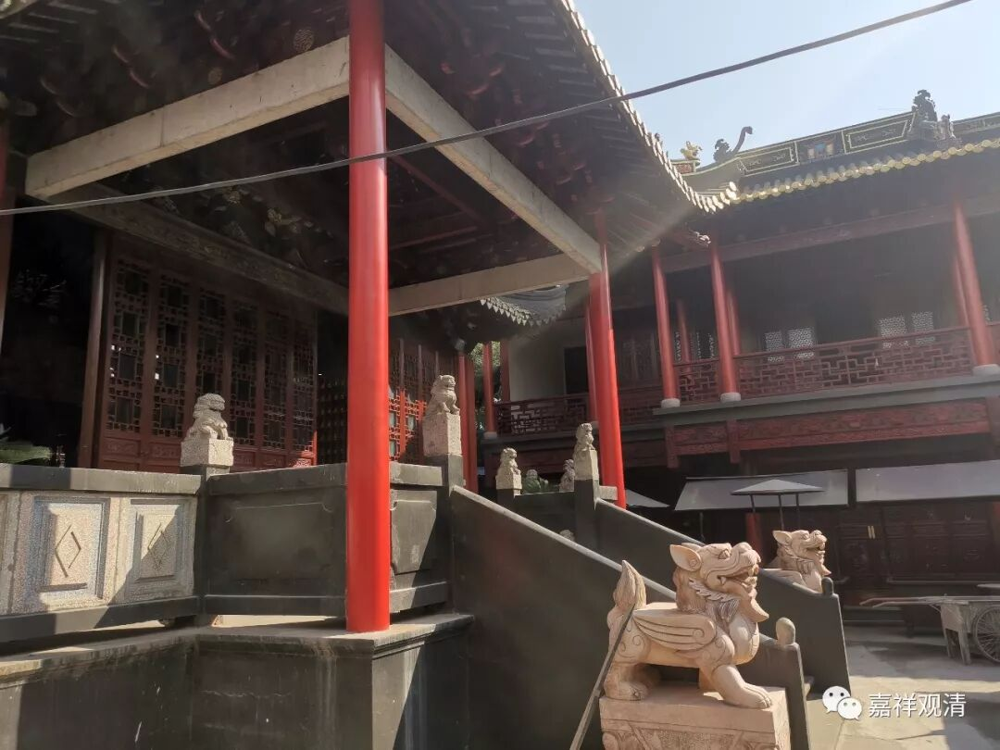

今天的“龙王庙”是一个道观了，但从名字上可以看出来，它原先并不直接和道教相关。80年以后开放宗教信仰，这里被注册成道教活动场所，但实际原先的龙王庙并没有供奉正统道教的神仙，进驻的道长征求道教协会意见后，还是在正殿中间塑了“玉皇大帝”的神像，但据说民众并不表达为对此位正神的信仰，仅仅在普供全堂神佛的时候在他面前摆上一份果品——对历史的“龙王庙”而言，玉皇大帝反而是外来的客，龙王、钦公们才是正主儿。

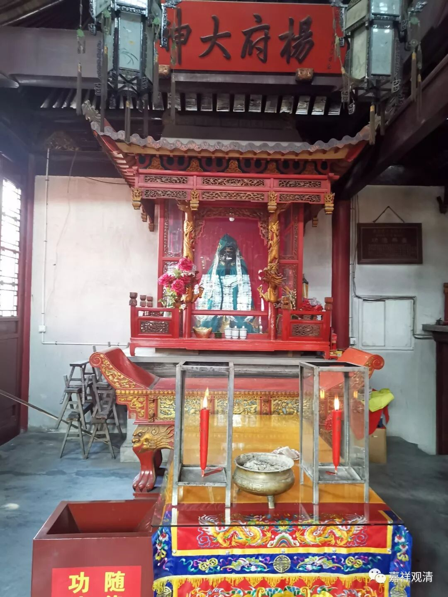

杨震，昨天金泽也有他

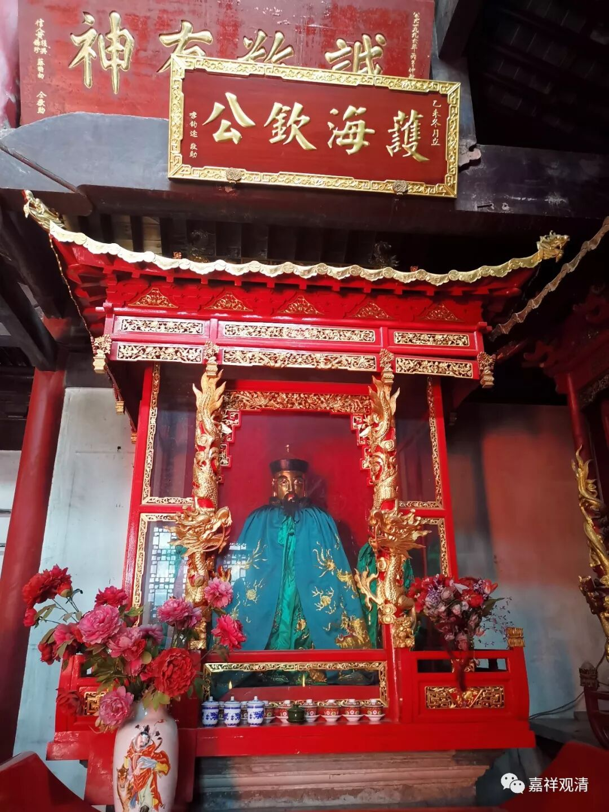

钦公，清代本地知县，整修过海塘，造福一方

一到龙王庙地界，我就发现一个很有趣的现象，整个龙王庙实际就是悬空建在水道上的，由于地基和周围拉平了，所以一般不注意是完全看不出来的……这倒是很好地应了这个“龙王庙”的名字呢。

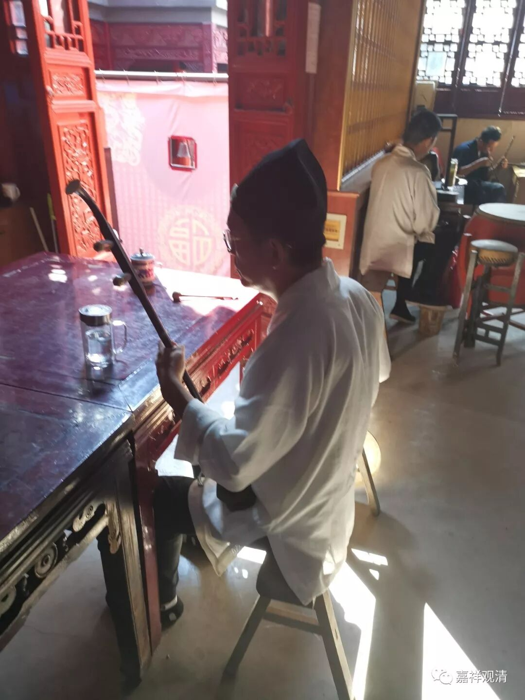

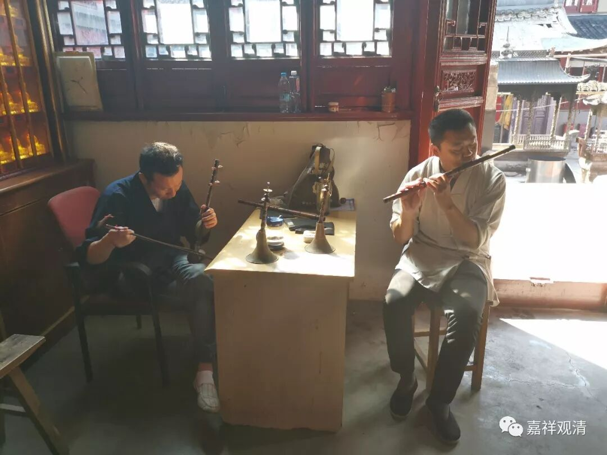

道长们今天有法事，附近的几个道观的道士都来帮忙，看到和尚上门也很客气。他们用的乐器很丝竹，我二十年前在海上白云观已经见过，并不陌生，那次还看他们用米在地上画图案“破地狱”、“破血湖”，今天的法事只是念经，和佛教接近。

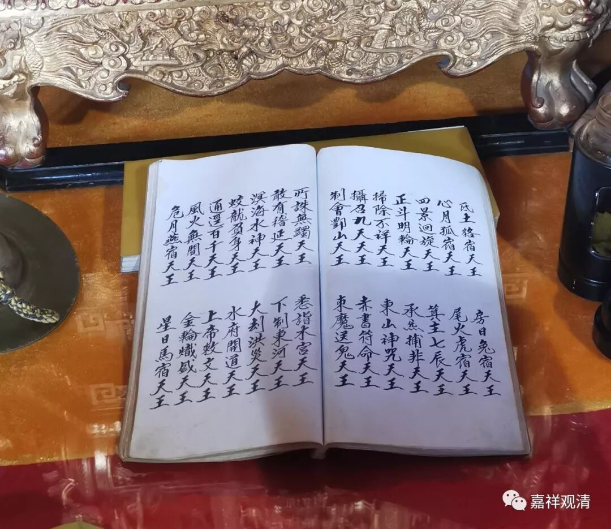

这是在念神仙名号

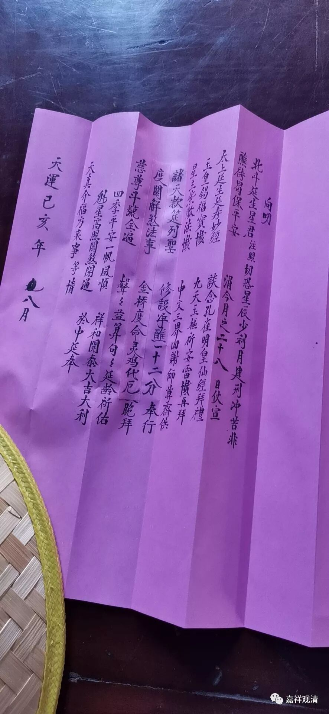

这是表文。

我一直认为，今天“佛教”寺院里的“表”的源头和这类有关，至少可以说平行出现的。同样我对“木鱼”的出处也是一样的看法，很可能是从道教里传过来的。至于“观音生日”之类，很难说是先从道教、佛教、扶乩里哪一个先传出的，我自认为是民间信仰里先出来而影响到佛道教的——道教的观音“生日”和“佛教”现在采用的是一致的：二月十九、六月十九、九月十九——日期取3、6、9是很明显的民间信仰的标志。

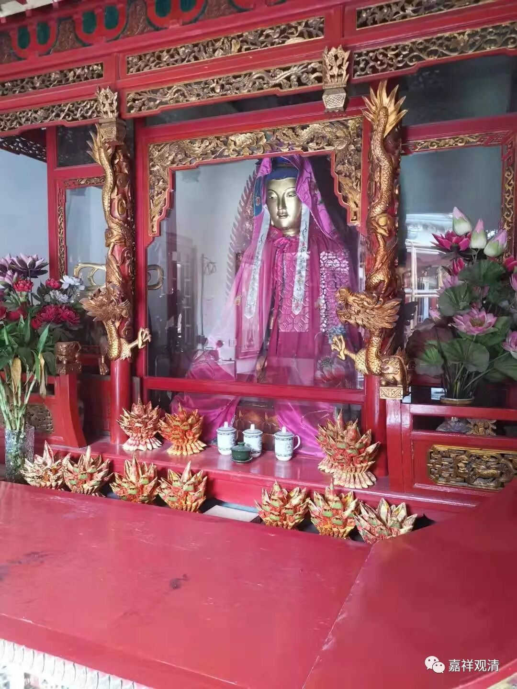

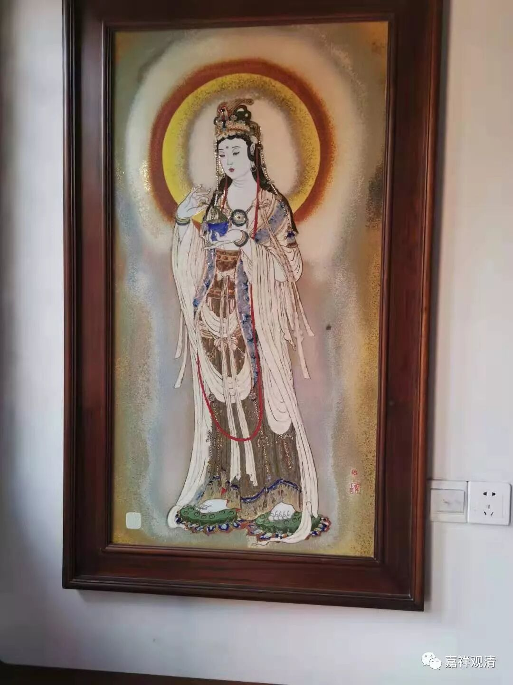

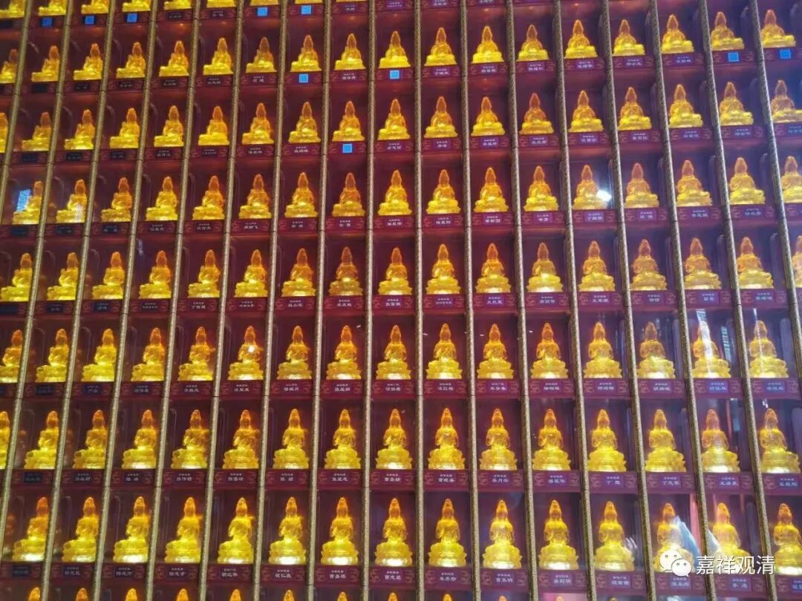

龙王庙供的观音像

今天是来龙王庙“踩点”的，等到他大型法会的时候，再来瞻仰瞻仰这些活在民间的信仰……下个月有个日子是关于欧阳修祭祀的“大日子”，“修”虽未必知道我，我却不能不知“修”……

收尾的时候点个题吧：龙王庙的主人是谁？广大人民！（民的两个解释都能用。）

