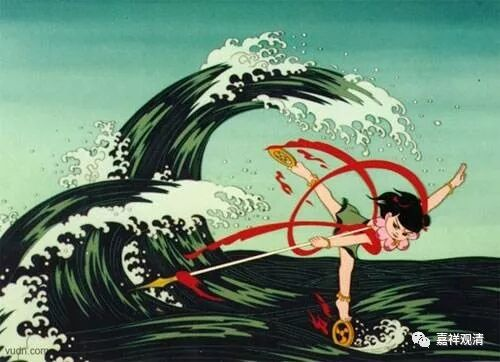
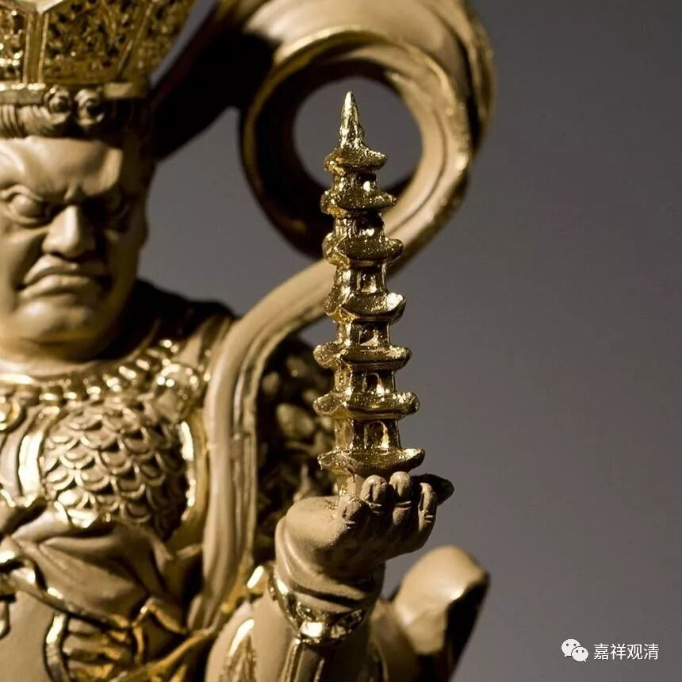
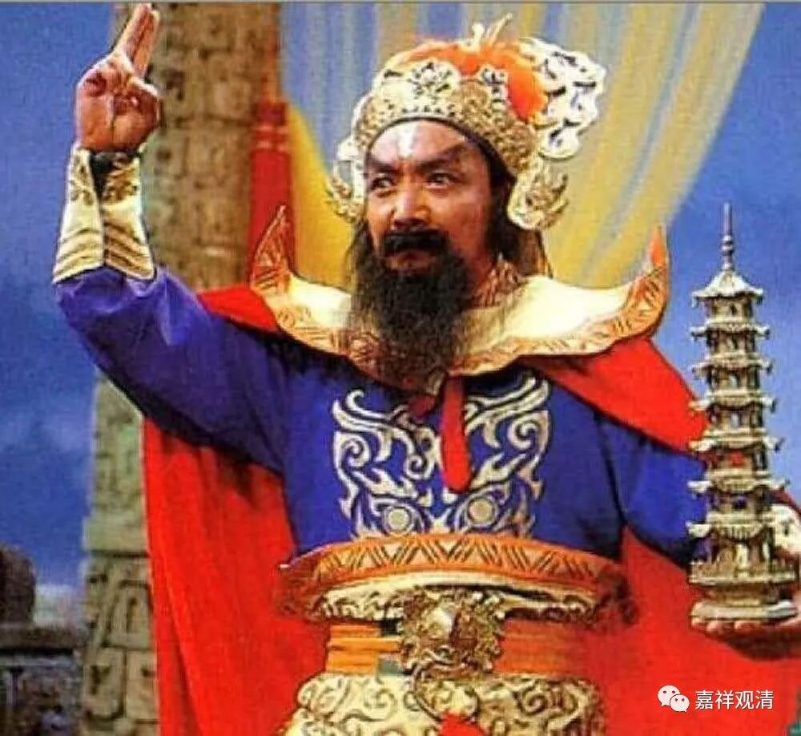
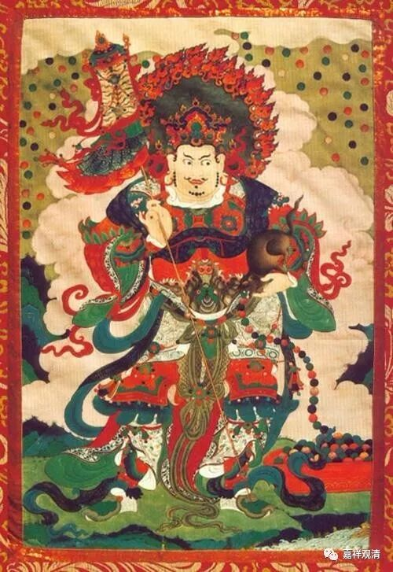
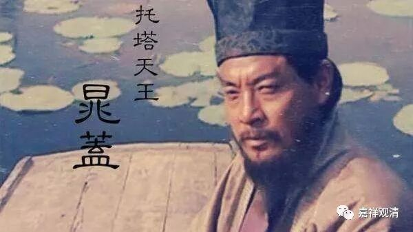
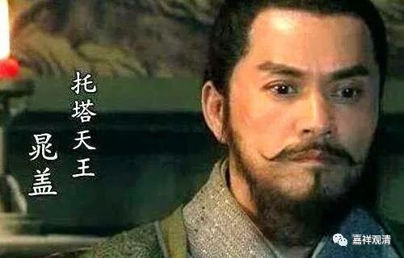
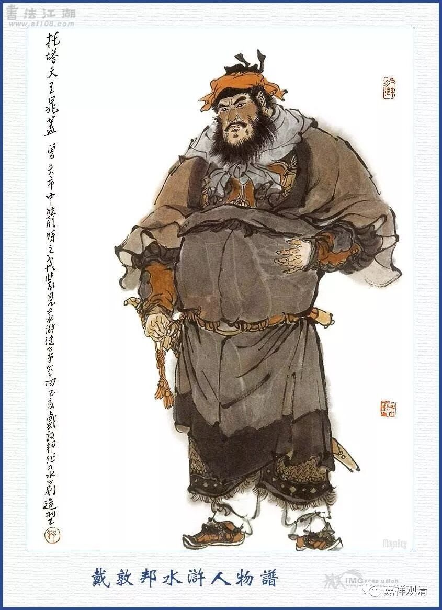

**宗教信仰的活标本——哪吒（一）**

** 卫公李靖是怎么成“托塔天王”的**

作为中国信仰活标本的“哪吒”真是拿来谈谈的好材料！

谈起中国的宗教和民间信仰，最近走红的哪吒正是绝佳的活标本，我们不妨拿它作为典型案例来分析一下。

我们按顺序来分析吧，先从他的出身谈起。

中国“哪吒”他爹是“钱塘关总兵”、“托塔天王”李靖，可是，哪吒是外来神祇，他跟李靖怎么扯上关系的呢？

唐·不空法师之《毗沙门仪轨》云：

毗沙门天王见身于楼上……奉佛教敕，令第三子那吒捧塔随天王……十一日第二子独健辞父王巡界日……二十一日那吒与父王交塔日……天王第二子独健，常领天兵护其国界。天王第三子那吒太子，捧塔常随天王……

这里。托塔的天王是北方多闻天毗沙门，哪吒是他第三子（哪吒三太子），第二子名“独健”，还没李靖啥事儿。

在这里，有个转折，就是大家最爱的（当当当当）——财神！

毗沙门是财神，李靖也曾经被当作财神（中国的财神多为武将信仰而来，姜子牙、黄飞虎、李靖、关羽都先后“任职”财神，而正是因为李靖跻身财神之列，结果《封神演义》里他也直接串场了，从唐代穿越去了商周），这使他们在“财神”这个位置上“扎吽邦火”互相融入了，李靖占了毗沙门的位置，变成了“托塔天王”，还有了个“三太子”。

民间记忆这件事情真的很神奇，不知怎么很多东西就是莫名其妙地继承下来了——毗沙门财神的位置被武将卫公李靖所替代，但其实民间一直没忘记毗沙门的符号，除了“托塔”，还有一个——老鼠！

看左手

现在寺院山门的四大天王，北方多闻天王（毗沙门）手里有一只貂，但原型是一只鼠——吐宝鼠，这只“鼠”民间还记得，一并送给了李靖。《西游记》里面，唐僧被老鼠精引入洞内，而老鼠精则是李靖的“干女儿”：

（哪吒说：）“父王忘了，那女儿原是个妖精。三百年前成怪，在灵山偷食了如来的香花宝烛，如来差我父子天兵，将他拿住。拿住时，只该打死。如来吩咐道：‘积水养鱼终不钓，深山喂鹿望长生。’当时饶了他性命。积此恩念，拜父王为父，拜孩儿为兄，在下方供设牌位，侍奉香火。不期他又成精，陷害唐僧，却被孙行者搜寻到巢穴之间，将牌位拿来，就做名告了御状。此是结拜之恩女，非我同袍之亲妹也。”李靖一听，悚然惊讶道：“孩儿，我实忘了。他叫做甚么名字？”

——看出来了吗，这只诱惑“金蝉子”长老的老鼠精，其实就是毗沙门手里的吐宝鼠！但时日已久，民间记忆里知道有只老鼠和财神（李靖）有关，但忘了它的来历，只知道西方神仙（如来）有关，不关玉皇大帝（中国神仙）……

《西游记》老鼠精一事以前一直看不明白，直到把“毗沙门”拉进来才恍然大悟！

我们再来看《水浒传》。《水浒传》里有个“托塔天王”晁盖，为什么他外号叫“托塔天王”呢？是因为：

“邻村西溪村闹鬼，村人凿了一个青石宝塔镇在溪边，鬼就被赶到了东溪村。晁盖大怒，就去西溪村独自将青石宝塔夺了过来在东溪边放下，因此人称‘托塔天王’……”

其实不然！那顶多算得上是附会，多半是施耐庵望文生义地改编。晁盖之为“托塔天王”，乃因为他是“本乡富户，平生仗义疏财……闻名江湖……”，这才是他被称为“托塔天王”的真正来历——他有钱，在江湖人看来就是“财神”！

