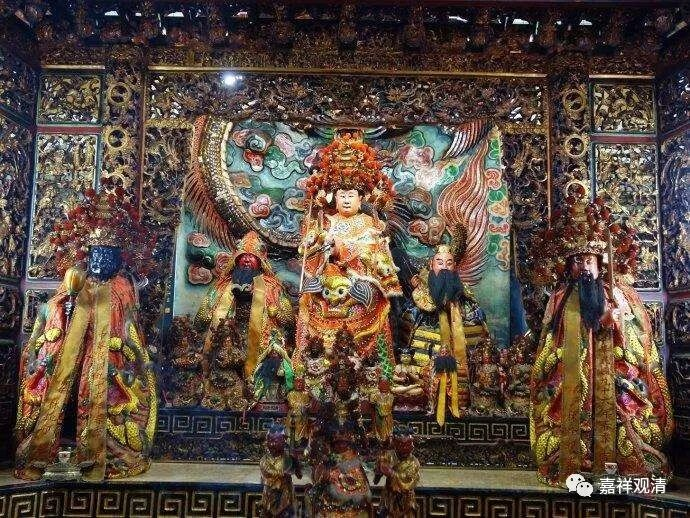
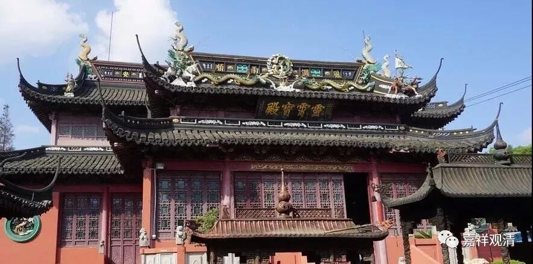
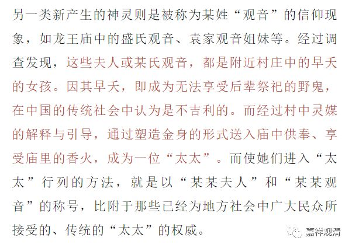
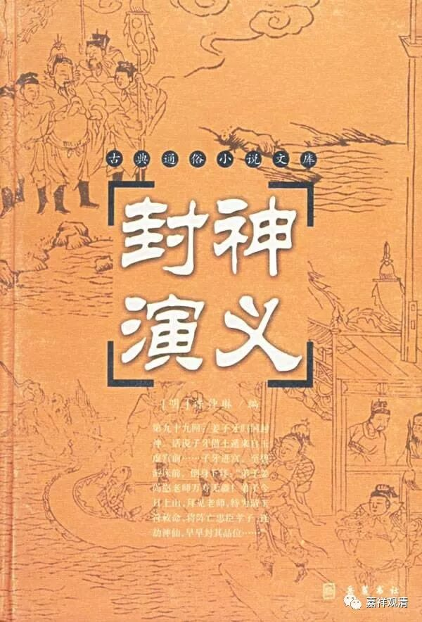
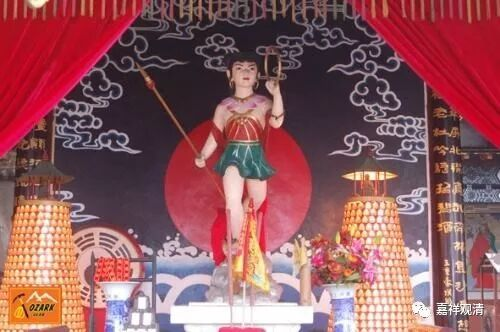
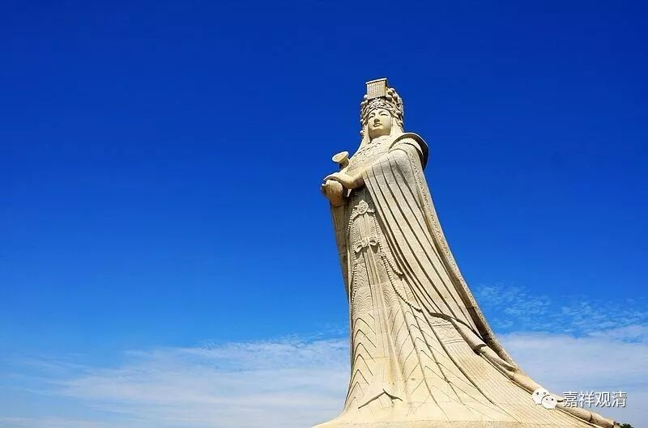
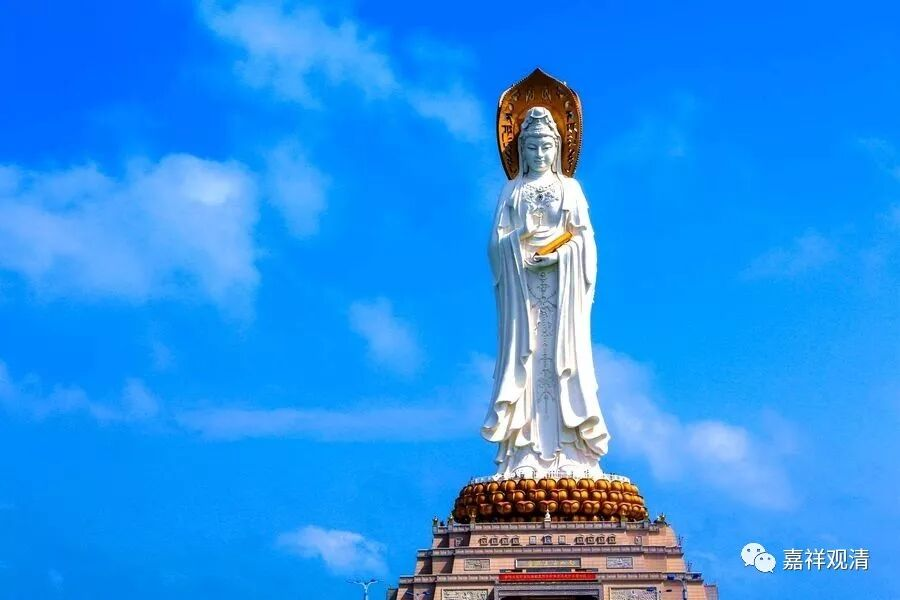

**太太、哪吒、妈祖和观音**

上海社科院龙飞俊在《太太们又回来了》一文中有这样一段：

** 另一类新产生的神灵则是被称为某姓“观音”的信仰现象，如龙王庙中的盛氏观音、袁家观音姐妹等。经过调查发现，这些夫人或某氏观音，都是附近村庄中的早夭的女孩。因其早夭，即成为无法享受后辈祭祀的野鬼，在中国的传统社会中认为是不吉利的。而经过村中灵媒的解释与引导，通过塑造金身的形式送入庙中供奉、享受庙里的香火，成为一位“太太”。而使她们进入“太太”行列的方法，就是以“某某夫人”和“某某观音”的称号，比附于那些已经为地方社会中广大民众所接受的、传统的“太太”的权威。**

**
**

早夭的孩子由灵媒引导，家人塑造金身供入庙中，成为一位地方神（太太在这里是地方神祇的意思，宁波、上海等地都有这种称谓法。）……这和中国版哪吒的故事不是一个版本吗？

《封神演义》版的哪吒死后（魂魄）去找师父太乙真人，太乙真人让哪吒给母亲托梦，请母亲为他塑像、造庙。哪吒依靠这个庙宇神像可以魂魄不灭，三年后可以重获新生。

** 《封神演义》第十四回：**

** 真人吩咐哪吒：“此处非汝安身之所……令你母亲造一座哪吒行宫，你受香烟三载，又可立于人间……”**

** （哪吒母亲）暗着心腹人，与些银两，往翠屏山兴工破土，起建行宫，造哪吒神像一座，旬月功完。哪吒在此翠屏山显圣，感动万民，千请千灵，万请万应，因此庙宇轩昂，十分齐整……**

** 哪吒在翠屏山显圣，四方远近居民，俱来进香，纷纷如蚁，日盛一日，往往不断。祈福禳灾，无不感应。不觉乌飞兔走，似箭光阴，半载有余……**

这一段的哪吒故事标准的是一个中国民间信仰：早夭的孩子由于没有（后人持续）香火而“立不住”，所以要塑像受香火。“灵感广大”以后香火渐胜……

哪吒故事和太太一文中这几个点完全重合：1、早夭；2、灵媒引导（哪吒故事里是自己托梦，和灵媒引导属于同一性质，甚至故事也可以还原为“由其他灵媒引导夫人”似乎更为贴切）；3、建庙受香火；4、渐渐神格化。（甚至可以由此推测，或许某地有个早夭的孩子因为立庙而有“灵感”，最后神格化为中国版哪吒！）

这里我们还可以看到中华文化圈另一位大神的影子——妈祖！妈祖也是未成年的女孩儿早夭（跳海），立庙显圣后，渐渐和沿海观音信仰重合……我们看《太太们又回来了》一文中就说到：“早夭的女孩……以‘某某夫人’和‘某某观音’的称号……为地方社会中广大民众所接受……”，可见。妈祖与观音的重合，是有其传统背景的。

下一回，我们来聊聊哪吒的“唯名言有”，和他的“无实体而有作用”……

