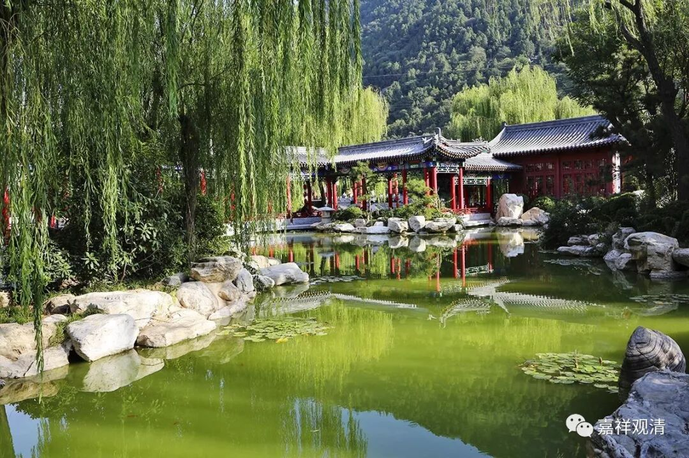

**《善说精髓》讲记 071（上）**

** “他爱执诸圆满源”**

一切** “圆满”**的** “源”**头是什么呢？** “他爱执”**。我们看看就知道了，比如说佛，那就是因** “他爱执”“圆满”**了菩提的事业。你看他成佛了，我和他的区别就是，我是有** “自爱执”**的。他因为“爱他胜自”而二障断除，我因为“爱自胜他”而积极于轮回……

** “故自爱执轻弃他，”**

** **

抛弃我爱执的话，并不是说“他就是我”的意思啊，不是这个意思。应该是把自己放在前面的心，换成把对方放在前面的心，是这样。

我们这里有一个人现在肯定是猫爱执——流浪猫爱执，这个对应的现实的果位是什么我不知道。** “他爱执”**生起，** “自爱执”**断除，这个是佛。猫爱执这个是什么呢？猫菩萨？（哦，可以是这样：他以后就想象自己是只猫，或者也有可能猫是他的坐骑，就是他骑着个猫，然后牵着一根缰绳到处跑，手上还拿着个猫棒，是吧？那就像坐在老虎的身上，成了伏虎罗汉啊！不过现在十八罗汉当中的伏虎罗汉，大家看起来更像伏猫罗汉啊！老虎都不像老虎，像猫。我们那个厨房的空间里面有个搪瓷画，其中有十八罗汉的，有个狮子狗——把狮子画得就像狮子狗一样。那是藏地没见过狮子，只见过狮子狗。这和“照猫画虎”是一个意思，照着狮子狗画狮子。）

** “二心位置互换易。”**

** **

就是从单纯地把自己放在前面，改为把对方放在前面。所以从这个角度讲，知母这个修法确实有道理啊！因为大部分母亲在很多时候都是把孩子放在前面，把自己放在后面，对吧？所以猫爱执的人以后会把猫放在前面，先喂它吃，然后再自己吃，是吧？

** “呼吸亦纯利他行。”**

** **

可以用这个方法来修呼吸，就是呼气的时候就观想把自己的功德给到对方，而吸气的时候把对方的障碍给吸进来。

