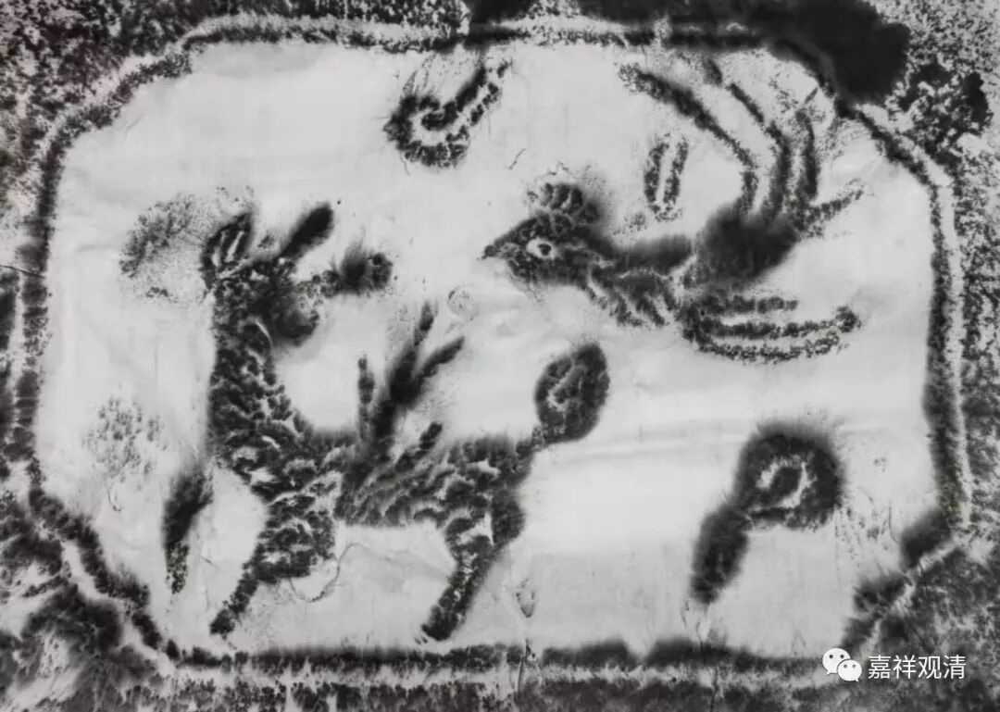
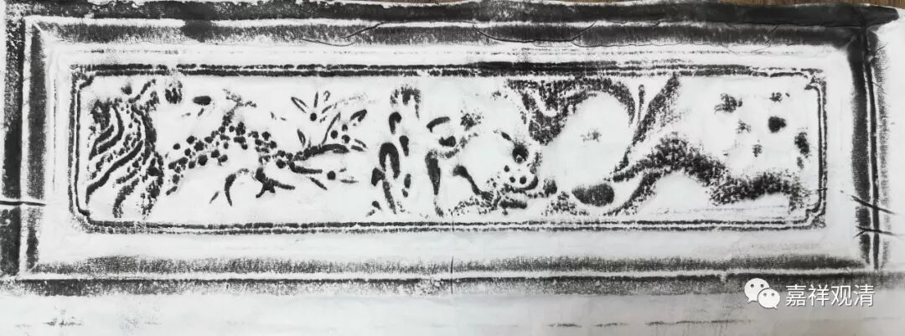
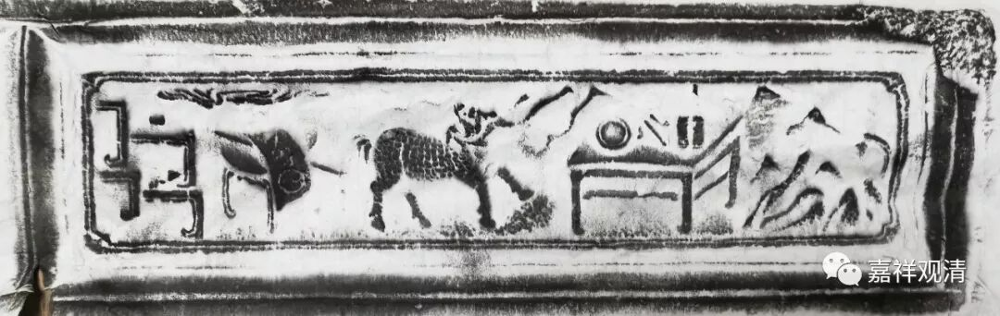
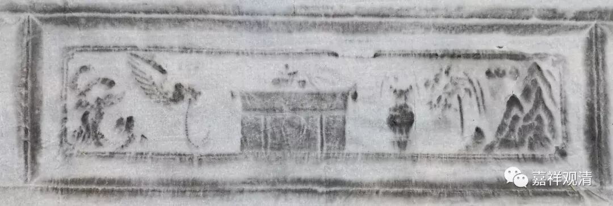
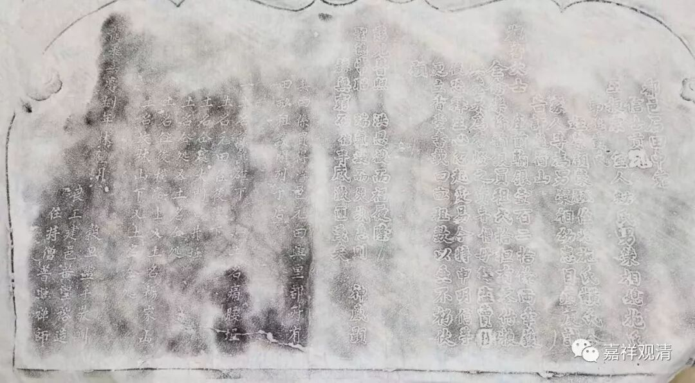
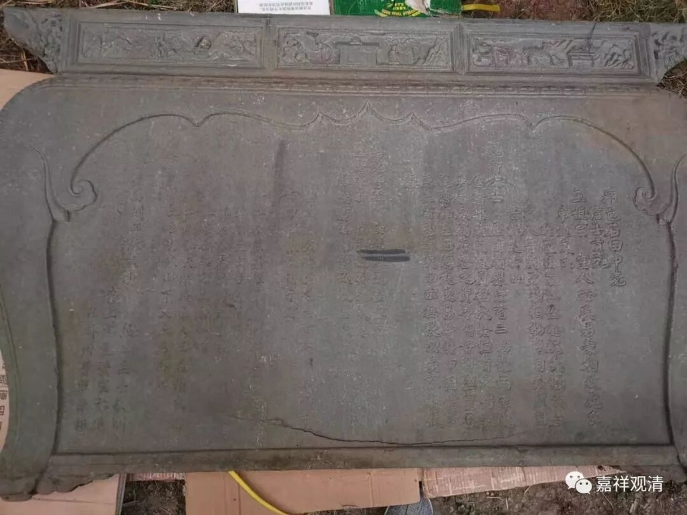

**拓碑（一）白云寺的田产

白云寺有几块碑，从我来以后一直还没有认真释读，这次回山，专门带了拓碑的工具，学着拓下来。今天下午先拓着试试……拓了几张下来，觉得：这确实是一门技术活儿。拓包准备了大的没准备小的，而浮雕的细节，单靠大的拓包是很难表现的。白芨水太稀，宣纸没粘牢，干了以后风一吹都掉了。

这是刻在一块毛石上的，比较粗糙，或许是麒麟和凤凰

这几张浮雕，因为没有小的拓包，表现不清楚。下次再做几个小的拓包。

打开大图还是可以看清楚的

这一幅很大，拓完第一遍宣纸就干了，先揭下来再说。就释读而言已经足够了，这块留着以后再好好拓吧。

碑文释读如下（基本用简体记录了）：

** 鄱邑石田中党**

** 信士贡元**

** 王振宗 室人方宋氏男荣相媳施氏**

** 弟媳黄氏**

** 侄荣颖荣完慧荣侄媳施氏黄黄氏合**

** 家人等为男荣相幼患目疾虔诚**

** 告许莲荷山**

** 观音大士 座前输银一百二十余两幸获**

** 全愈乐将输银买租一拾担有零付粮**

** 与庵永为香灯之资寺僧毋得盗卖日**

** 后恐释生心忽起变易今特申明信等**

** 更立香台书载田亩租数以垂不朽伏**

** 愿**

** **

** 慈光普照  洪恩被而福履隆**

** 圣德常昭  瑞气凝而灾氛息则  神威显**

** 赫无穷而  信等感激匪浅矣**

** **

** 其田系买得浮邑元田与皇都所有**

** 田亩租数开列于后**

** 一土名箃箕确下  一土名痛腰坵**

** 土名元田在后漕下**

** 土名仝处大门口井坵**

** 土名仝处又土名仝处**

** 土名住后横路上又土名杨家山**

** 土名坟林山下又土名仝处**

** **

** 龙飞嘉庆捌年林钟月  榖旦盥手敬酬**

**    良工建邑黄圣裕造**

**     住持僧普照禅师**

这是乡绅的孩子眼疾痊愈后。给寺院买的地产，租金用作寺院的香火钱。鄱阳的乡绅，给寺院置办浮梁的地产——因为寺院处在两省三县交界之处，而附近属鄱阳的山区田就少一些，浮梁那边还有稍大片的农田。乡绅怕和尚以后把地私自卖了，留了碑下来有个说法。倒霉催的，文革的时候凭这块碑就能把住持定性为地主了……反正今天我们也没这些产业了，我们现在是近乎白手起家。

这块碑上有阴阳两种刻法，有点意思。

注：

1、嘉庆八年是公元1803年，距今216年了。

2、林钟月是六月。

3、“谷旦”就是“良辰”的意思，吉日。

