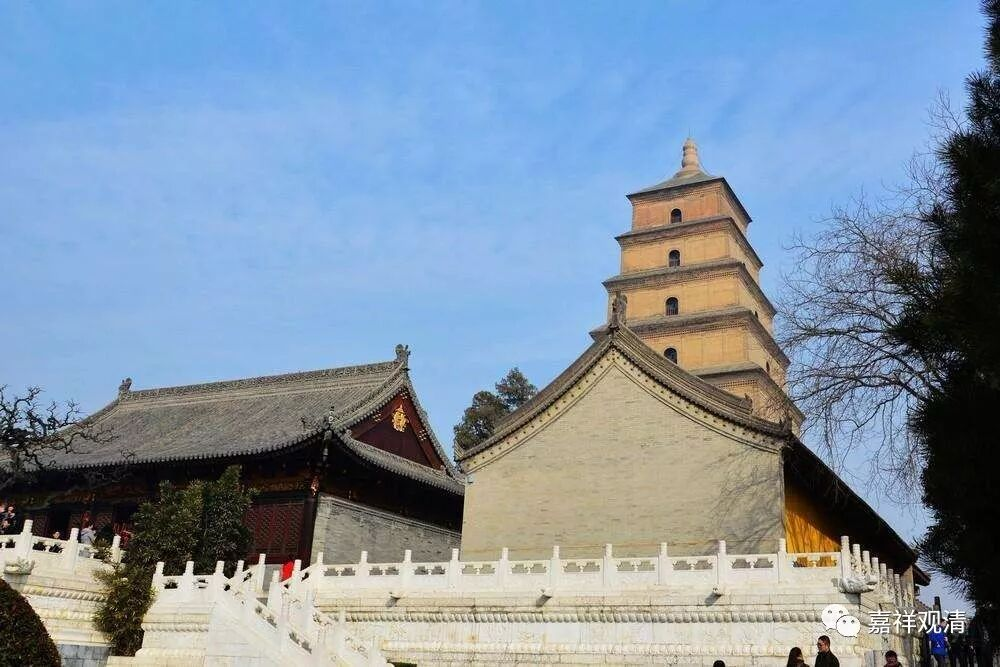

**《十二门论》初颂与龙树诸论**

《十二门论·观因缘品第一》的第一颂：

** “眾緣所生法，**

** 是即無自性；**

** 若無自性者，**

** 云何有是法？”**

《中观论》也说：

** “因缘所生法，**

** 我说即是无……”**

此二颂之前半颂意思非常接近。不仅如此，《十二门论》此颂里的意思，在《大智度论》中也反复强调，如（卷三十七）：

** “若從因緣和合生，是法無自性，若無自性即是空！”**

这是说，随一法（或者说“诸法”也一样），如果是因缘生，那么他就无自性；如果你认可此法无自性，我们就接着说此法“空”。文字和理路都很明白。

需要“无数加一次”强调的是，龙树在这里说的“无自性”并不是“不存在”，而是“自性不存在”、“本体”不存在，这里文字上已经说得很明白了，不要选择性无视“自性”这两个字，也不要夹带自己的私货（“无自性就是什么都不存在”这种私货少来）！

如果我们认可鸠摩罗什一系的传说，那么，上述三篇文献都直接指向龙树大师，圣龙树的观点虽远追根本《阿含》，而其直接的来源则是《般若》系经典。如《大品般若》（鸠摩罗什译）卷二十二：

** 佛言：“諸法和合因緣生，法中無自性。若無自性，是名無法。以是故，須菩提！菩薩摩訶薩當知一切法無性。何以故？一切法性空故。以是故，當知一切法無性。”**

这里的文字几乎完全可以认为是上述龙树三论的直接来源。

乃至在玄奘译的《大般若》第一会和第二会中，也还是可以窥见其文义：

** 《大般若经》卷364：**

** “佛言：‘善現！一切相智無和合自性故，若法無和合自性，是法則以無性為性。……**

** 善現！由是因緣，諸菩薩摩訶薩應知一切法皆以無性為其自性。’”**

**
**

** 《大般若经》卷463：**

** “佛告善現：‘一切智智無和合自性故，若法無和合自性，此法則以無性為性。色、受、想、行、識亦無和合自性故，若法無和合自性，此法則以無性為性。如是乃至有為界、無為界亦無和合自性故，若法無和合自性，此法則以無性為性。善現！由是因緣諸菩薩摩訶薩應知一切法皆無性為性。’”**

另外，在罗什传译的《思益梵天所问经》卷一也明说：“** 若法从缘生，自无有定性**”。这里的“定性”，就是“实性”，也是说：“若法从因缘生，则无有自性。”

我们可以发现上述罗什传译的经典有其整体的一致性。我们可以再看一例。罗什译《中论·青目释》中，青目在注释《观三相品》“若法眾緣生，即是寂滅性”时说：

** “眾緣所生法，無自性故寂滅，寂滅名為無。”**

和上述龙树三论、《思益经》、《般若经》完全一致……

