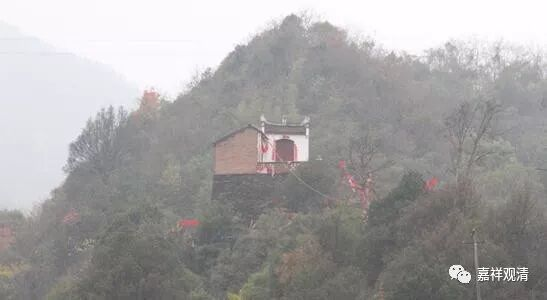
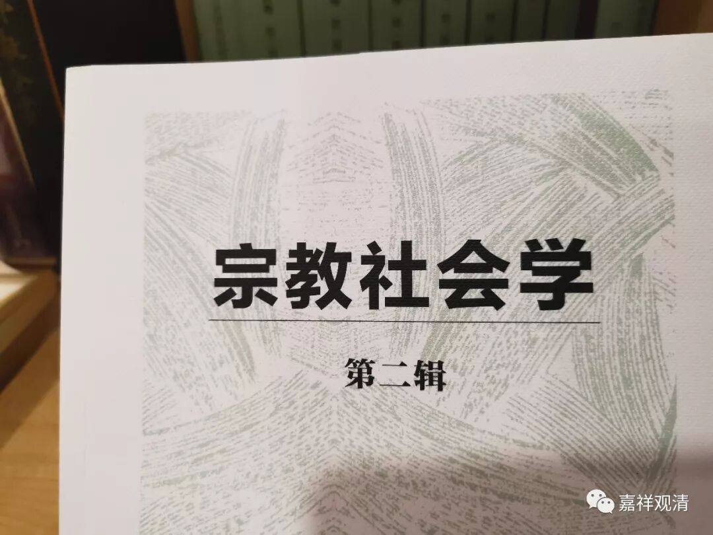
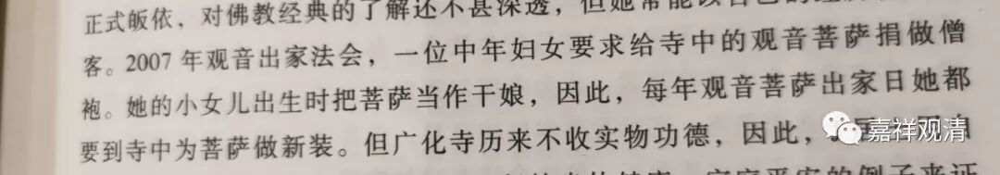
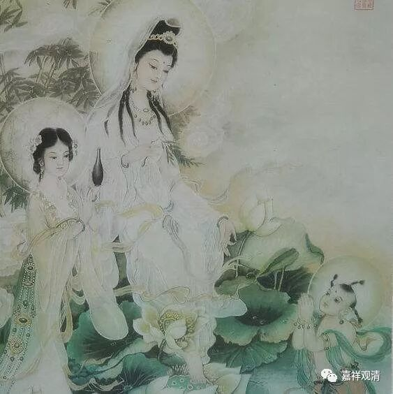
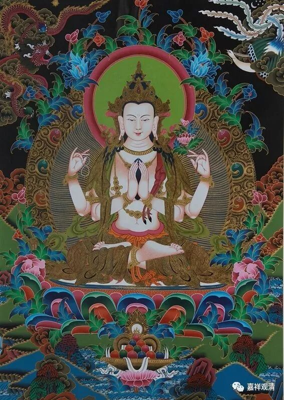
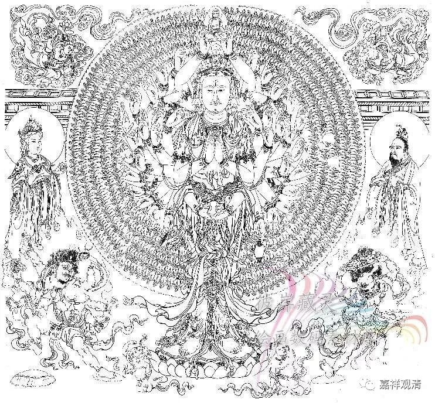
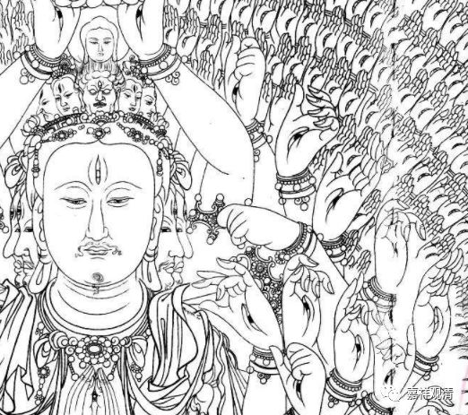

**
**

** “仙人叫我来拜干妈的！”**

上次谈到拜观音做干妈的事儿，江西鄱阳有，上海也有，但吴语地区民间一般称观音菩萨为“观音娘娘”的，“观音老母”是北方的说法。

最近买了不少书，专门买了一些社会学、人类学的读物，今天翻看《宗教社会学》（第二辑）也谈到了一例给观音“干娘”做新装的案例，可以一起看一下：

《宗教社会学》（第二辑）P101：

** “……2007年观音出家法会，一位中年妇女要求给寺中的观音菩萨捐做僧袍。她的小女儿出生时把菩萨认作干娘，因此每年观音菩萨出家日她都要到寺中为菩萨做新装……”**

说起拜观音为干妈的民俗，应该很晚出现，估计要到明代了吧，因为我们知道，观音菩萨本来并非女性形象，而观音菩萨的女性化应该比较晚出的。

这个认菩萨做干娘的“风俗”估计最初和“大仙儿”、算命这些有关，一般都是因为孩子身体差、“八字薄”而到寺院认的干亲，民间乡村里的“巫医平行”甚至“巫先医后”（我遇到过在上海郊区的中医大师经手的很多病人都是“仙人介绍伊拉来的”，一开始我还反应不过来啥是“仙人”）助推了这一“认亲”的流行……

所以山里小庙经常遇到的是“请问哪一尊观音菩萨很灵的？仙人叫我来替孩子拜干妈的！”

