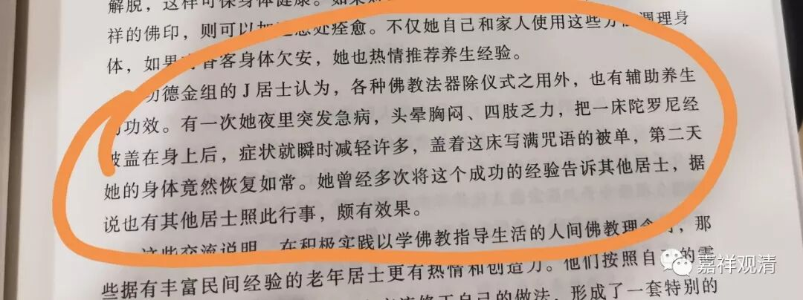

**“在民间的佛教”常见的“姿势”**

在民间的佛教的样子，真是让我们“大开眼界”

今天读书，看到一篇社会学论文《某市某寺的护法××和居士生活》里这样叙述——

** “功德组的J居士认为，各种佛教法器除仪式之用外，也有辅助养生的功效。有一次他夜里突发疾病，头晕胸闷、四肢乏力，把一床陀罗尼经被盖在身上后。症状就瞬时减轻许多，盖着这床写满咒语的被单，第二天她的身体居然恢复如常。她曾经多次将这个成功的经验告诉其他居士，据说也有其他居士照此行事，颇有效果。”**

我们知道，“陀罗尼经被”又叫“往生被”，那可是“往生”以后才盖上的，老居士居然用来“治病”并推而广之，这真是不得不佩服民间大神们的“创造性诠释”啊！

这现象还不罕见，前一段时间我在朋友圈也发过这样一则“佛盲的花式作死”，LOOK：

这是真正的在做“广告”了。真是佩服这些心大的“野生佛教徒们”……

《……某寺……居士生活》一文总结道：

** “这些交流说明，在积极实践以学佛教指导生活的人间佛教理念时，那些具有丰富民间经验的老年居士更有热情和创造力。他们按照自己的需要，参照民俗逻辑，通过实践和交流，形成了一套特别的养生观。”**

最近常说一句话：

我知道智慧的顶点在哪里——那是佛

但我不知道愚蠢的底线在哪里……

