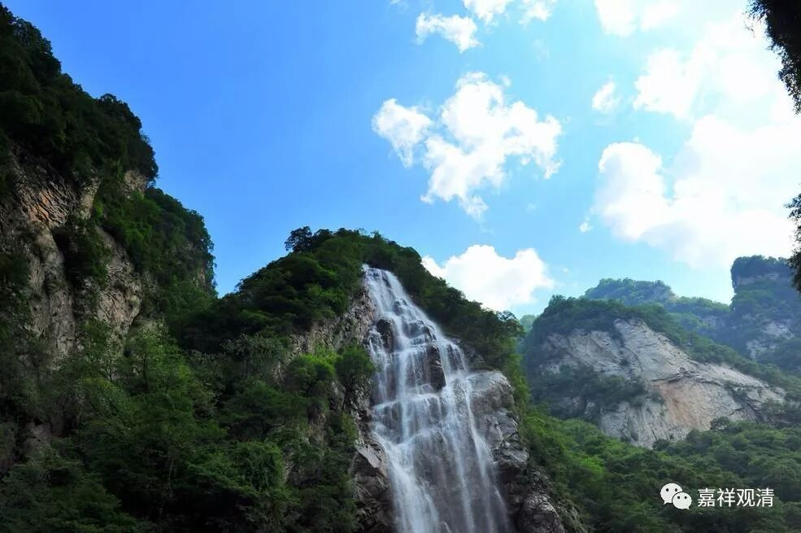

**《善说精髓》073（五）**

** “若知正立因二谛，道位方智果二身，”

** 

破除他宗邪执后，自宗给出了简单的回应：

一个宗派的成立，需要圆满成立其“教、道、果”的安立，有时候又称为“教、理、行、证”，现在很多翻译为“基、道、果”，基就是基础，也就是“教”、“理”了。

自宗中观派说：我们来看一下“教、道、果”的正确安立（和方便智慧都脱不了干系）。“教”、“基位”，谈一切法（一切存在）；道，谈趋向解脱的路；果，谈佛陀究竟的果位。

“教”、“基位”，一切法（一切存在）上，中观派谈二谛。如果知道** “正”**确的安** “立”**，** “因”**位、就是基位，是什么呢？从** “二谛”**上讲——胜义谛、世俗谛。中观说：一切法分二谛，都被这二谛所包含，二谛以外没有法了。那么，方便、智慧正可以对应世俗谛、胜义谛。

道位：我们的** “道位”**——在我们修行的路上，就是方便道和解脱道，就是是** “方”**便和** “智”**慧所摄。

果位：《现观》说“果法身”。那么，在果位上就是佛的** “二身”**——智慧身和福德身。

所以呢，这方便、智慧这两个，从头到底都不能缺，一个都不能缺少——在基位对应世俗谛、胜义谛，在道位对应方便道、解脱道，在果位对应福德身、智慧身。

** “略示广慧即解故，”

** 

自宗说，这里是一个简单的** “略示”**，如果有** “广”**博的智** “慧”**的话，就能够了** “解”**。

** “归依无缘大悲师，开示诸事无自性，

**然诸因果无少乱。”

** 

** “无缘大悲师”**指的是佛——我们的** “归依”**对象，他** “开示”**了一切** “诸”**法的** “无自性”**。但是在这个当中，** “因果”**也没有没有少许的错** “乱”**，也就是说，无自性表现为缘起，缘起又表现为无自性。

这个** “无缘大悲师”**就是在夸我们的佛。** “无缘”**就是修空的一方面，是吧？而** “大悲”**又是行有的一方面。那么佛是既有空的一方面，又有有的一方面。这个无缘不是没有因缘的意思，不是说没有因缘也能生起大悲心——不是这个意思啊。这个无缘是缘空的意思，能够生起对空的认识。佛在观察有情的时候，能够同时看到有情、看到有情的因缘和看到有情的空性——缘生大悲、缘法大悲和无缘大悲。

** “（庚三）释学习学处之次第。”**

** 

第三，解** “释”**一下，** “学习”**戒律的** “次第”**。

第四，

** “分二：（辛一）总学大乘之理；（辛二）别学金刚乘之理。”**

** 

** “大乘”**呢，就是波罗蜜多乘。这个不是说三乘以外再有一乘叫** “金刚乘”**，这个是包括在大乘里面的，就是有这么一种比较特殊的密乘。但密乘本身还是属于大乘的啊。大乘肯定不是小乘，这个一定要区分开来，但是密乘肯定是属于大乘的。

** “（辛一）总学大乘之理。

** 

** 分三：（壬一）净修欲学菩萨学处；（壬二）修已受佛子律仪；（壬三）受已如何学习之理。**

** （壬一）净修欲学菩萨学处：

** 

** “咒与别解脱调伏，未受不可听学处，”

**  **

** “咒”**指的是密乘的戒律，** “别解脱”**指的是出家人的戒律。“** 调伏”**就是指的戒律。

** 

密宗的戒律和出家人的戒律都是先受了以后再学。如果** “未受”、**没有得到比丘别解脱戒、密乘戒以前呢，就“** 不可**”以“** 听**”这些戒律。

