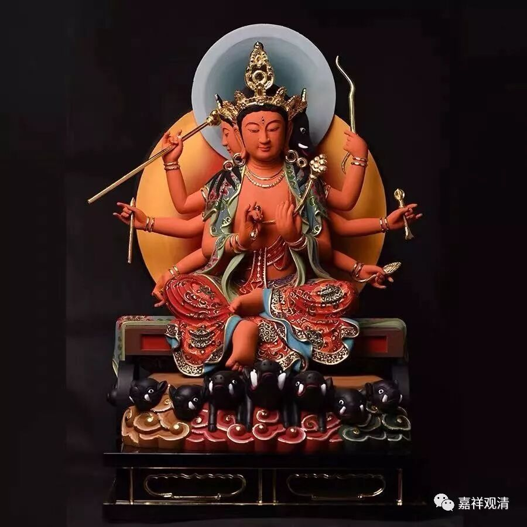
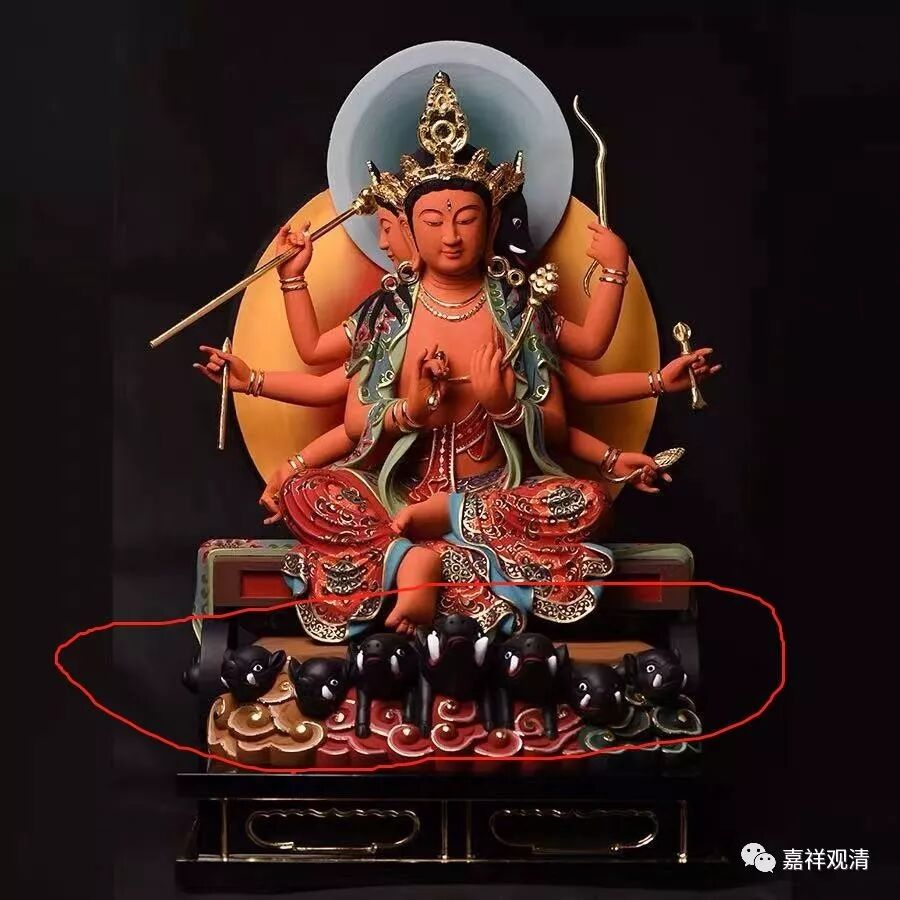
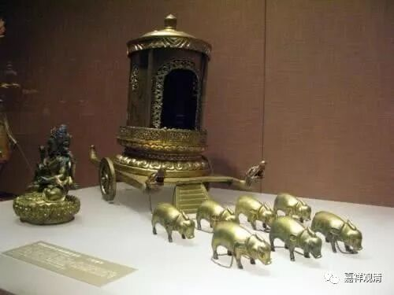
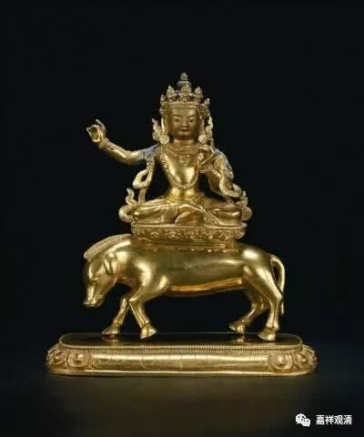
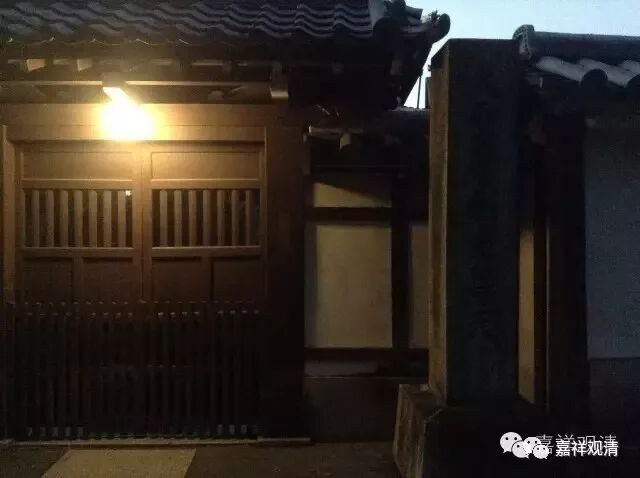
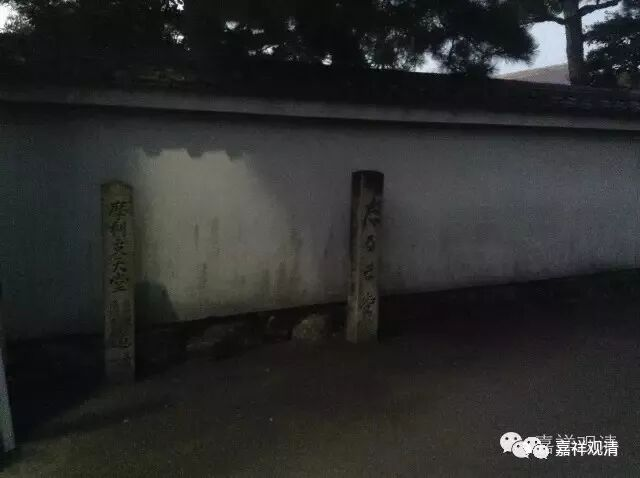
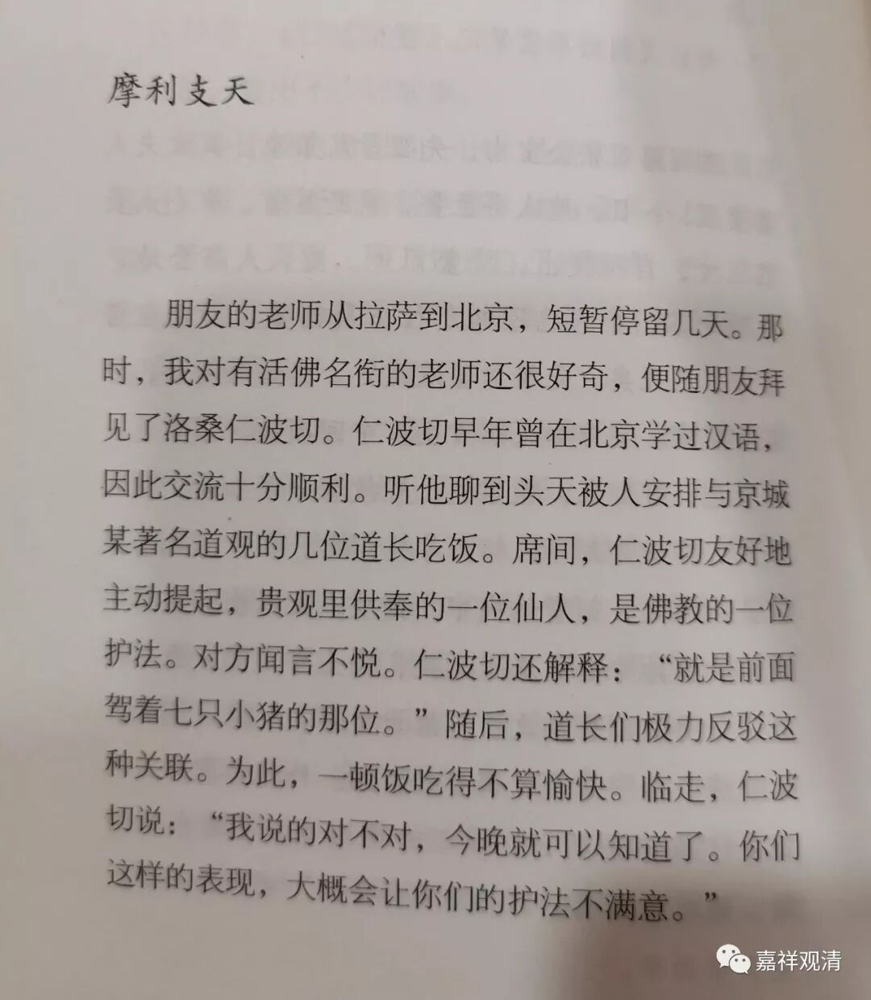
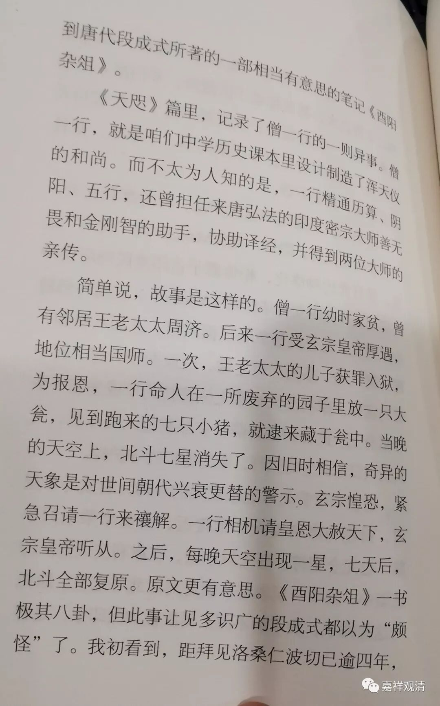
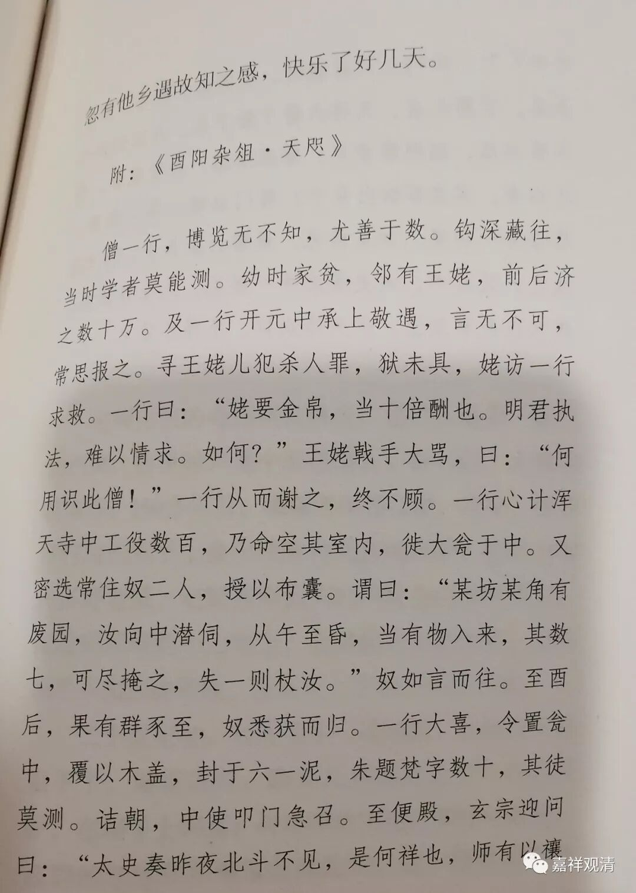
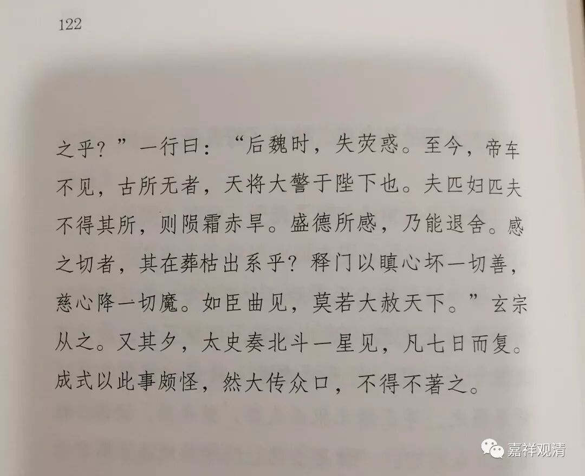

**摩利支天·斗姥和猪八戒**

《金泽》引《金泽志》，说上个世纪五十年代，金泽镇上有一个“斗会”，是一批老秀才们办的，常年在20人以上，“农历三月初一起‘年忏’三天……会员们纶巾道氅，道貌岸然。人们称为道士”（《金泽志》）。《金泽》一书中说“‘斗姥’信仰可以归为道教，但斗会人士也是佛教信众，同时这种信仰方式也是改造过的民间宗教……”

这里可以补充的，有两点：

一、道教里的“斗姥”实即佛教“摩利支天”的道教形式。就像观音在道教里成了慈航道人，燃灯佛在道教里成了燃灯道人一样。摩利支天坐骑是七只小猪，就是对应的北斗七星，所以道教称之为“斗姥”。有时候也有表现为一只猪的。

《西游记》里的猪八戒，在元杂剧里自报家门就说自己是“摩利支天”的御车将军。

摩利支天在佛教里又称光明母，汉地曾经很流行，不知为什么后来流行到道教里尔佛教里反而较少提及，但日本修摩利支天的很多，很多寺院都有摩利支天的殿堂。日本忍者修隐身术，就是用的密宗里的摩利支天的法门。

南禅寺的摩利支天殿，那天去晚了

摩利支天堂

张梅在《家师逸事》里有一节《摩利支天》，我就直接搬上来大家读吧。

二、金泽的斗姥信仰，其实还可以跟国家正祀（《金泽》里说的儒教）有关。“农历三月初一起‘年忏’三天”，正日子就是三月粗三，而“三月初三”则源于汉代的上巳节。

前几天去了浦东的龙王庙，现在归道教协会管理，也有很多民间信仰、也拜杨震，也供了“斗姥”。

