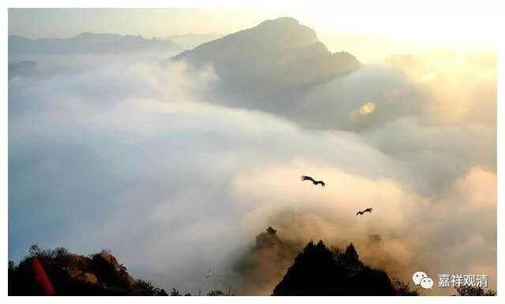

**两处藏文版本差异留下的“大坑”**

由于本文对照参考了叶少勇的《中论颂·梵藏汉合校》，而叶氏刊本以月称传本为底本，所以这里有一个问题，即今之学界研读《中论》主流版本为月称系之梵藏本，若依月称本，则《十二门论》第四门第六颂仅相当于《中论》7·7之半颂。

《十二门论》4·6

是生生生時，

或能生本生；

生生尚未生，

何能生本生？

7·7

《中论》罗什本

若生生生時

能生於本生

生生尚未有

何能生本生

《中论》中西书局本

彼之正在生起者，

确实能够生出彼，

如果此虽未被生，

而仍能够生出彼。

我们来看一下《中论》此颂的梵藏本：

Ayam utpadyamānas te      kāmam utpādayed  imam|

Yadīmam utpādayitum        ajātaḥ śaknuyād ayam||

1、

ཁྱོད་ཀྱི་དེ་ནི་སྐྱེ་བཞིན་པ།།

མ་སྐྱེས་དེ་ཡིས་གལ་ཏེ་ནི།།

དེ་ནི་སྐྱེད་པར་བྱེད་ནུས་ན།།

དེ་སྐྱེད་པར་ནི་འདོད་ལ་རག།།

2、

གལ་ཏེ་མ་སྐྱེས་པ་དེ་ཡིས།།

དེ་སྐྱེད་པར་ནི་བྱེད་ནུས་ན།།

ཁྱོད་ཀྱི་སྐྱེ་བཞིན་པ་དེ་ཡིས།།

དེ་སྐྱེད་པར་ནི་འདོད་ལ་རག།།

此中，藏文本有二，颇不相同，前者出自《无畏疏》《佛护释》《般若灯论》《般若灯论释》之藏文本，后者出自藏译《中论》和《明句论》的版本。

二、《十二门论》与《七十空性论》

对照发现，《十二门论》与《七十空性论》相关的有三颂。这里把《十二门论》与《七十空性论》相关的偈颂对照表单列：

《十二门论》与《七十空性论》对照表

《十二门论》

《七十空性论》

1

《观因缘门第一》

缘法实无生，

若谓为有生，

为在一心中，

为在多心中？

第八颂

缘起十二支，

有苦即不生，

于一心多心，

是皆不应理。

2

《观有无门第七》

有無一時無，

離無有亦無，

不離無有有，

有則應常無。

第十九颂

生灭非同时，

无灭则无生，

应常有生灭，

无生则无灭。

3

《观生门第十二》

生果则不生，

不生亦不生，

离是生不生，

生时亦不生。

第五颂

已生則不生，

未生亦不生，生时亦不生，

即生未生故。

这里谈一下第三则。

按，《十二门论》末一颂对应《七十空性论》之颂文，今梵文本暂缺，藏文则有两个版本：

（一）

གང་ཞིག་སྐྱེས་དེ་བསྐྱེད་བྱ་མིན། །

 མ་སྐྱེས་པ་ཡང་བསྐྱེད་བྱ་མིན། །

སྐྱེས་པ་དང་ནི་མ་སྐྱེས་པའི། །

སྐྱེ་བཞིན་པ་ཡང་བསྐྱེད་བྱ་མིན། །

（此藏文版出自德格版《七十空性论本颂》，东北目录编号3827。）

汉译：

诸生不当生，

未生亦不生，

已生未生者，

生时亦不生。

（二）

སྐྱེས་པ་བསྐྱེད་པར་བྱ་བ་མིན།།

མ་སྐྱེས་པ་ཡང་བསྐྱེད་བྱ་མིན།།

སྐྱེ་བའི་ཚེ་ཡང་བསྐྱེད་བྱ་མིན།།

སྐྱེས་དང་མ་སྐྱེས་པ་ཡི་ཕྱིར།།

（此藏文版出自德格版《七十空性论自释》，东北目录编号3831）：

汉译（法尊译）：

已生則不生，

未生亦不生，

生时亦不生，

即生未生故。

《七十空性论》此二版本，与《十二门论》此颂各有一半相类。

这两处藏文本出现差异的地方是两个“大坑”啊，怎么填？谁来填？啥时候填？！

