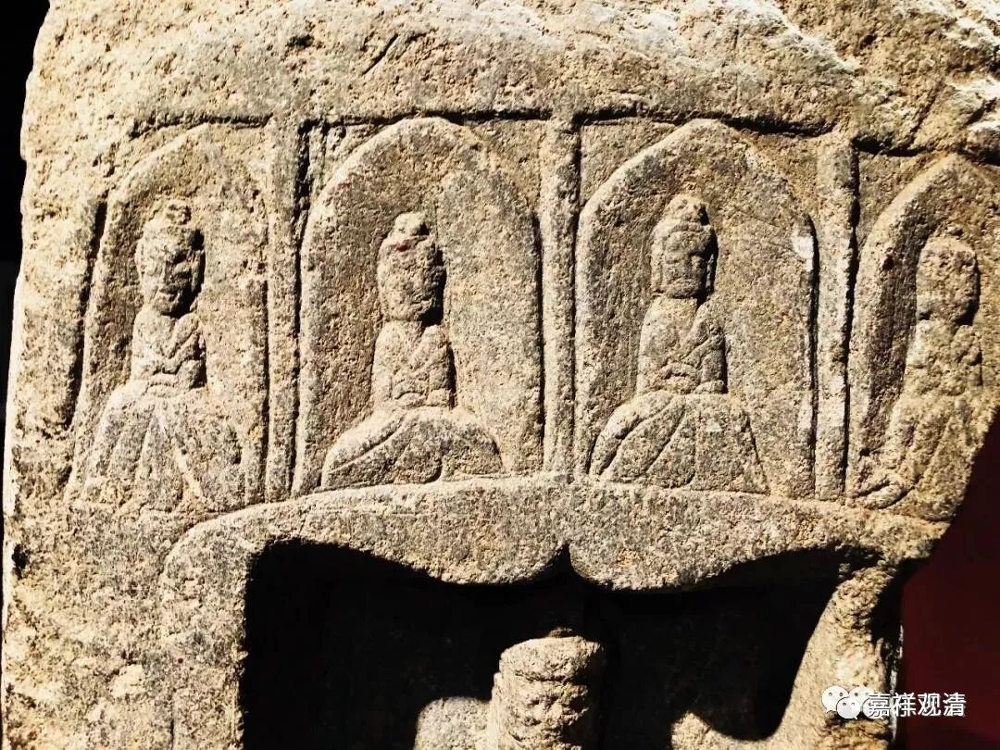

**佛、道两家在一块造像碑上**

** ——和谐的宗教氛围**

昨天下午去了碑林。

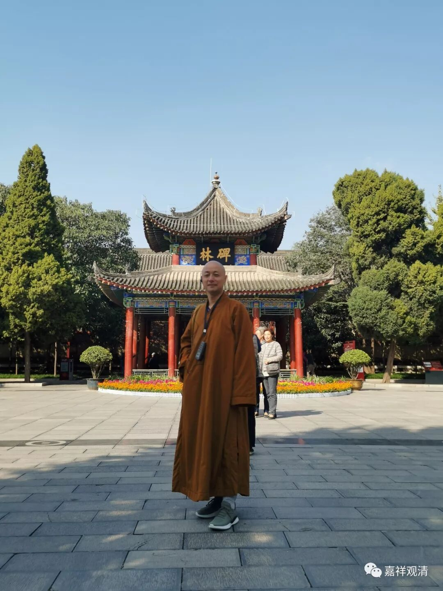

去了那么多次西安，碑林一直留着——知道下次还会去西安的，就先走了西安的诸多古寺，这次总算轮到“碑林”了。也还是没来得及“仔细学习”，估计以后还得来……

作为僧人，自然对佛教题材比较感兴趣，最近在学习中国的宗教、信仰、民俗的生存现象，所以几块造像碑引发了我的“兴趣”——佛道教合一的“造像碑”。

一、朱奇兄弟造像碑

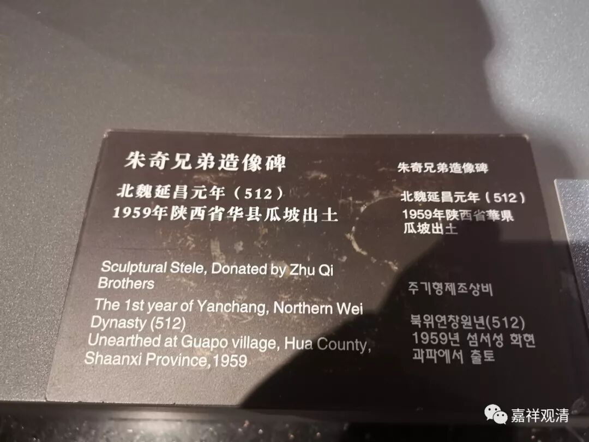

说说我关注的点。

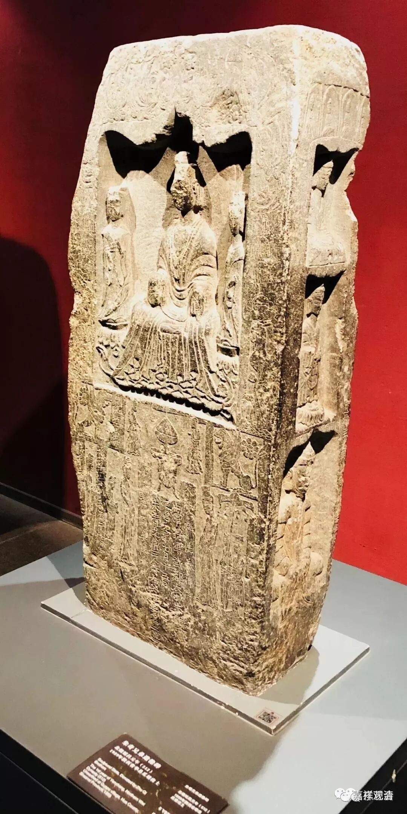

就是这块碑。这块碑四面都有造像，但是看现在右手的这一个侧面，这是一个三层的“石窟”。

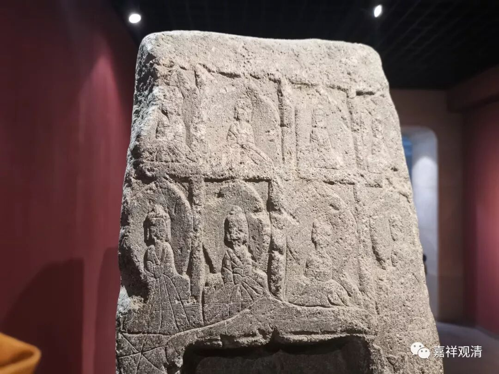

最上面是这个，我刻的印章就是这个套路了……

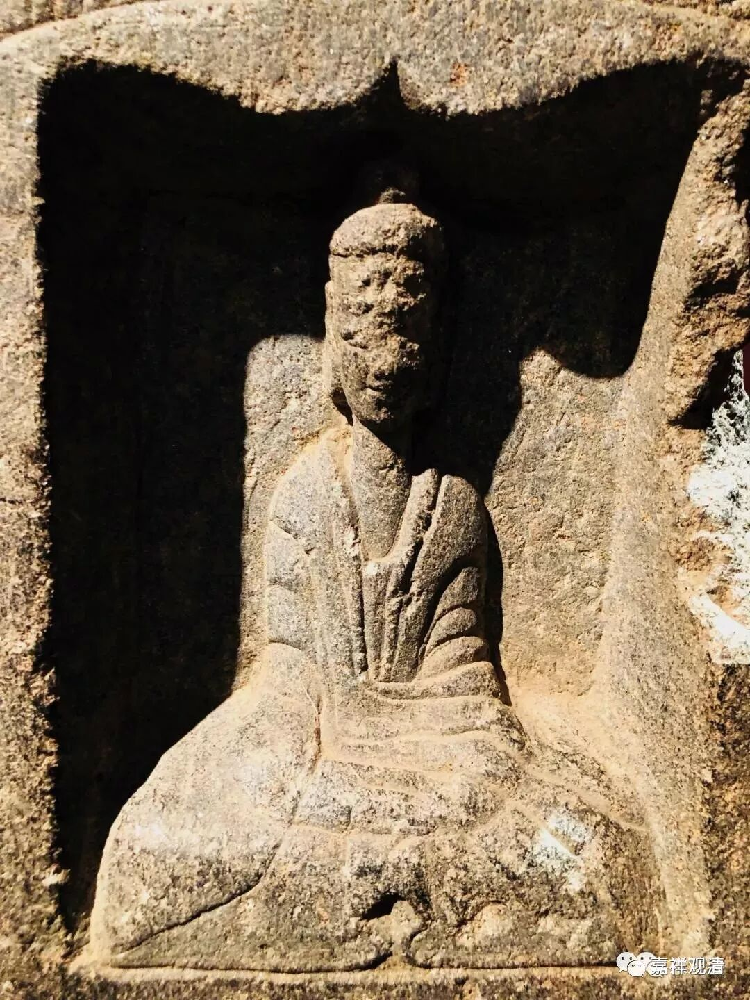

最上一层坐佛。

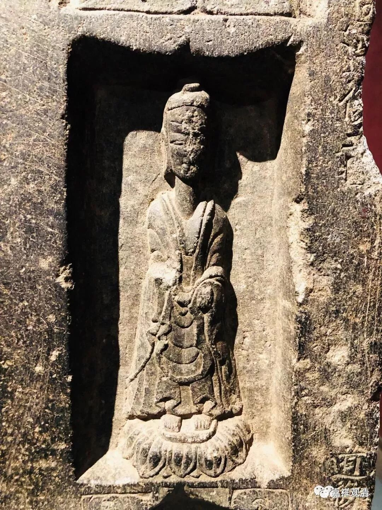

第二层立佛

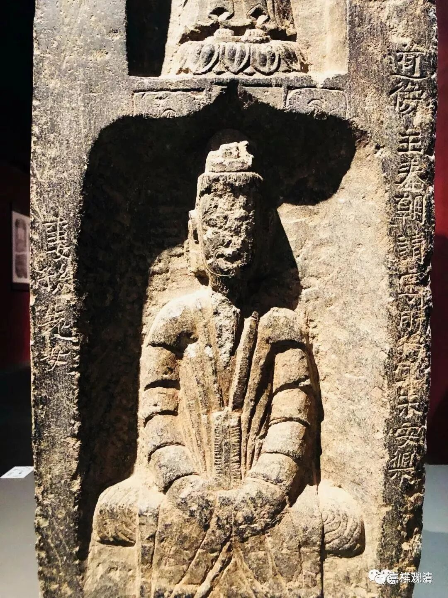

第三层是——道教的神像！，看右上方……

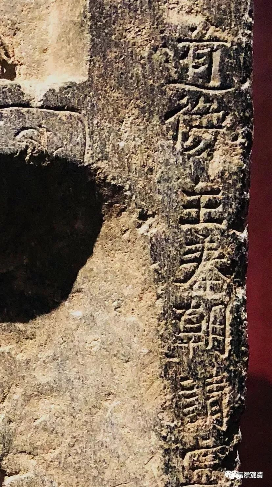

“道像”！造像家里三个当官的，一个信道教，于是给他们爹积累功德的造像碑上佛道教都有了。很有趣哦，这是走在民间的信仰，可也是北朝时期士大夫阶层的信仰——“朱奇兄弟”官也都不算小了。

无独有偶——

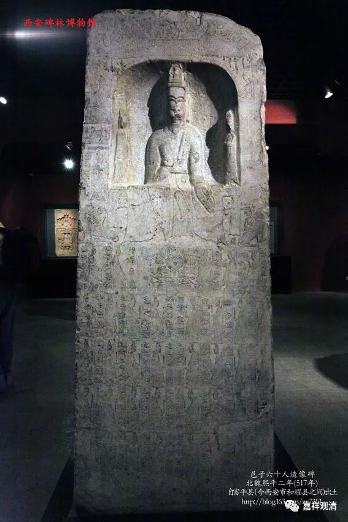

《邑子六十人造像碑》

正面是道教造像，一天尊两真人

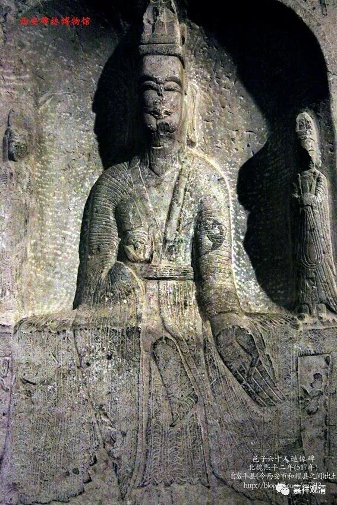

碑阴是一佛二菩萨

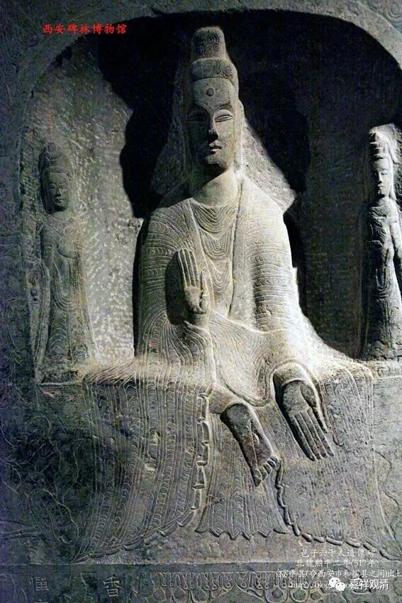

又是佛道教在一块碑上，这个更平等一些，一家占一面。

中国的历史慢慢走来，宗教一直在趋向于融合，西方似乎正相反，一神教的犹太教分出基督教，基督教再分出天主教、东正教、新教，新教再分路德派、加尔文派……很有趣的现象……

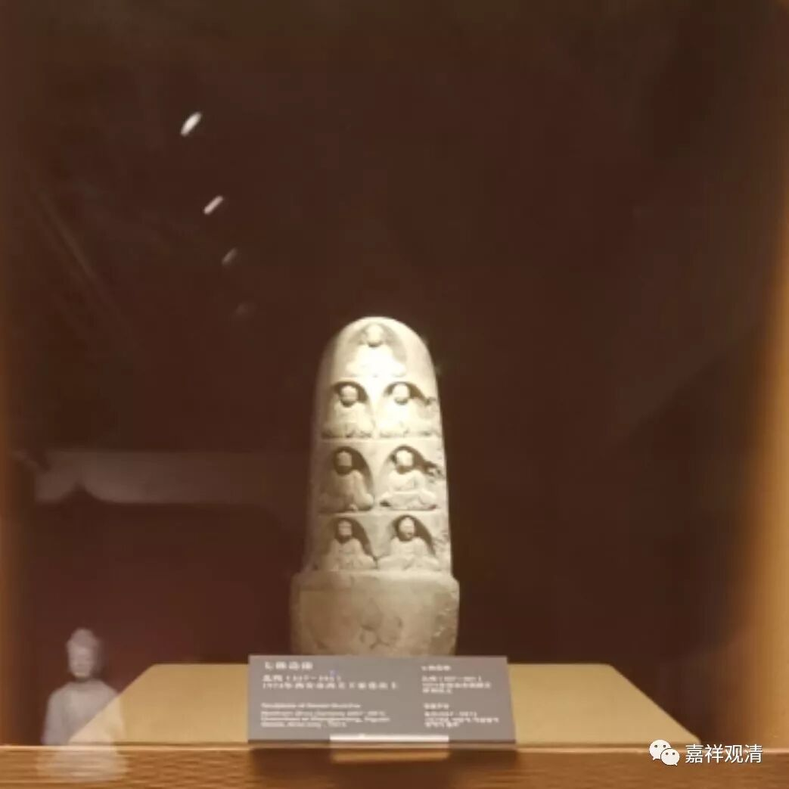

看到有一块“七佛如来”的碑……就——

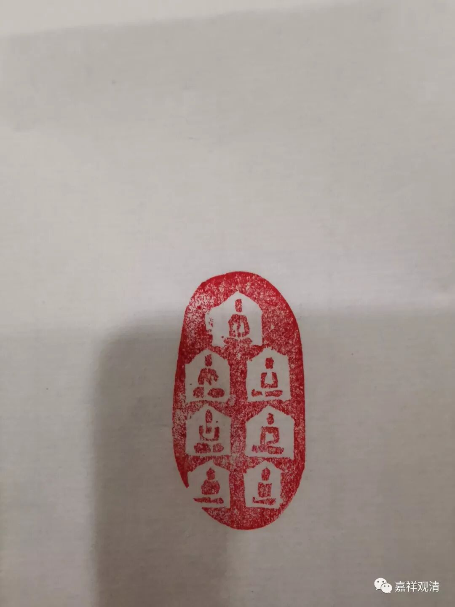

试着按这个思路刻了一枚“七佛如来”……

