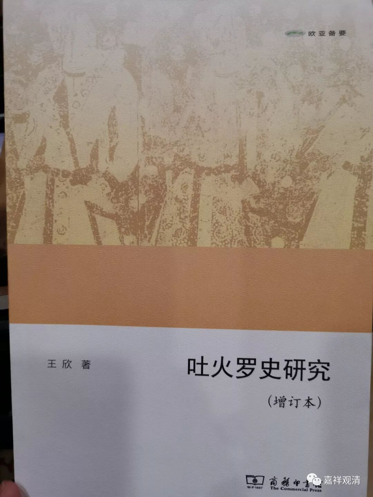
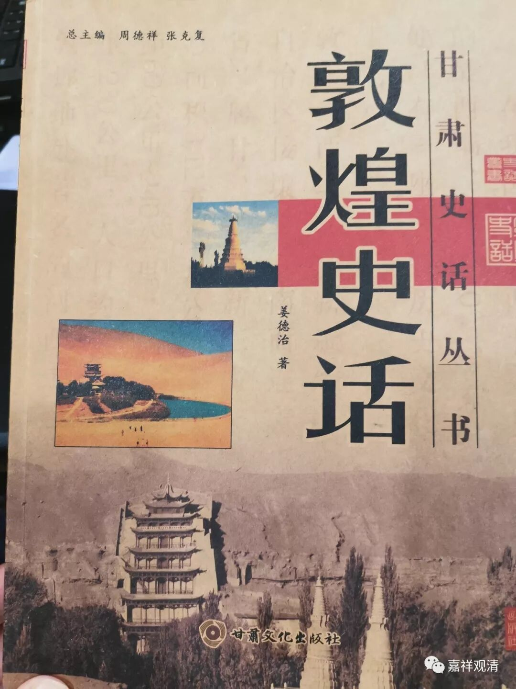

**“敦煌”、“敦薨”与“吐火罗”**

最近学会在当当、京东网购，正在大肆购书中，其中新买了一本《吐火罗史研究》，王欣著。书里谈到“敦煌”。

“敦煌”一词的解释，常见的说法是《汉书·地理志》“敦煌郡”条目下的应劭注：“敦，大也；煌，盛也”，若据本书，则这种解释“纯属望文生义”。本书谓“敦煌”即“敦薨”：

** “‘敦薨’或‘敦煌’是汉文文献指称吐火罗人的另外一种形式。据研究其得名直接源于‘大夏’，系‘大夏’一词的同名异译……”**

** **

吐火罗大家可能比较陌生，但我们知道的国学大师季羡林，他就是吐火罗语的专家。张骞通西域的“大月氏”、后来佛教史里常见的“贵霜王朝”都是吐火罗人的国家……

“敦薨”一词比“敦煌”出现更早。大致成书于战国、先秦时期的《山海经·北山经》就有了“敦薨之山”、“敦薨之水”：

** “又北三百二十里，曰敦薨之山，其上多棕枬，其下多茈草。敦薨之水出焉，而西流注于泑泽。出于昆仑之东北隅，实惟河原。其中多赤鲑，其兽多兕，旄牛，其鸟多柝鸠。”**

据考，此处的“敦薨”，地理位置就是后来的“敦煌”。

手边还有一本《敦煌史话》，这里谈到“敦煌”一词的来源，也否定了东汉应劭的“字面上解释”，而说：

** “学术界对‘敦煌’的含义和来源有多种说法，有的认为是‘吐火罗’的音译，有的认为来自羌语，还有的认为来自突厥语，说法不一。总之，现在可以确定，‘敦煌’一词是少数民族语，究竟是哪种语言，还有待进一步探讨。”**

