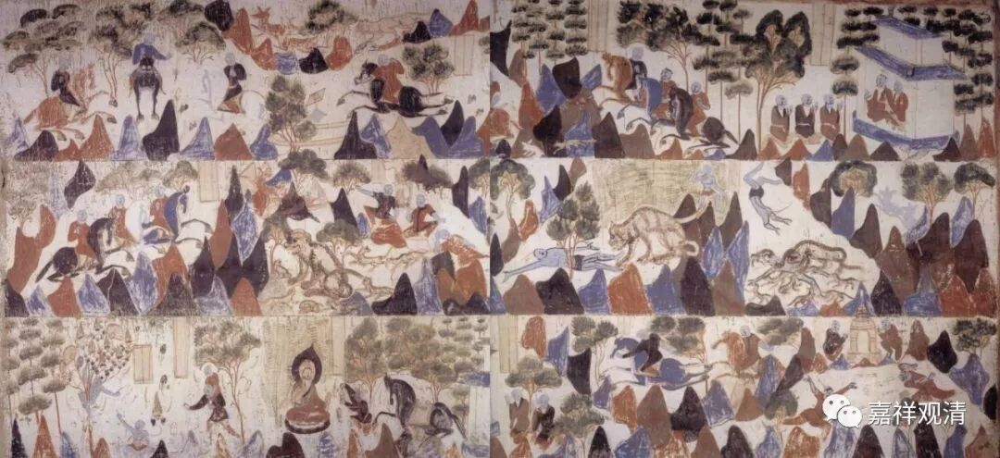

**《善说精髓》075（二）**

** “身受用与三世善，”

** 

** “身”**也好，财物、** “受用”**也好……我们每天早上不是念的吗？“身财受用善根等，悉皆施舍于一切父母众生，而今我为饶益有情故，仍需受用衣食卧具等，并唯行利益众生之事业也。”每天早晨起床，就说我已经起来了，我的这些东西全都是给众生的，但是呢，我也要吃饭，我也要活着，是吧？我就用我的那一部分，用完以后呢，我的这个身体也要做利益众生的事情。（嘴上是这么说的，做起来还是有点困难哦。）我的** “身”**、财、** “受用”**，一切都施于众生，还包括什么呢？** “三世善”**——我所累积的一切功德，也都施于众生。

** “施时若具六度修，”

** 

这个就是布** “施”**的同** “时”“具”**备** “六度”**了。布施本身就是布施，布施当中防止二乘作意，是持戒，布施当中坚住不动、耐他怨害就是安忍，布施一心坚持就是禅定；知道什么该布施，什么不该布施，这个是智慧。一个布施同时具备六度，那么其他也是一样。

六度每一度含有六度的说法，《般若经》、《大智度论》等里面都有，意思差不多。《广论》中说：

“具足六种波罗蜜多者，如行法施，防止声闻、独觉作意，是名持戒；于种智法信、行、堪忍，忍恕他骂，为令法施倍复增长，发起欲乐，是名精进；心专一趣不杂小乘，廻向此善于大菩提，是名静虑；了知能施、所施、受者悉如幻化，是名般若。具足六种，力最强大。此是《八千颂广释》所说。”

《八千颂广释》是狮子贤论师的《现观广释》，是配合《小品般若》解释的。因为篇幅比《现观明义释》要广，故称“广释”，是《现观》重要参考书。现在还没有汉译，可能是因为篇幅太大了。

** “成就久暂诸所须。”**

** 

布施呢，能够** “成就久”**远和** “暂”**时的资具。以后的那些资具，都是由这个布施而来的。

题图是敦煌壁画《舍身饲虎（连环画）》

