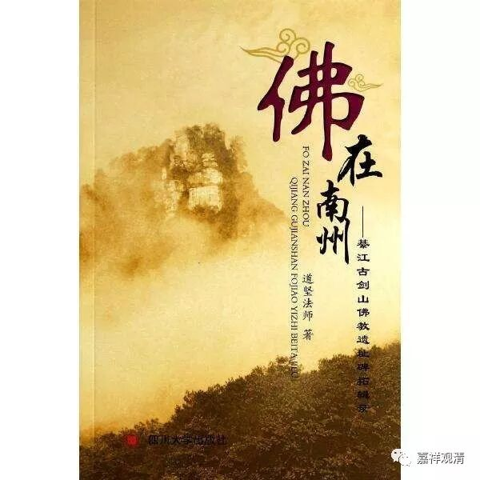
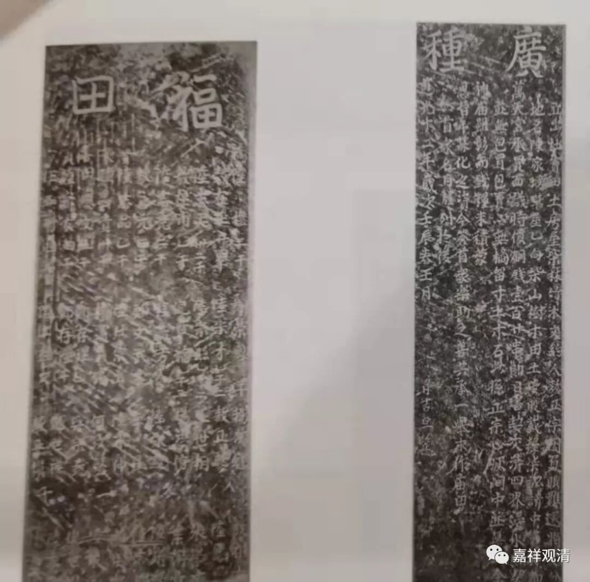
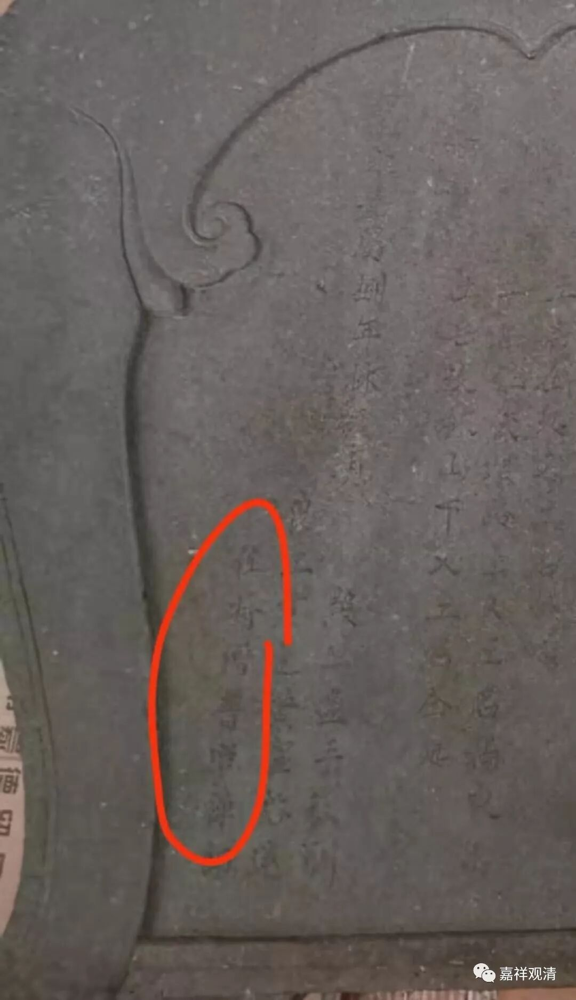

**庙里的卖地碑**

上次我们寺院一块碑是买地的，功德主拿钱买地给寺院做“香灯田”，今天看到一块类似的碑文，是以卖地的人口吻写的：

立出度卖田地房屋竹木文约人敖正宗，因付账难还，将受分

土地名陈家塝草屋乙向，柴山田土一股，载粮七亩，请中卖与都

万天宫，承买面议时价铜钱一百二十贯，即日书契交清。四界堰水照契，

并无包买包卖。亦无摘留寸土木石，此系正宗心囗间中并无曲全。

神庙虽彰而钱粮未积。蒙

恩昔年募化之资，今签首众乐助之善。共承一举，永作庙田。

首众名目胪列于后道光十二年岁次壬辰春三月   廿吉旦竖。

此碑为重庆郭扶镇龙泉村都府庙遗存。见于《佛在南州》P144~145页。

碑文的个别字还有点认不清，文字在文白之间，立碑时间和白云寺接近，略异的是，白云寺功德田碑是由乡绅、信众以买地人的口吻写的，此碑是站在卖地的人的立场上写的，立碑的功能都是确定庙产，并彰显功德主（都府庙此碑后面罗列有功德主姓名）善举。

白云寺功德碑上有“住持僧普照禅师”落款，而都府庙卖地碑上没有出现住持的名字，或许因为此庙并无固定出家人长期住持。

都府庙在碑文上被称“万天宫”，或许又是一个宗教杂糅的“庙观”。

民间走一走，或许可以有更多资料可以解读哦。以后行走江湖要随时准备拓碑了。

