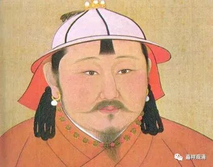
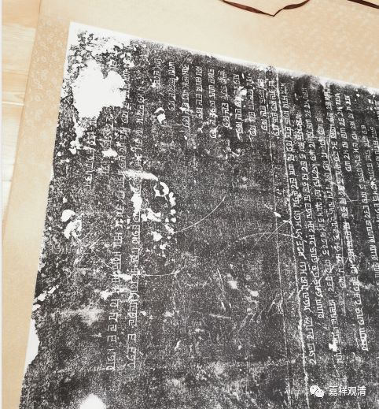
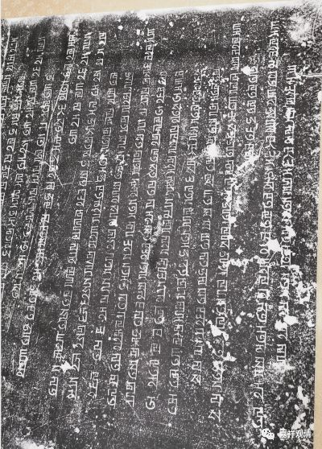
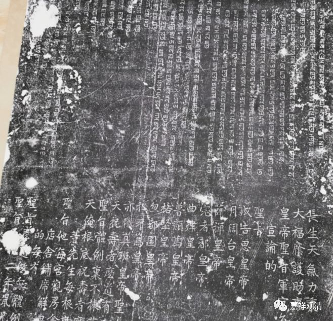
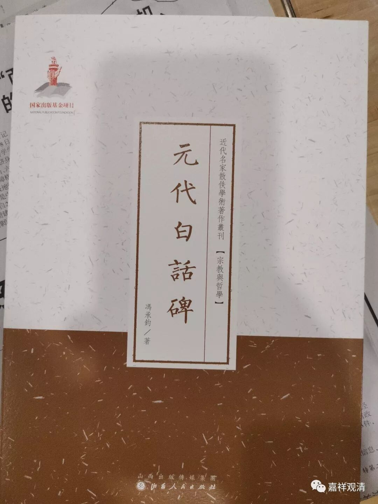

**蒙古皇帝的圣旨碑**

前一段时间，小居介绍了个卖拓片的，这两年陆陆续续在他那里买了一些和佛教相关的碑拓——我不是收藏用来练字、研究书法的，只是觉得以前佛教史方面只注意了纸质文献《高僧传》之类，碑文的这种（佛教）文献形式以前没可以关注过，现在看来，有些资料值得关注，补补我以前关注点的缺失。

在这些碑拓中，有一张元代的圣旨碑特别可笑（我们几个试着读一下的人都快笑趴下了），虽然是白话，但几个人凝神看半天才仅仅看懂一点点意思。

碑是上一半蒙文（八思巴文）

下一半汉文的，而圈里面有个蒙古和尚，那天忽然想到找给他翻译，他……说要复习一个月（蒙文再说）。另有两位大师也学过蒙文，可是都说自己的蒙古文都已经还给老师们了……

买了一本冯承钧先生的《元代白话碑》，今天新到，翻了一下，觉得基本可以“解读”清楚这块碑了。今天先释读一下原碑吧。（分行按碑文）

** 长生天气力里，**

** 大福荫护助里。**

** 皇帝圣旨：军官人每根底，军人每根底，城子达鲁花赤官人每根底，往来的使臣每根底，**

** 宣谕的**

** 圣旨。**

** 成吉思皇帝**

** 月阔台皇帝**

** 薛禅皇帝**

** 完者都皇帝**

** 曲律皇帝**

** 普颜笃皇帝**

** 格坚皇帝**

** 忽都图皇帝**

** 扎牙笃皇帝**

** 亦怜真班皇帝圣旨里：和尚、也里可温、先生，达失蛮，不拣甚么差发休着。告**

** 天祝寿者麽道有来，如今依在先**

** 圣旨体例里，不拣甚么差发休着者。告**

** 天俺根底祝寿者，么道汴梁路许州天宝宫里有的有的明真广德大师提点王青贵为头儿**

** 等先生每根底，与了执把的**

** 圣旨他。每宫观房舍里，使臣休安下者。铺马只应休着者。税粮休与者，田土、园林、碾磨、**

** 店舍、铺席、解典库、浴堂、竹园、船只，不拣甚么，他每的不拣是谁，休以气力夺要者。这**

** 的每有**

** 圣旨么道，做无体例的勾当呵他更不怕那甚么**

** 圣旨囗囗二年鼠儿年七月十二日，上都有时分写来。**

同样内容的碑现存还有几块，文字略有差异。

我问卖家这块碑拓的出处是哪里？人家说是“河南天宝宫”，就是碑文里的“天宝宫”了。

大家先猜猜这上面写的什么意思

（未完待续……）

