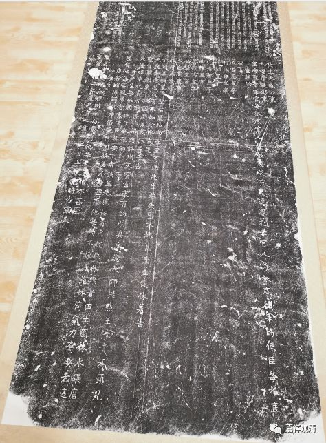

**元朝皇帝的白话圣旨（续）**

我们来解读一下碑文：

长生天气力里，

大福荫护助里。

被长生天所护佑的

皇帝圣旨：

皇帝下的圣旨

军官人每根底，军人每根底，城子、达鲁花赤官人每根底，往来的使臣每根底

军官、军人、各地长官、往来的使臣人等

（达鲁花赤，意即“长官”。）

宣谕的

圣旨

【诸位先皇】宣谕过的圣旨

成吉思皇帝

月阔台皇帝

薛禅皇帝

完者都皇帝

曲律皇帝

普颜笃皇帝

格坚皇帝

忽都图皇帝

扎牙笃皇帝

亦怜真班皇帝

成吉思汗、窝阔台汗、忽必烈汗……

圣旨里：

圣旨【发布过的】

和尚、也里可温、先生，达失蛮

佛教、基督教、道教、回教的诸教职人员

不拣甚么差发休着

免一切差发、徭役

告天祝寿者

【他们是】祈祷神灵、为圣上祝寿的

麽道有来

等等【已经说过了】

如今依在先圣旨体例里

现在依照之前已经降下的圣旨

不拣甚么差发休着者

免一切差发、徭役

告天俺根底祝寿者，

么道

【他们是】祈祷神灵、为我祝寿的

等等

汴梁路许州天宝宫里

汴梁路许州天宝宫

明真广德大师提点王青贵为头儿等先生每根底

诸众……人等

与了执把的圣旨他

把圣旨给他

每宫观房舍里，

所有宫观房舍

使臣休安下者。

使臣不许住下

铺马只应休着者。

不许取铺马只应

税粮休与者，

税粮概免

田土、园林、碾磨、店舍、铺席、解典库、浴堂、竹园、船只

田土、园林、碾磨、店舍、铺席、解典库、浴堂、竹园、船只

不拣甚么，他每的不拣是谁，休以气力夺要者

所有宫观属物任何人等不得强行侵夺

这的每有圣旨么道

该【天宝宫】亦不得凭有圣旨

做无体例的勾当呵他更不怕那甚么

有恃无恐，而做些不法之事

圣旨俺的

钦此！

二年鼠儿年七月十二日

二年某子年七月十二日

上都有时分写来

写于上都

看到“圣旨俺的”原来竟然是“钦此”，真是笑喷了。这应该是汉臣先把“钦此”翻译为蒙文，再把圣旨从蒙文翻译为白话汉文的吧……

也可以想象到当时汉人文臣们被打压得一定很厉害，都不敢帮皇上润色。

