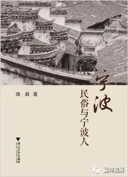

**中国的“贱民”——堕民**

《宁波民俗与宁波人》有一篇附录《中国的吉普赛人——堕民》提到“堕民”，才知道原来中国也有类似印度“贱民”的族群。

鲁迅有文章《我谈“堕民”》，周作人也有文章《堕民的生活》，唐弢也有小文谈“堕民”。现在大致知道，“堕民”是历史上一种生活在中国底层社会里的较被歧视的族群，他们或者是战败被俘人员的遗续（元初俘兵、元末陈友谅、张士诚部），或者是降将部属（南宋焦光赞部），或者为职业人群（伶人）……

“堕民”不入“四民”（士、农、工、商）之列，且禁止“科举”（清代中期有赴科举被举报者），甚至禁止置地置产（如海南、广东疍民生活在水上），职业主要是理发、演戏、做饴糖、挑换糖担（小时候还见过）、抬轿、出售田鸡（青蛙）、“跳灶王”、“喜婆”（都是贱业，以前唱戏的很被人瞧不起）。堕民自相聚居，自相婚配（不与平民通婚），无缘接受教育、禁止科考、捐官，生活在旧时社会底层……种种变现，真的很像印度的“贱民”。

“堕民”是在历史里长期演变形成的，历代以国家名义数次干预，却并没什么大的成效。明洪武四年“诏禁再呼为堕民”，清雍正元年下旨取消“丐民”一类，礼部有“削籍之文”（削除丐籍，“丐民”是“堕民”的另一种称呼），乾隆年间数次重申并准予应试、捐监，民国元年孙中山亦下令“一体享有公权私权”，但民间就习难改。鲁迅《我谈“堕民”》里说：

“每一家堕民所走的主人家是有一定的，不能随便走;婆婆死了，就使儿媳妇去，传给后代，恰如遗产的一般;必须非常贫穷，将走动的权利卖给了别人，这才和旧主人断绝了关系。假使你无端叫她不要来了，那就是等于给与她重大的侮辱。我还记得民国革命之后，我的母亲曾对一个堕民的女人说，‘以后我们都一样了，你们可以不要来了。’不料她却勃然变色，愤愤的回答道：‘你说的是什么话?……我们是千年万代，要走下去的!’”

“千秋万代要走下去的”，就是不放弃这个身份——固有的思维很难一下子改变的。

解放以后，“堕民”很快就消失在大众记忆力了！

真是要衷心的说一句：社会主义国家人民地位高！中国共产党万岁！

        修改于