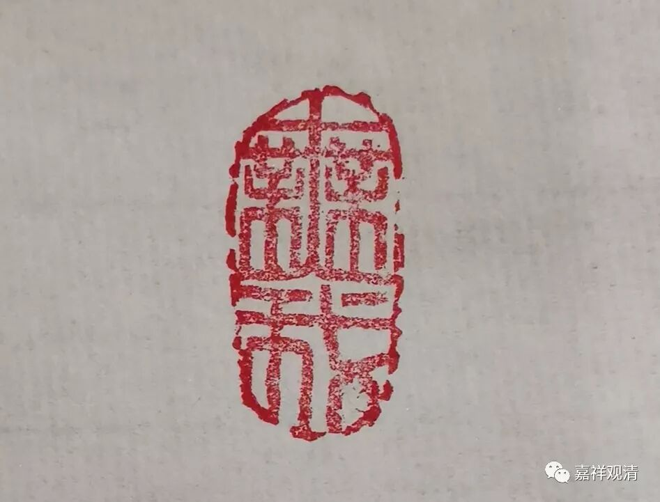
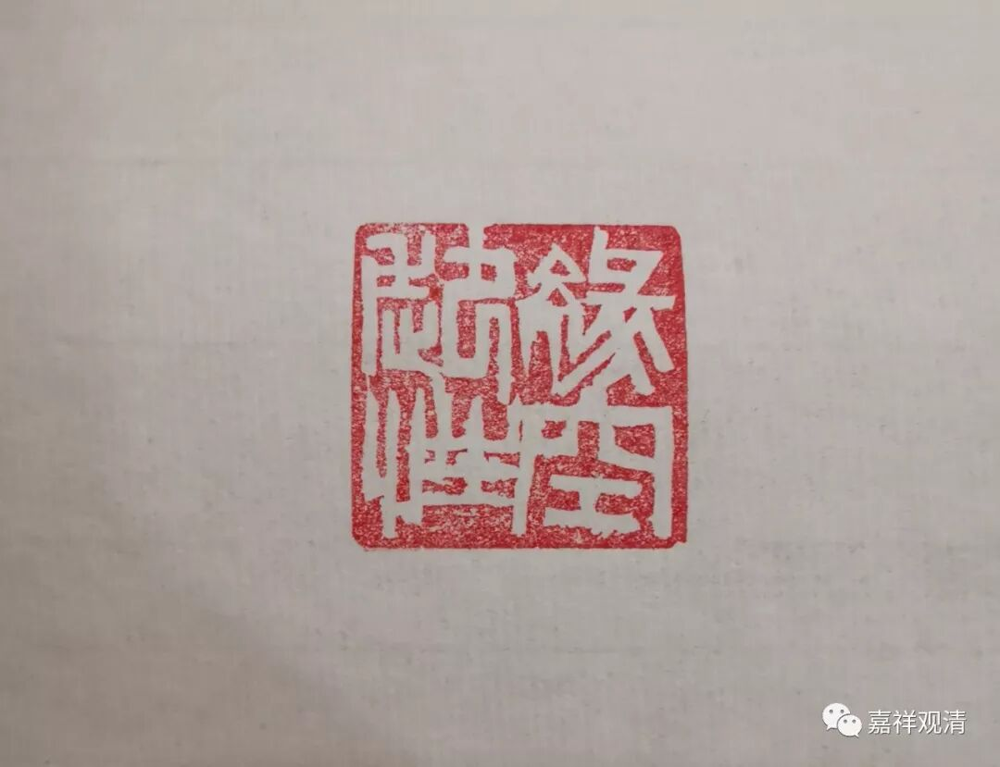
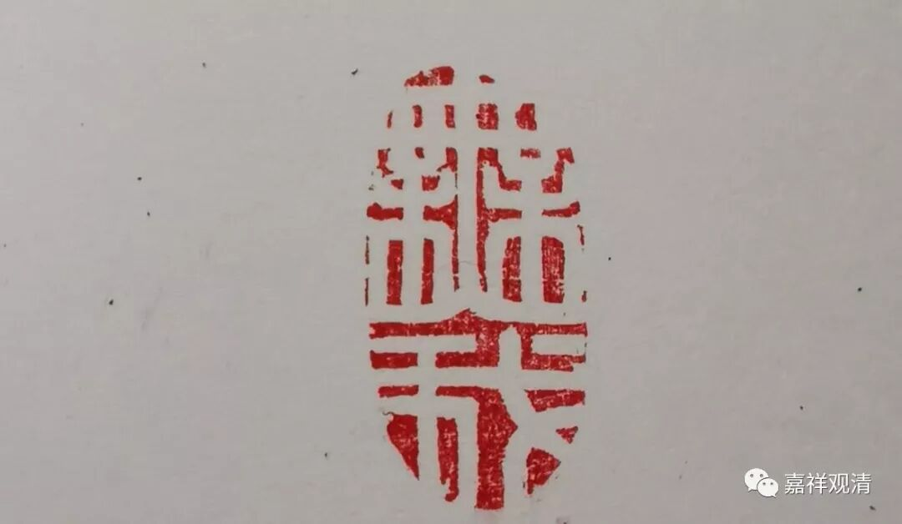

**《缘起赞》讲记027**

** 佛事语最胜，  语中此理妙，**

** 是故诸智者，  应从此忆佛！**

** **

佛的所有的身语意的事业当中，语事业是最重要的。佛的意的事业是两种一切种智：尽所有智和如所有智，佛的身的事业比如放光、动地等等。语事业是讲经。为什么语事业最胜呢？其它人是因为听到了以后才可以去学习，去证寂灭，圆满二种资粮、圆满自他二利最初的种子，就是在听闻佛法以后种下的，而佛法的传播，有赖于佛的宣讲，所以说“** 佛事语最胜**”——佛的事业中，语方面的事业最殊胜！

**
**

** “语中此理妙”：**佛** “语中**”最核心的道理是“** 此**”缘起的道“** 理**”，缘起性空，此理殊“** 妙**”无比，

** “是故诸智者，  应从此忆佛！”**所以智者们、聪明人啊，最好的忆念佛的方法就是从缘起的这个方面去忆佛。多思维缘起理。就如须菩提思维（缘起）性空的道理而没有去迎接佛陀，佛陀却说，须菩提是最早见到佛的。《金刚经》也教导我们，以“色见”以“色观”佛，都不见佛的本质，而佛的本质是，缘起而性空……

** 在大师后而出家，  学习佛经不疏浅，**

** 勤瑜伽行一比丘，  婆伽梵前如是敬！**

** **

宗喀巴大师说：“** 在大师后而出家”，**我跟着佛陀的身后出家，“** 学习佛经不疏浅”**对佛所讲的道理总算有了一点深刻的认识，“** 勤瑜伽行一比丘**”还经常闭关进行观修的比丘，“** 婆伽梵前如是敬！”**在世尊您的面前我这样来敬礼——通过赞叹缘起、思维缘起来敬礼。

想想自己也是很幸运，我也是“** 在大师后而出家**”，还能够遇到如此殊胜的圆满解说，真的上辈子积德，太幸运了。真的要敬礼佛陀他老人家，敬礼各位师长！

《缘起赞》的文字就是这样几个起伏，刚才还是不知道方向的感觉，现在就是看到了笔直的路，手上有导游图了，心情从沮丧到明亮了。宗大师的文字真好！法尊法师的译笔真好！

        修改于