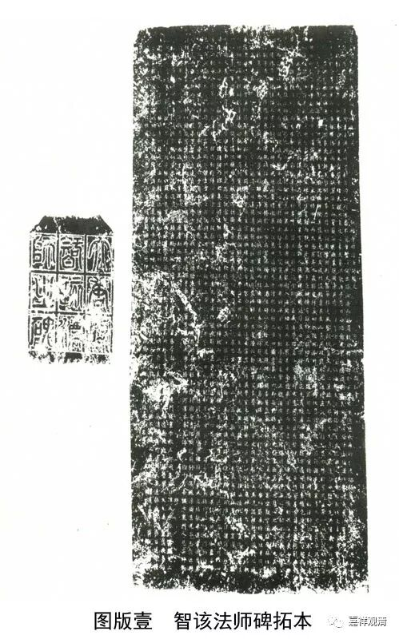
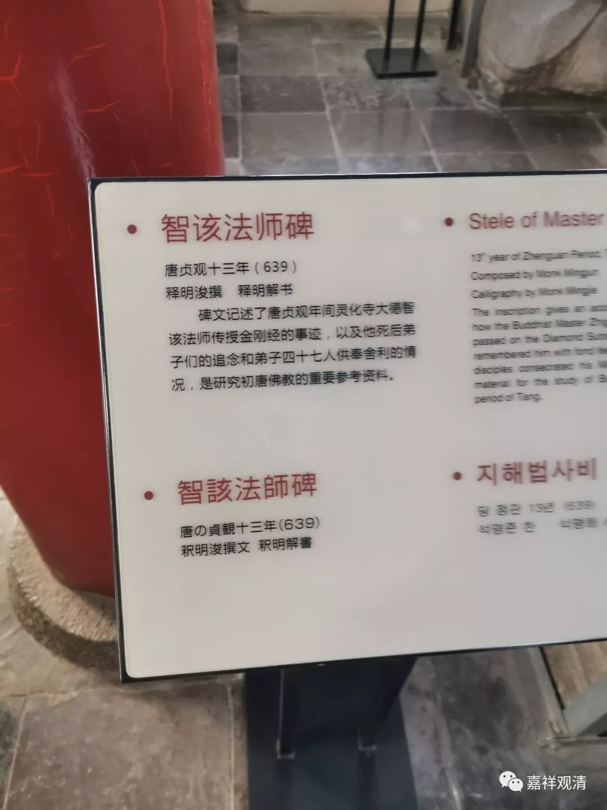
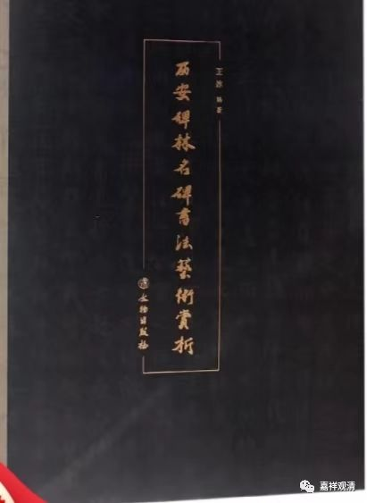
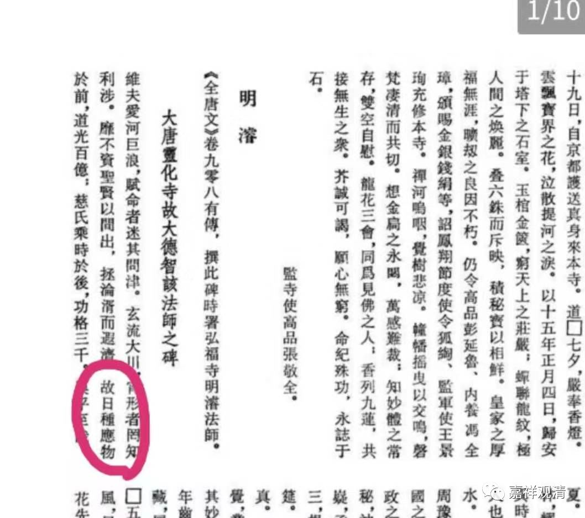
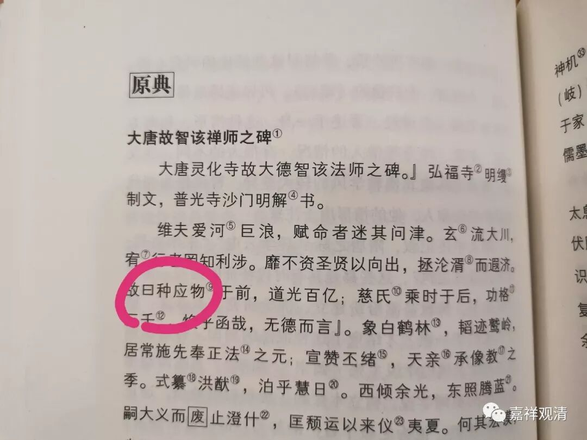

**解读《智该法师碑》的几个问题（一）**

《大唐灵化寺故大德智该法师之碑》现在大概有三个解读的版本：

1、《考古与文物》1985年第4期，《长安发现唐智该法师碑》，周伟洲、朱捷元；

2、《全唐文补遗》第六卷；

3、《佛教新出碑志集萃》。

三个版本略有小异，不知道是不是各自释读的问题。

原碑现在西安碑林。

买的基本碑林的书里都没有此碑的原图，《西安碑林名碑书法艺术赏析》一书中收录此碑，只好继续买买买！

现就手头有的资料，谈谈释读中的几个问题。

1、“日种”和“曰种”：

《《全唐文补编》校读札记》说：

** “《大唐灵化寺故大德智该法师之碑》**

** ‘故曰种应物于前，道光百亿；慈氏乘时于后，功格三千’（74页上），“曰”字误，当作“日种”。释迦牟尼之祖甘蔗王相传有日照而生，故称日种。”**

这个校改是正确的，但《全唐文补编》“日种”不误。

《长安发现唐智该法师碑》和《佛教新出碑志集萃》皆作“曰种”，误读。

2、“当见”与“常见”

** 《《全唐文补编》校读札记》说：**

** “‘南北兴鼠首之执，当见怀犹豫之疑’（75页下）‘当见’当作‘常见’”**

这个校改也是正确的。上述三本皆误。

《长安发现唐智该法师碑》和《佛教新出碑志集萃》皆作“‘南北兴鼠首之执，当见怀犹豫之【疑】’”，“疑”字为补足，《全唐文补编》则直接为“南北兴鼠首之执，当见怀犹豫之疑”，释读完整。

……

        修改于