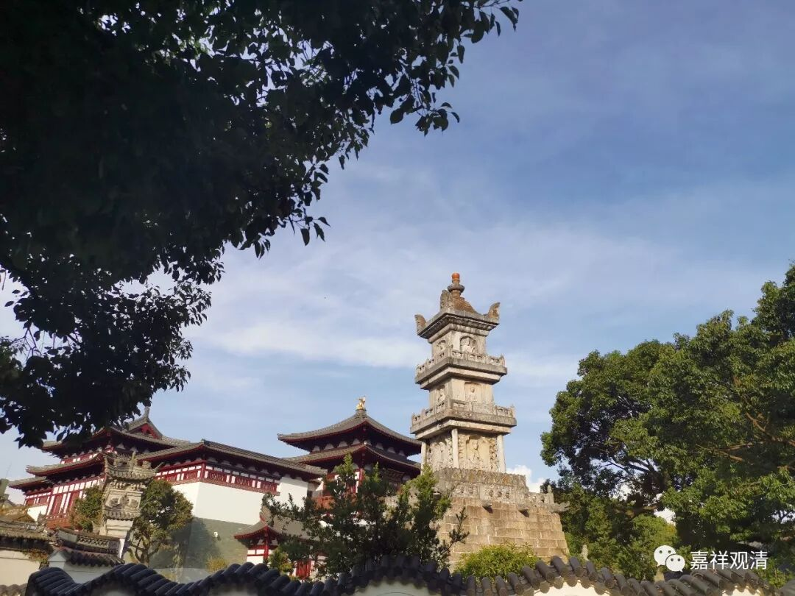

**《善说精髓》讲记 077**

好，我们继续《菩提道次第·善说精髓》。

今天是这一次的最后一堂课了，那么接下来的半天要把止观讲完是不可能的。要把这些都讲明白了，佛是可能的，大菩萨是有可能的，我们这次这么点时间应该不够的。

好像我们一直有欠大家一个工程——《菩提道次第广论》。我们现在《四家合注》的译本也有了，那么《四家合注》我们可以慢慢地讲，是不是也每天晚上讲一点？这个一直欠着，到现在为止都还没讲完呢，如果每天晚上都讲一点，轻松点可能比较好。

比如，我们之前在微课堂讲《心经》和《金刚经》，这两部经都比较熟悉，不用怎么备课，如果再要备课的话，那就很累了，因为备课要花点时间的。那么，前两天讲《善说精髓》当中就有一些问题，我也没讲清楚，这些问题到哪里去找呢？基本上这都是从《广论》当中引过来的，如果在文字当中看不清楚的话，那我们去《广论》当中找就比较好。

我们昨天没讲清楚的一个地方是** “（寅四）学精进之理”**当中的** “顺缘胜解坚固喜，暂息欲善具六度，自住精进安立他”**。这里就有点没有找到它相应的地方，没有讲清楚。现在大家可以去看一下我们嘉祥版的《广论四家合注》第410页，是什么意思呢？在** “精进”**里面，积集** “顺缘”**的资粮有四个：

第一个是** “胜解”**力。那么，在《广论》当中指出了这个** “胜解”**力实际上是指欲，这在藏文当中是译为** “胜解”**，在《广论》当中还是把这个** “胜解”**解释为欲。

第二呢，是** “坚固”**力。

第三个呢，是欢** “喜”**力。这个在藏文当中是喜，而在《广论》当中是欢喜。

第四是** “暂”**止** “息”**力，就是暂时休息一下。精进得太勇猛了，暂时休息一下，是这个意思，叫暂止息力。

这些道次第的内容要看《广论》的，如果《广论》当中也看不出来呢，就要去看《大藏经》了。

好，我们暂时把我们心爱的《四家合注》放到边上吧。这本《四家合注》印刷之后，也不知道有多少人看过。我们的想法就是先把《四家合注》翻译出来、印出来，这样以后能够有更多的人看到，那就可以了！

不过这种书只能保存70年，其实我们以后应该再想办法用石头把它刻出来。我已经咨询过了，这种现代印刷只能保存70年。所以，我曾经的想法估计是不可能——5000年以后大家考古，来到我们这个地方挖呀挖，然后挖到几本《四家合注》，一看：“嘉祥！咦？嘉祥是谁呀？”然后一查，吉藏大师。现在想想，估计挖不出来了，真的挖出来还得了，都已经碎得一塌糊涂了。

我曾经碰到过一位比较老派的和尚，其实他的年纪并不大，比我大不了几岁，但他是80年代出家的，比较老派。他做的很多事情很有趣的，比我有思路，好像确实是有一种责任感在身的。他建寺院的时候做了夹墙，弄了几套大藏经藏进去……

