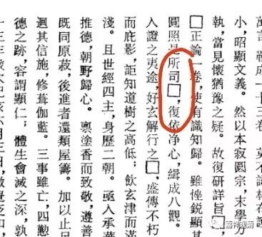
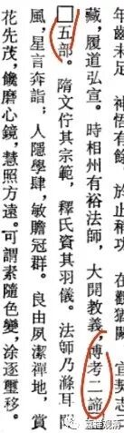
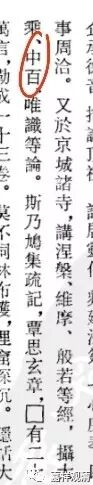

**
**

** 解读《智该法师碑》的几个问题（二）**

……

3、“是所司在”与“是所司正”

《《全唐文补编》校读札记》说：

“是所司[在]，复依净心（75页下），‘在’当作‘正’。”

这个改正是正确的。《长安发现唐智该法师碑》作“是所司[在]，复依净心”。

《全唐文补编》作“是所司囗，复依净心”，“在”或者“正”字没有读出来。

《佛教新出碑志集萃》作：“是□，复依净心”，“是”“囗”之间漏置“所司”两字。

4、“二谛”or“四谛”

《长安发现唐智该法师碑》作“博考□缔，□□五部”。

《全唐文补编》作“博考二缔，□□五部”。

《佛教新出碑志集萃》作：“博考□缔（谛），口九五部”。

清案：

“缔”即“谛”，《长安发现唐智该法师碑》仅作“□缔”，《全唐文补编》读作“二缔”，《佛教新出碑志集萃》在注解里读为“四谛”。此中，依行文习惯，当从《全唐文补编》读作“二缔（谛）”为是，读为“四谛”或未尽善。（等图版到了再仔细读一下看看。）

《集萃》注释“五部”谓：“五部：指四谛（见道）再加上修道。”误。《集萃》实误取词典所引的《大毗婆沙论》“五部”说。而此处“五部”是指“律分五部”的“五部”，即：昙无德部（法藏部）、萨婆多部（有部）、弥沙塞部（化地部）、迦叶遗部（饮光部）、摩诃僧祇部（大众部）。这里的“五部”是指代一切佛法的一种修辞。

5、《百论》有无？“唯识”为何？

《长安发现唐智该法师碑》作“摄大乘、中百、唯识等论”。

《全唐文补编》作“摄大乘、中百、唯识等论”。

《佛教新出碑志集萃》作：“《摄大乘》、《中》、《唯识》等论”。

清案：《集萃》漏抄“百”字，且在注解和白话翻译里也少《百论》。

又，《集萃》注解“唯识”作“唯识：全称《成唯识论》，梵文Vijamatrasiddhisastra，玄奘着，是法相宗主要著作之一。”此条全误。此时《成唯识论》玄奘尚未译来，智该何由得说？！故此“唯识”当即真谛所译之《大乘唯识论》（即玄奘译《唯识二十论》），或《转识论》（即玄奘所译之《唯识三十论》），不堪释为《成唯识论》。

……

        修改于