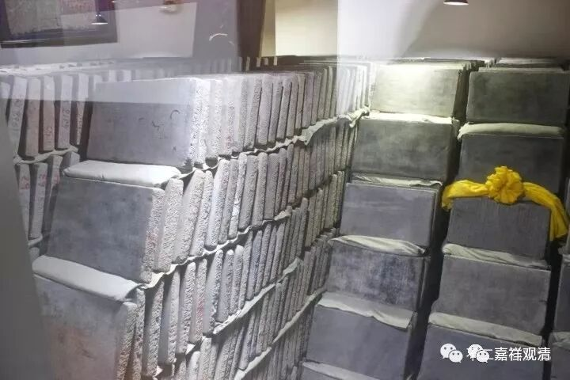
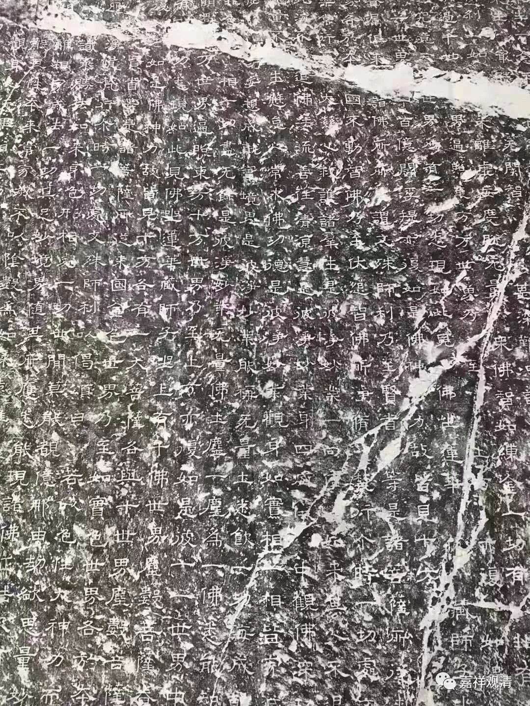
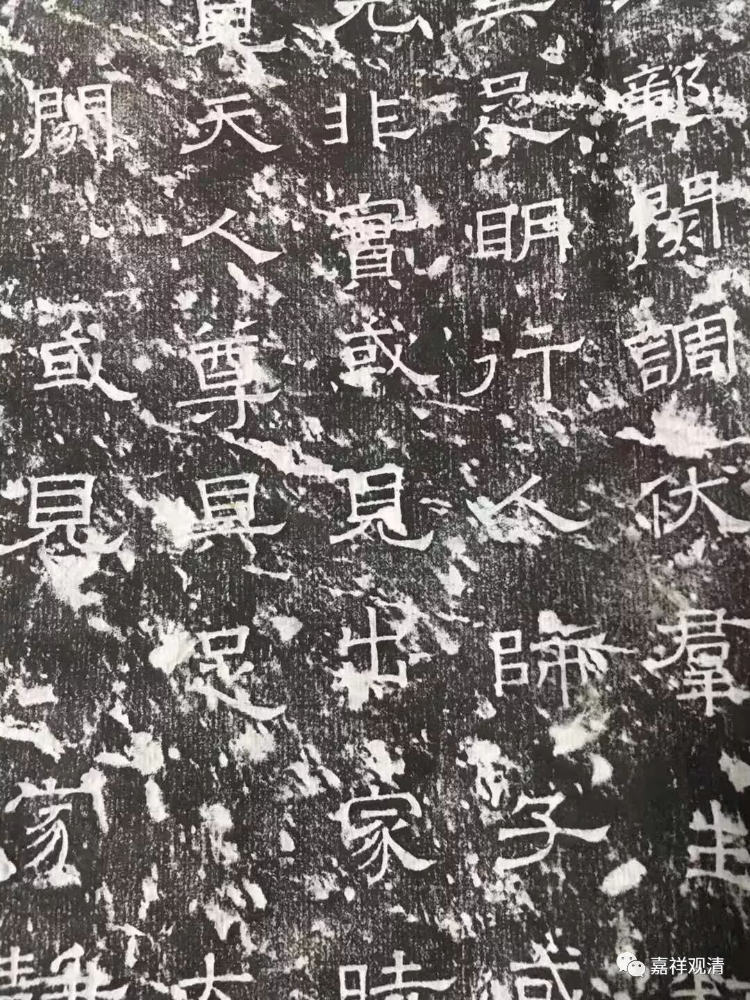

**《善说精髓》讲记 078（上）**

他在建造寺院的大雄宝殿的时候，还建了一层夹墙——就是一个夹层，你从外面是看不出来的，然后他在夹层里面放了好几部藏经。他觉得如果再来一次什么什么的话，至少他这里还保存了一些经典。现在我们知道了，他保存的这些经典的寿命也就几十年，现代纸张和油墨也就只能保证70年，你看有些印刷的唐卡，才几年颜色就不对了。据说德国有“保鲜”五百年的油墨。

从这个角度来说，类似房山石经这样的石经就比较能保存了。

房山石经经版

在房山石经开刻之前，有一个南北朝时期，有个道壹法师在河北、山东都刻了很多石经，主要有般若经、华严经。

响堂山华严经

刚才说的这位跟我年纪差不多大的法师，他这个人也很有趣，他建寺院的钱是怎么来的呢？他先建塔，用了很多空心砖，每块空心砖的当中都放一本印得很小很小的《金刚经》。然后每一块空心砖，大家捐多少钱……寺院就这样建成了。后来，他的徒弟比他更狠，这个事情我就不讲了，不太好。

他是八十年代出家的，他的戒牒就比较老。有一次他去见他的一个师兄弟，带着老的戒牒就去了（要挂单），结果那个师兄弟那几天不在，而那个寺院可能也不大，是一个小沙弥管事。因为他的师兄弟不在，那个小沙弥又不认识老的戒牒，就说：“你这个是假戒牒，你是个骗子。”硬说他的戒牒是假的，让他上山干活，还打他。后来他就假装被打伤了，赖着不走了。结果他的师兄弟回来，就看到他了：“哎，你怎么来了？”他说：“我已经被打了。”他的师兄弟问：“谁打的？”他说：“除了你下面的人还有谁啊？”他的师兄弟很生气，要把这个小沙弥赶走。他倒是在一旁劝说：“不对，你不应该赶走沙弥，是因为你自己没有教育好。”

这个事情让他觉得江湖没法混了：“我们这种八十年代的老出家人，居然现在小朋友们都不认我们了。”于是他又去受了一次戒，再领了一张新的戒牒，要不然新的小朋友们都不认识。老的戒牒就像六、七十年代那种结婚证一样，就一张纸的，连硬板纸都不是的那种。他当时来受戒的时候就说：“我是来‘受戒牒’的，不是来‘受戒’的。”否则在江湖上行走太不方便了。

