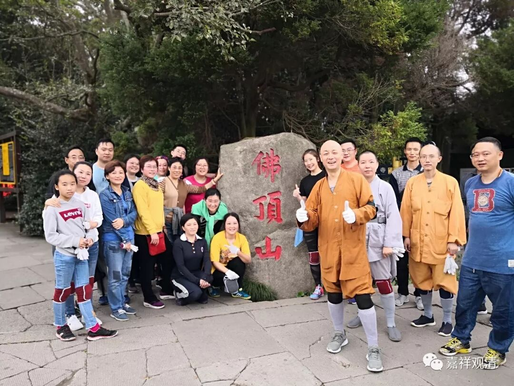

**普陀朝山**

大约03或者04年起我基本每年带队去普陀山“朝山”的，那时候都还年轻，大队人马的年龄也都相仿佛，我们是从码头一路磕头上佛顶山直到惠济寺的，码头起的可能磕了有十次吧，也有几次从佛顶山山脚磕上去的。应该说，“拜山”的经验也算是“老丰富”了。（另外，我们黄山翠微寺的拜山活动我大概参加了四五次，五台山岱螺顶也磕了一两次，我记得有一次我还正腰疼。但岱螺顶算是比较轻松的。）

大约一五年以后我们普陀山朝山活动就……不提了，因为……老了，腰疼。我的老腰在后面几次拜山当中越来越……最后一次实在是勉强拜完的——码头而惠济寺的漫漫长路我这老腰恐怕是撑不下去了。

今年又有人提出拜山，我抓来龙智师，万一要从码头“干”起就靠他了！（其实他心里比我还慌——没经验。）最后这些十五年前的青年们还是考虑……从山脚下拜上去。哈哈，这小意思了，拼一下，了不起卧床一礼拜呗。

于是这次这二十几个人的小队就“小壮烈”地出发了……

这次天气真的很帮忙，阴天，气温也合适，人数二十个左右正好，一共一个半小时，整个算是（包括几次山脚起的）最轻松的一次了。我一个人一口气大约可以四十五分钟左右磕完，一般带队都得两个小时甚至近三个小时，这次真的是很轻松的行程，关键大家也都说“不累”……

上照片

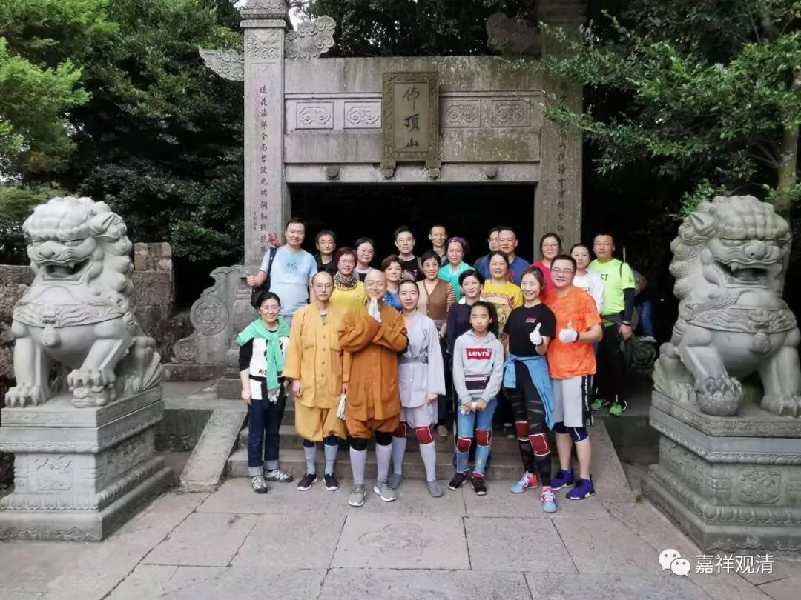

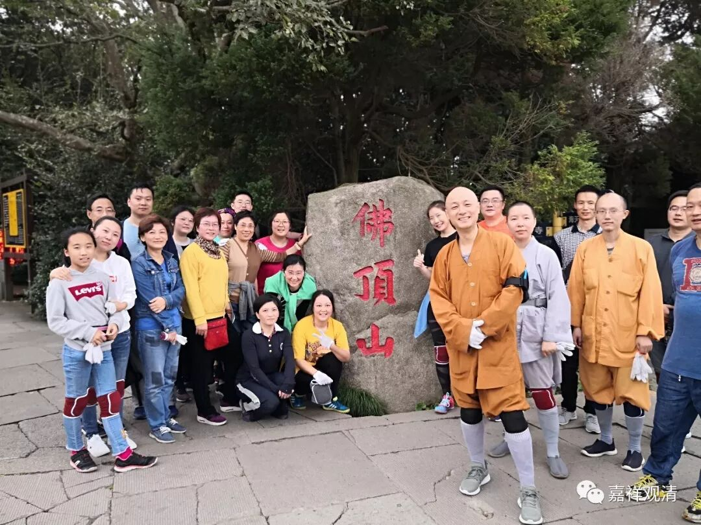

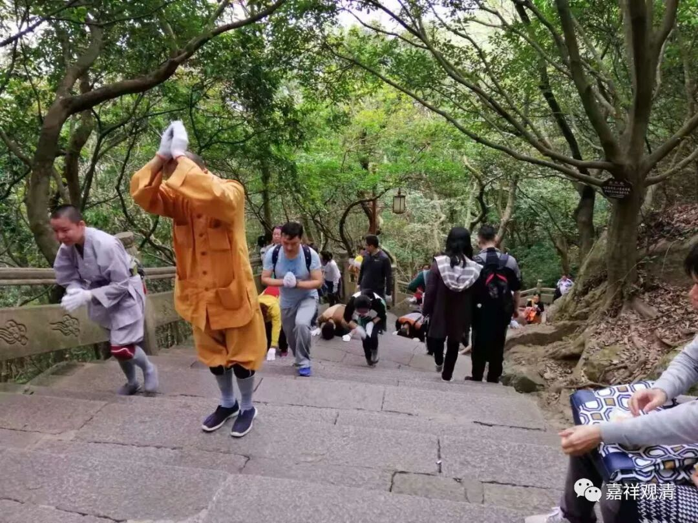

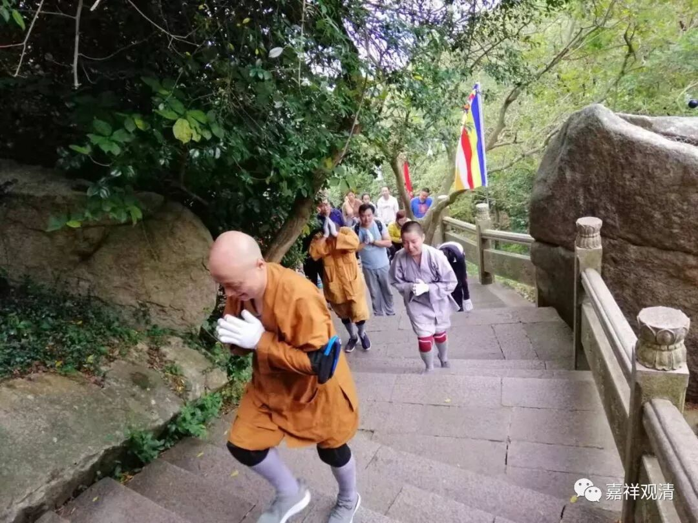

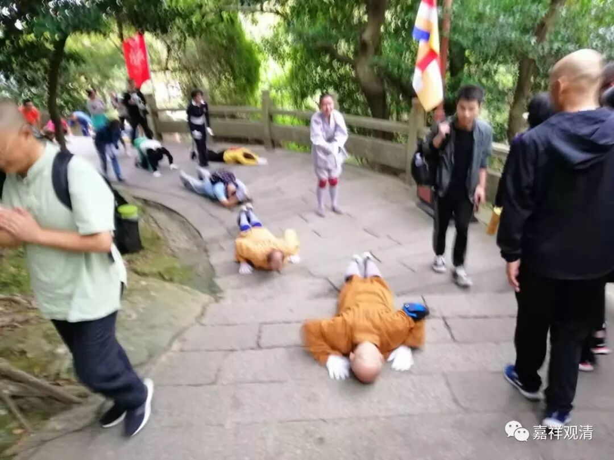

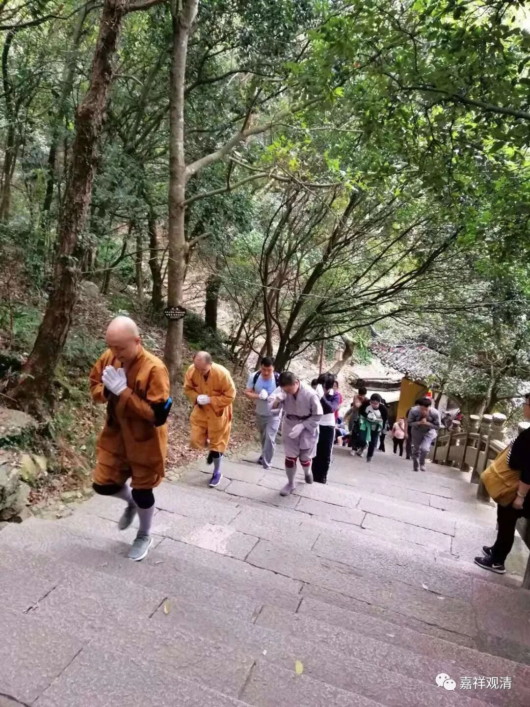

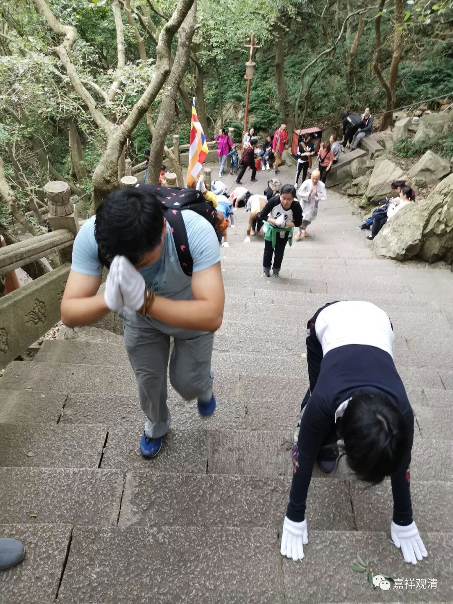

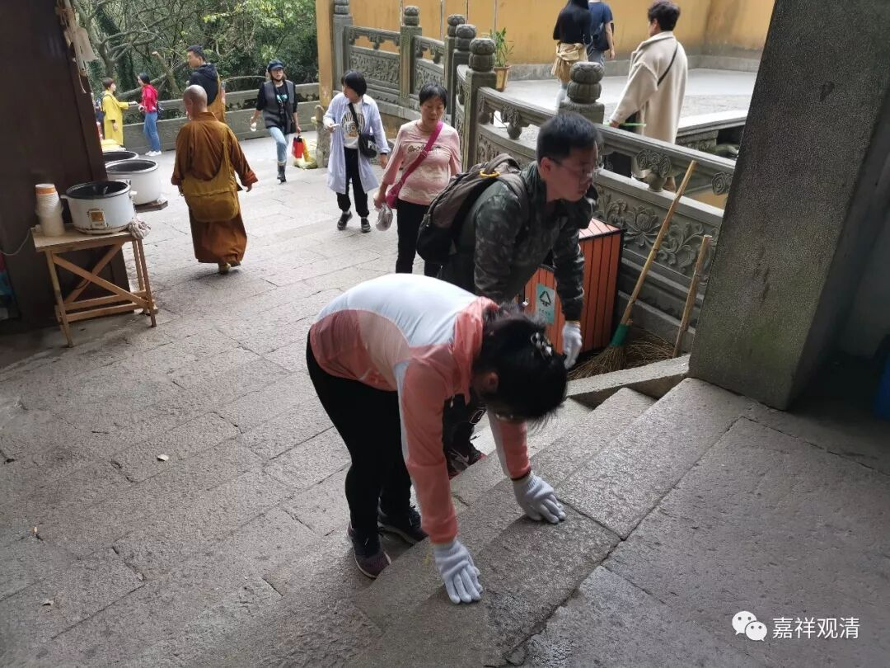

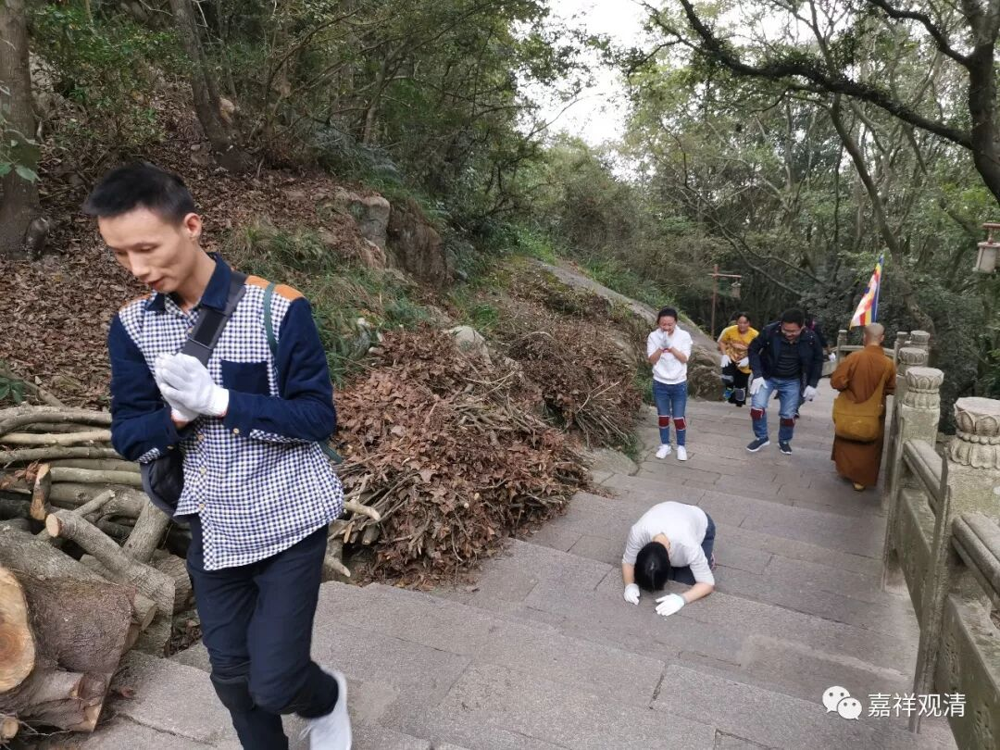

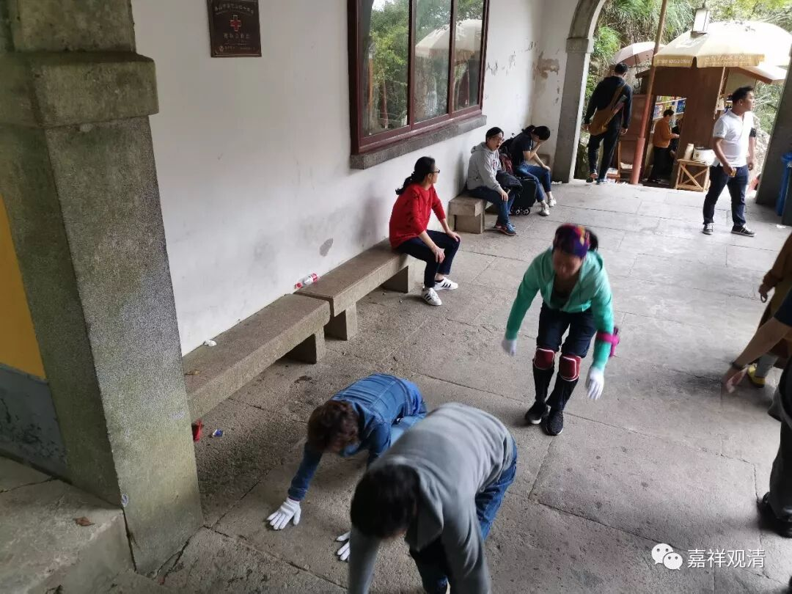

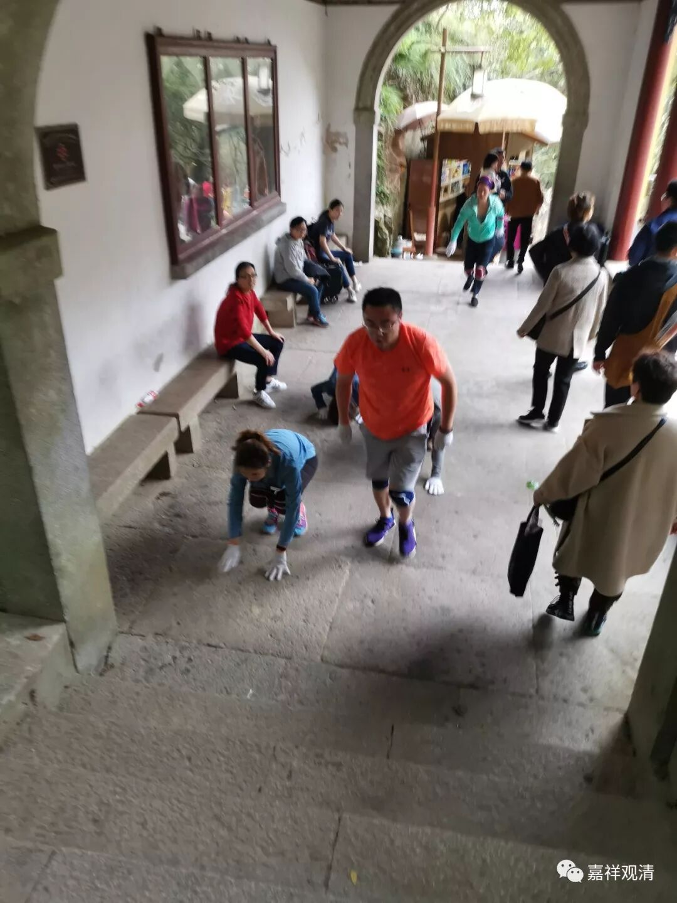

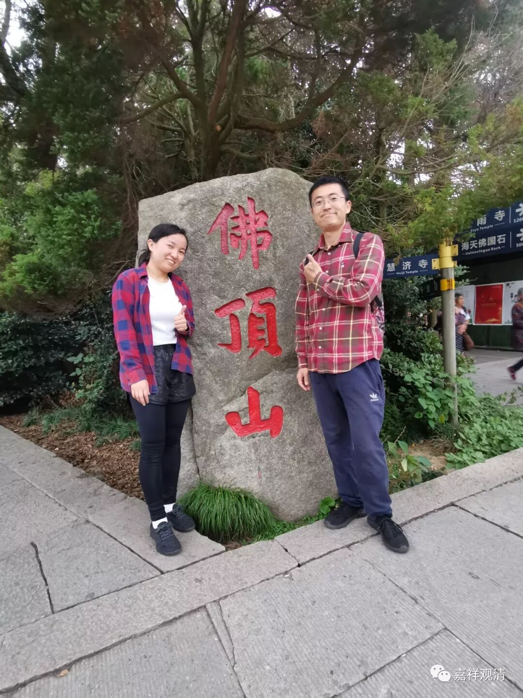

最后这两位迟到（其实没多久）……一直追着没追上

那我们明年就可以继续召集了，报名的……

还有谁！

（有些照片文件太大发不上来）

