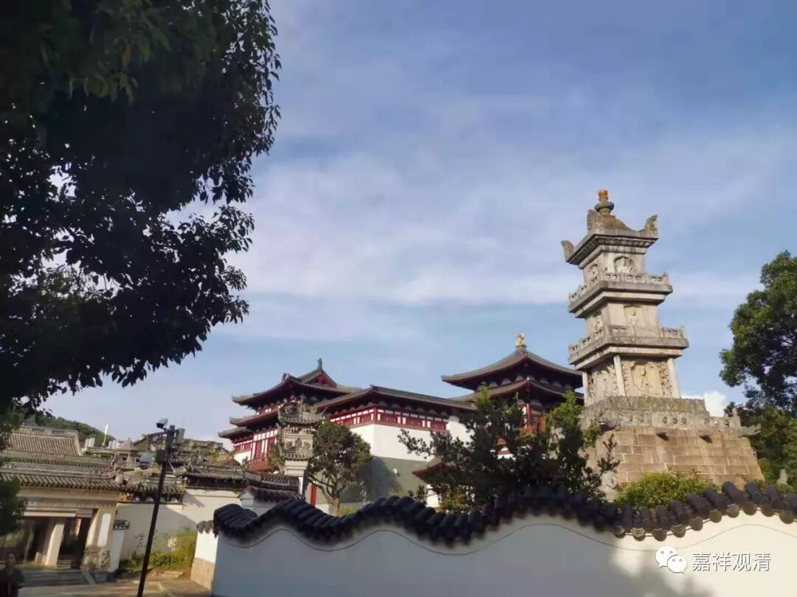
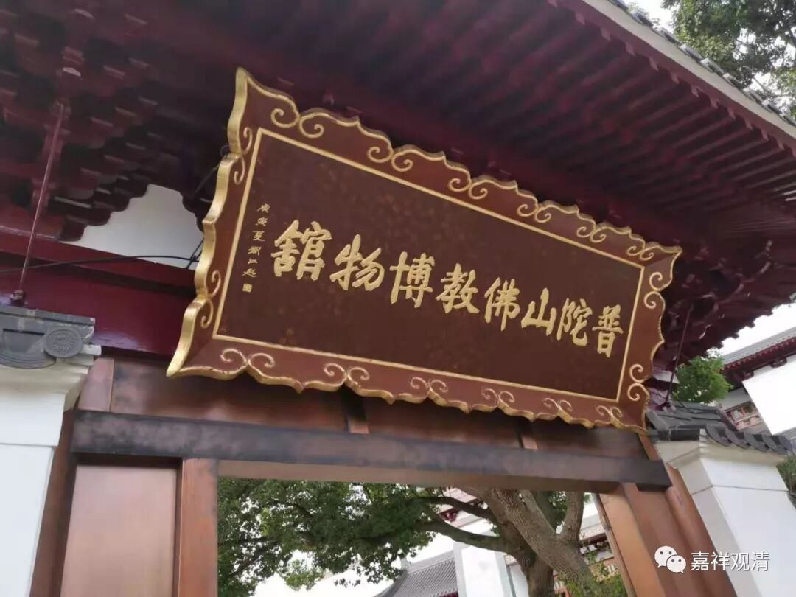
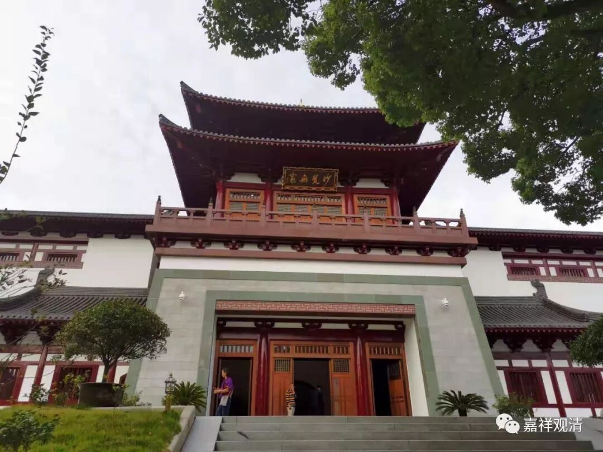
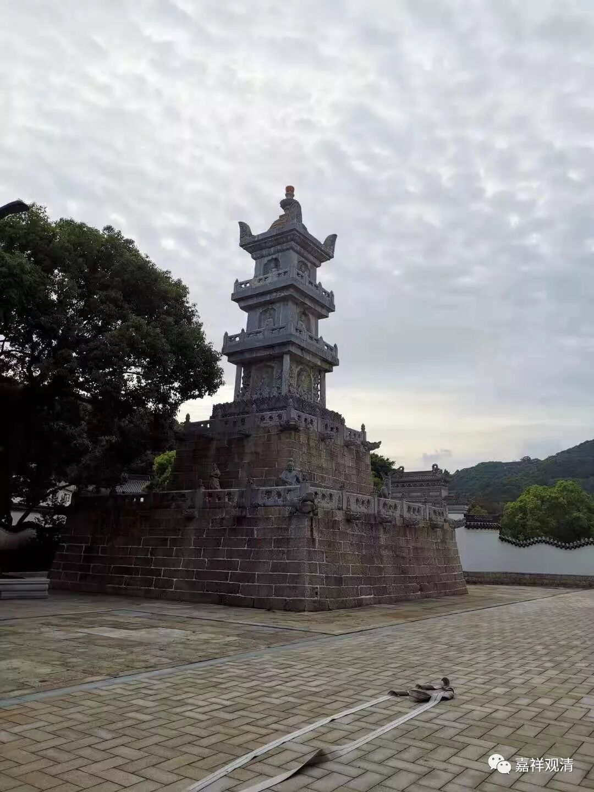
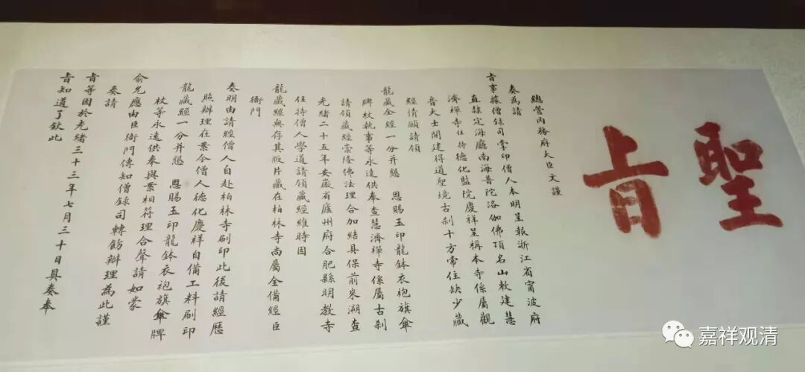
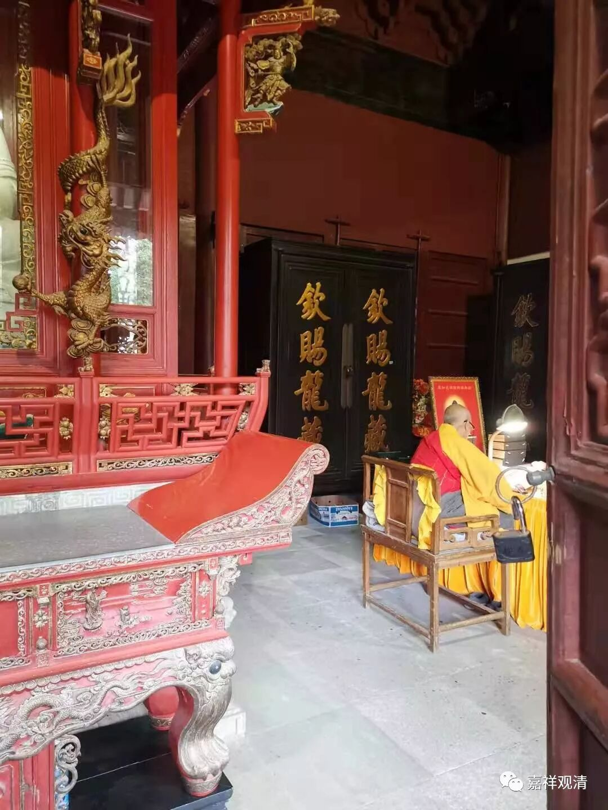
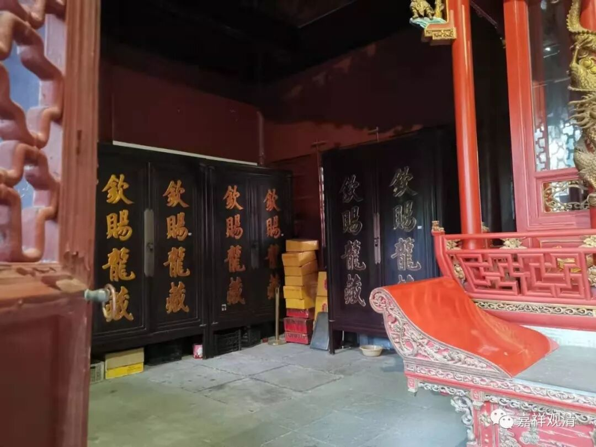

**普陀山的龙藏**

去普陀山拜山，早到了一天，逛了逛，去了趟普陀山佛教博物馆

最早是九四年来的普陀山，那时候有个文物馆，在今天大乘庵附近。现在升级了，成了博物馆，搬到普济寺的车站边上了。

可能已经来晚了，人很少，而且绝大部分人对这个也不感兴趣吧。

这里有一份圣旨

内容是佛顶山普济寺住持德化、监院庆祥去清廷请龙藏，光绪皇帝（实际是慈禧）允可，并且，赐了一道圣旨，和圣旨一起御赐的还有龙钵（景泰蓝龙钵）和墨印（新疆和田墨玉）等。

“总管内务府大臣文谨,奏为请旨事 。 据僧录司掌印僧人本明呈报,浙江省宁波府直隶定海厅南海普陀洛迦佛顶名山敕建慧济禅寺住持德化、监院庆祥……

……

……

……于光绪三十三年七月三十日具奏奉

旨知道了钦此”

中间我就不写了，大家自己看。

这里陈列的圣旨是复制品，原件在库房。

这是法雨寺装龙藏的柜子

普陀山（解放前）一共有龙藏三套（有说五部，是不懂《大藏经》和《龙藏》的区别，除龙藏外，另两套是明代的南、北藏），乾隆时普济寺获颁赐一套，光绪年间，法雨寺、慧济寺各迎请一套。虽然说是“领”的“钦赐”龙藏，但由于“皇上家也没有余粮”，实际是要自己准备印刷、装订、起运费用的。

这不独清代如此，明代请官版藏经也是如此。明代请《南藏》“印造装潢，起价亦百金以上”（冯梦祯《嘉兴藏序》），清乾隆五十四年印刷的费用（工钱）“照例”是六百六十八两，装订再另算。普陀山三套龙藏里面，普济寺（乾隆送来的）那套龙藏是不花钱的。

今天我们请藏经要便宜多了，只是今天的印刷，不能长久保存……

